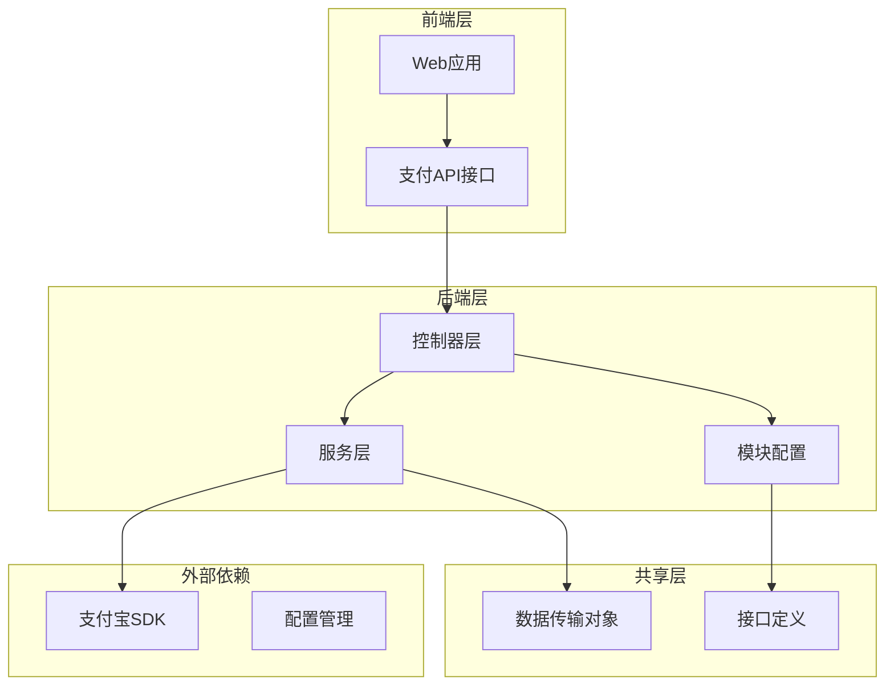
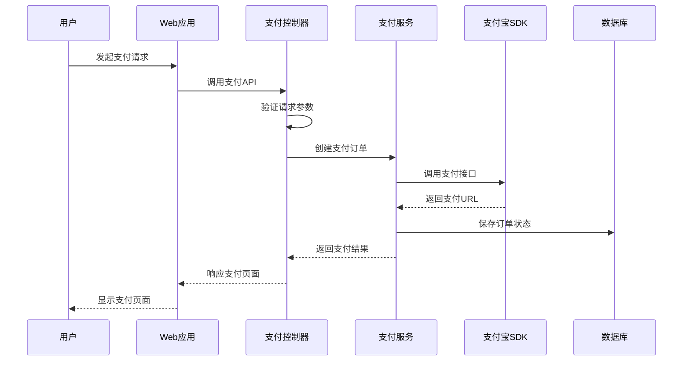
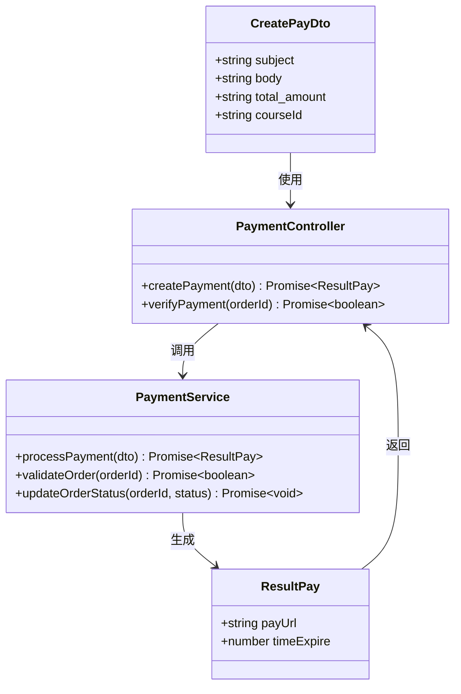
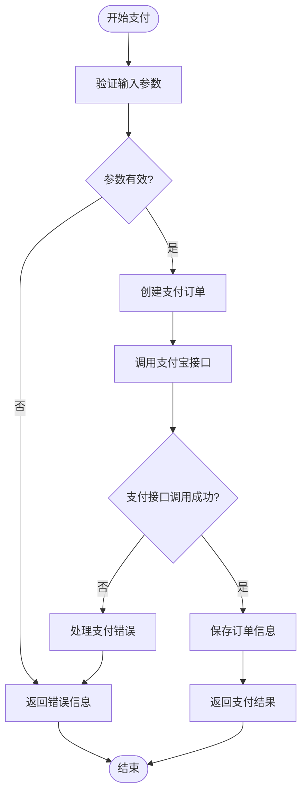
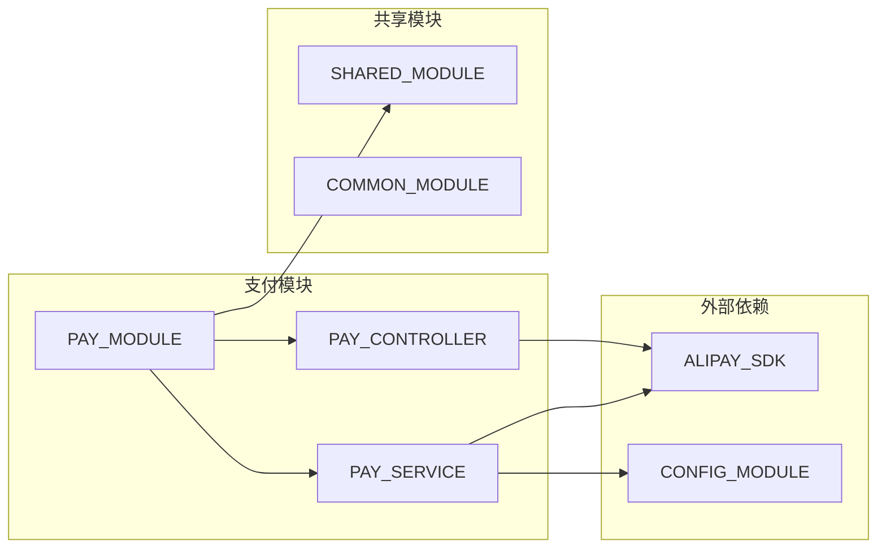
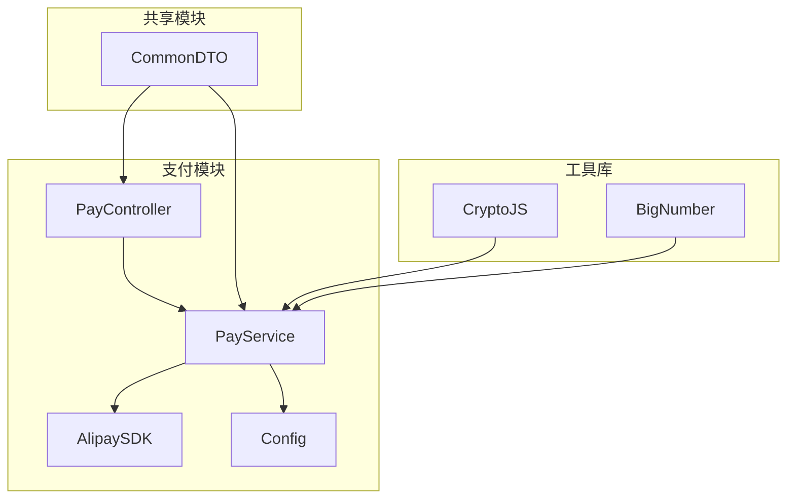

# 支付处理模块

<cite>
**本文档引用的文件**
- [packages/common/pay/index.ts](file://packages/common/pay/index.ts)
- [apps/web/src/apis/pay/index.ts](file://apps/web/src/apis/pay/index.ts)
- [server/apps/server/src/pay/pay.controller.ts](file://server/apps/server/src/pay/pay.controller.ts)
- [server/apps/server/src/pay/pay.service.ts](file://server/apps/server/src/pay/pay.service.ts)
- [server/apps/server/src/pay/pay.module.ts](file://server/apps/server/src/pay/pay.module.ts)
- [server/libs/shared/src/pay/pay.module.ts](file://server/libs/shared/src/pay/pay.module.ts)
- [pnpm-lock.yaml](file://pnpm-lock.yaml)
</cite>

## 目录
1. [项目概述](#项目概述)
2. [项目结构](#项目结构)
3. [核心组件](#核心组件)
4. [架构概览](#架构概览)
5. [详细组件分析](#详细组件分析)
6. [依赖关系分析](#依赖关系分析)
7. [性能考虑](#性能考虑)
8. [故障排除指南](#故障排除指南)
9. [结论](#结论)

## 项目概述

支付处理模块是AI英语学习网站的核心功能模块，负责处理用户购买课程的支付流程。该模块采用前后端分离架构，结合了前端Web应用和后端服务端应用，通过支付宝SDK实现安全的在线支付功能。

该模块的主要目标包括：
- 提供完整的支付流程管理
- 确保支付数据的安全性和完整性
- 支持多种支付方式集成
- 实现支付状态的实时跟踪
- 提供用户友好的支付体验

## 项目结构

支付处理模块在项目中采用分层架构设计，主要包含以下层次：

**图表来源**
- [apps/web/src/apis/pay/index.ts:1-200](file://apps/web/src/apis/pay/index.ts#L1-L200)
- [server/apps/server/src/pay/pay.controller.ts:1-200](file://server/apps/server/src/pay/pay.controller.ts#L1-L200)
- [server/apps/server/src/pay/pay.service.ts:1-200](file://server/apps/server/src/pay/pay.service.ts#L1-L200)

**章节来源**
- [packages/common/pay/index.ts:1-11](file://packages/common/pay/index.ts#L1-L11)
- [apps/web/src/apis/pay/index.ts:1-200](file://apps/web/src/apis/pay/index.ts#L1-L200)
- [server/apps/server/src/pay/pay.controller.ts:1-200](file://server/apps/server/src/pay/pay.controller.ts#L1-L200)

## 核心组件

支付处理模块的核心组件包括数据传输对象、API接口、控制器和服务类。

### 数据传输对象

模块定义了两个关键的数据传输对象：

1. **CreatePayDto**：用于创建支付订单的数据结构
2. **ResultPay**：用于返回支付结果的数据结构

这些接口确保了前后端数据传递的一致性和类型安全性。

### API接口层

前端Web应用通过专门的支付API接口与后端进行通信，提供用户友好的支付操作界面。

### 控制器层

后端控制器负责接收和验证来自前端的支付请求，协调服务层完成具体的支付处理逻辑。

### 服务层

支付服务类实现了核心的支付业务逻辑，包括与支付宝SDK的集成和支付状态管理。

**章节来源**
- [packages/common/pay/index.ts:1-11](file://packages/common/pay/index.ts#L1-L11)
- [apps/web/src/apis/pay/index.ts:1-200](file://apps/web/src/apis/pay/index.ts#L1-L200)
- [server/apps/server/src/pay/pay.controller.ts:1-200](file://server/apps/server/src/pay/pay.controller.ts#L1-L200)
- [server/apps/server/src/pay/pay.service.ts:1-200](file://server/apps/server/src/pay/pay.service.ts#L1-L200)

## 架构概览

支付处理模块采用经典的三层架构模式，实现了清晰的关注点分离：

**图表来源**
- [apps/web/src/apis/pay/index.ts:1-200](file://apps/web/src/apis/pay/index.ts#L1-L200)
- [server/apps/server/src/pay/pay.controller.ts:1-200](file://server/apps/server/src/pay/pay.controller.ts#L1-L200)
- [server/apps/server/src/pay/pay.service.ts:1-200](file://server/apps/server/src/pay/pay.service.ts#L1-L200)

该架构具有以下特点：
- **清晰的职责分离**：前端负责用户交互，后端负责业务逻辑
- **可扩展性**：支持添加新的支付方式
- **安全性**：通过中间件和验证机制确保数据安全
- **可维护性**：模块化设计便于代码维护和测试

## 详细组件分析

### 支付数据模型

支付模块使用标准化的数据模型来确保跨平台的一致性：

**图表来源**
- [packages/common/pay/index.ts:1-11](file://packages/common/pay/index.ts#L1-L11)
- [server/apps/server/src/pay/pay.controller.ts:1-200](file://server/apps/server/src/pay/pay.controller.ts#L1-L200)
- [server/apps/server/src/pay/pay.service.ts:1-200](file://server/apps/server/src/pay/pay.service.ts#L1-L200)

### 支付流程控制

支付流程通过控制器层进行统一管理，确保每个支付请求都经过适当的验证和处理：

**图表来源**
- [server/apps/server/src/pay/pay.controller.ts:1-200](file://server/apps/server/src/pay/pay.controller.ts#L1-L200)
- [server/apps/server/src/pay/pay.service.ts:1-200](file://server/apps/server/src/pay/pay.service.ts#L1-L200)

### 模块依赖关系

支付模块的组织采用了标准的Angular模块模式：

**图表来源**
- [server/apps/server/src/pay/pay.module.ts:1-200](file://server/apps/server/src/pay/pay.module.ts#L1-L200)
- [server/libs/shared/src/pay/pay.module.ts:1-200](file://server/libs/shared/src/pay/pay.module.ts#L1-L200)

**章节来源**
- [packages/common/pay/index.ts:1-11](file://packages/common/pay/index.ts#L1-L11)
- [server/apps/server/src/pay/pay.controller.ts:1-200](file://server/apps/server/src/pay/pay.controller.ts#L1-L200)
- [server/apps/server/src/pay/pay.service.ts:1-200](file://server/apps/server/src/pay/pay.service.ts#L1-L200)
- [server/apps/server/src/pay/pay.module.ts:1-200](file://server/apps/server/src/pay/pay.module.ts#L1-L200)

## 依赖关系分析

支付模块的依赖关系相对简单且明确，主要依赖于支付宝SDK和其他必要的工具库。

### 外部依赖

模块的主要外部依赖包括：

- **alipay-sdk**：支付宝官方SDK，提供支付相关的API调用
- **crypto-js**：加密解密工具库，用于支付数据的安全处理
- **bignumber.js**：高精度数值计算库，确保支付金额的精确性

### 内部依赖

模块内部的依赖关系遵循清晰的层次结构：

**图表来源**
- [pnpm-lock.yaml:1942-1944](file://pnpm-lock.yaml#L1942-L1944)
- [server/apps/server/src/pay/pay.service.ts:1-200](file://server/apps/server/src/pay/pay.service.ts#L1-L200)

**章节来源**
- [pnpm-lock.yaml:1942-1944](file://pnpm-lock.yaml#L1942-L1944)
- [server/apps/server/src/pay/pay.service.ts:1-200](file://server/apps/server/src/pay/pay.service.ts#L1-L200)

## 性能考虑

支付处理模块在设计时充分考虑了性能优化和用户体验：

### 异步处理
- 支付请求采用异步处理模式，避免阻塞主线程
- 使用Promise和async/await确保异步操作的正确性

### 缓存策略
- 支付状态查询结果进行适当缓存
- 减少重复的数据库查询操作

### 错误处理
- 实现全面的错误捕获和处理机制
- 提供友好的错误提示信息

### 安全性
- 所有敏感数据进行加密存储
- 支付接口进行严格的参数验证

## 故障排除指南

### 常见问题及解决方案

**支付超时问题**
- 检查网络连接稳定性
- 验证支付宝接口可用性
- 调整超时参数设置

**支付失败问题**
- 检查订单状态是否正确
- 验证用户账户余额
- 确认支付参数完整性

**接口调用异常**
- 检查API密钥配置
- 验证签名算法正确性
- 确认请求格式符合要求

### 调试建议

1. **启用详细日志记录**：监控支付流程中的每个步骤
2. **使用测试环境**：在正式上线前进行全面测试
3. **实施监控告警**：及时发现和处理异常情况

**章节来源**
- [server/apps/server/src/pay/pay.service.ts:1-200](file://server/apps/server/src/pay/pay.service.ts#L1-L200)

## 结论

支付处理模块是一个设计合理、结构清晰的完整支付系统。通过采用现代化的架构模式和最佳实践，该模块能够为用户提供安全、可靠的支付体验。

模块的主要优势包括：
- **模块化设计**：清晰的职责分离便于维护和扩展
- **安全性保障**：完善的加密和验证机制
- **用户体验**：简洁直观的操作流程
- **可扩展性**：支持未来功能的添加和修改

建议在未来的工作中继续关注支付安全、性能优化和用户体验的持续改进。