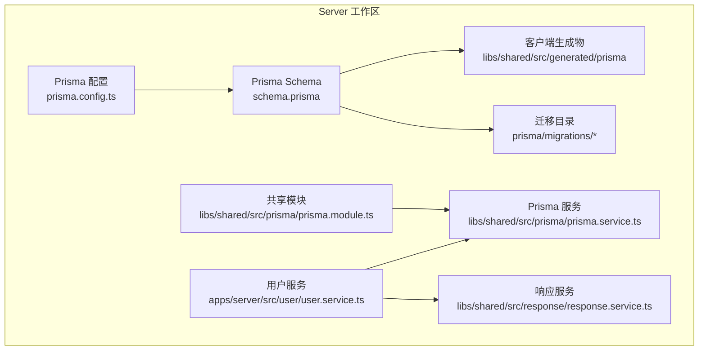
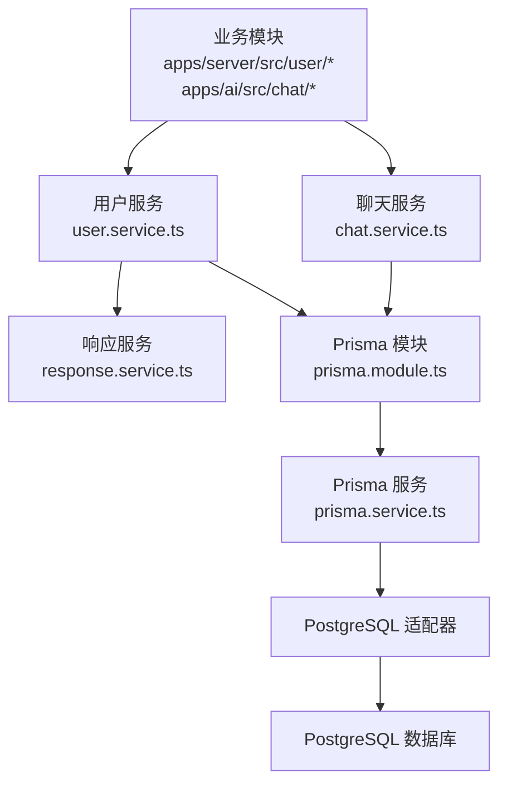
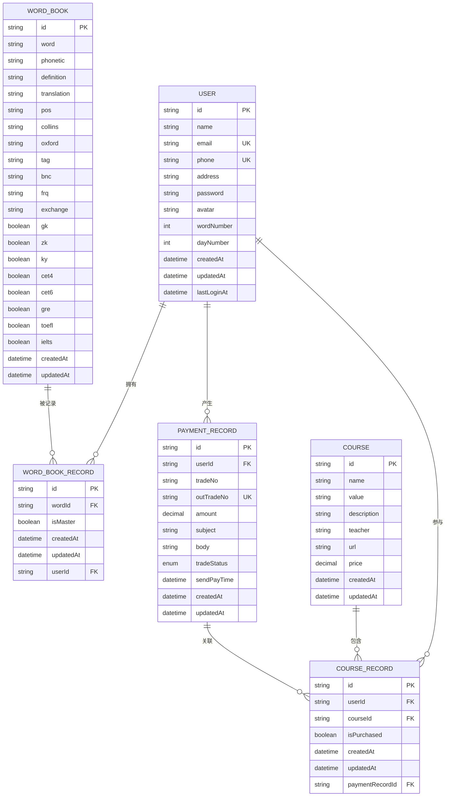
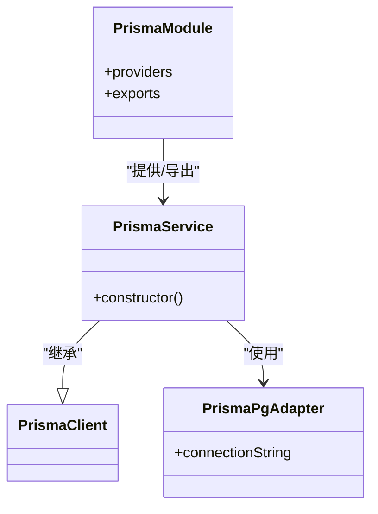
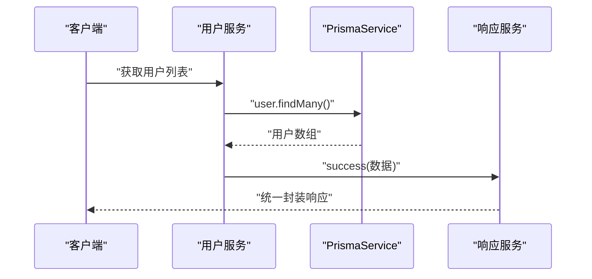
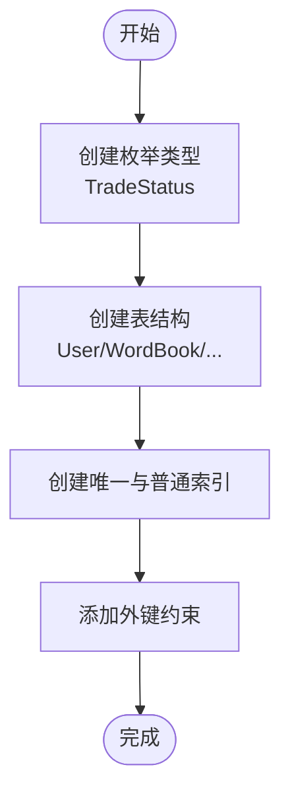
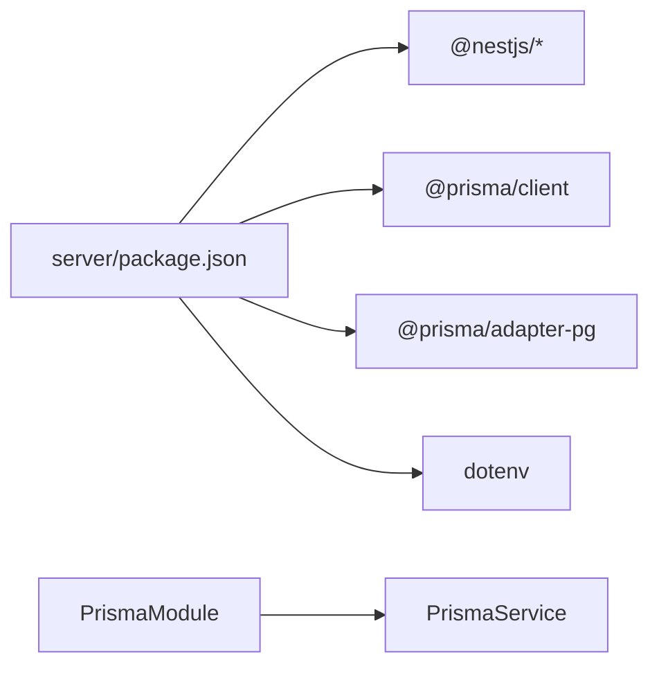

# 数据库设计

<cite>
**本文引用的文件**
- [schema.prisma](file://server/prisma/schema.prisma)
- [migration.sql](file://server/prisma/migrations/20260513053954_init/migration.sql)
- [prisma.config.ts](file://server/prisma.config.ts)
- [prisma.service.ts](file://server/libs/shared/src/prisma/prisma.service.ts)
- [prisma.module.ts](file://server/libs/shared/src/prisma/prisma.module.ts)
- [user.service.ts](file://server/apps/server/src/user/user.service.ts)
- [response.service.ts](file://server/libs/shared/src/response/response.service.ts)
- [create-user.dto.ts](file://server/apps/server/src/user/dto/create-user.dto.ts)
- [update-user.dto.ts](file://server/apps/server/src/user/dto/update-user.dto.ts)
- [chat.service.ts](file://server/apps/ai/src/chat/chat.service.ts)
- [create-chat.dto.ts](file://server/apps/ai/src/chat/dto/create-chat.dto.ts)
- [update-chat.dto.ts](file://server/apps/ai/src/chat/dto/update-chat.dto.ts)
- [user.entity.ts](file://server/apps/server/src/user/entities/user.entity.ts)
- [chat.entity.ts](file://server/apps/ai/src/chat/entities/chat.entity.ts)
- [server/package.json](file://server/package.json)
</cite>

## 目录
1. [简介](#简介)
2. [项目结构](#项目结构)
3. [核心组件](#核心组件)
4. [架构总览](#架构总览)
5. [详细组件分析](#详细组件分析)
6. [依赖分析](#依赖分析)
7. [性能考虑](#性能考虑)
8. [故障排查指南](#故障排查指南)
9. [结论](#结论)
10. [附录](#附录)

## 简介
本文件面向英语学习平台的数据库设计与实现，围绕 Prisma ORM 的配置与使用进行系统化说明。重点覆盖以下方面：
- 数据库模式设计：用户、单词本、单词、支付记录、课程与课程记录等核心实体及其关系。
- 字段定义、约束与索引策略：主键、唯一性、外键、索引与枚举类型。
- 迁移管理、版本控制与数据同步：基于 Prisma Migrate 的迁移流程与配置。
- 数据访问模式与查询优化：Prisma 客户端使用方式、常见查询路径与优化建议。
- 缓存与性能调优：Prisma 加速（Accelerate）能力与实践建议。
- 备份恢复与数据安全：迁移与备份策略、敏感信息保护与最小权限原则。

## 项目结构
本项目采用 Monorepo 结构，数据库层位于 server 工作区，核心由 Prisma Schema、迁移脚本、Prisma 客户端生成物与 NestJS 模块组成；共享模块提供 PrismaService 与响应封装，业务模块通过依赖注入使用 PrismaService 实现数据访问。

图表来源
- [prisma.config.ts:1-15](file://server/prisma.config.ts#L1-L15)
- [schema.prisma:1-133](file://server/prisma/schema.prisma#L1-L133)
- [prisma.module.ts:1-9](file://server/libs/shared/src/prisma/prisma.module.ts#L1-L9)
- [prisma.service.ts:1-18](file://server/libs/shared/src/prisma/prisma.service.ts#L1-L18)
- [user.service.ts:1-34](file://server/apps/server/src/user/user.service.ts#L1-L34)
- [response.service.ts:1-29](file://server/libs/shared/src/response/response.service.ts#L1-L29)

章节来源
- [prisma.config.ts:1-15](file://server/prisma.config.ts#L1-L15)
- [schema.prisma:1-133](file://server/prisma/schema.prisma#L1-L133)
- [prisma.module.ts:1-9](file://server/libs/shared/src/prisma/prisma.module.ts#L1-L9)
- [prisma.service.ts:1-18](file://server/libs/shared/src/prisma/prisma.service.ts#L1-L18)
- [user.service.ts:1-34](file://server/apps/server/src/user/user.service.ts#L1-L34)
- [response.service.ts:1-29](file://server/libs/shared/src/response/response.service.ts#L1-L29)

## 核心组件
- Prisma Schema：定义数据模型、关系、索引与枚举，生成客户端代码。
- Prisma 配置：指定 schema 路径、迁移目录与数据源连接字符串。
- PrismaService：继承 PrismaClient 并通过适配器连接 PostgreSQL。
- 共享模块：导出 PrismaService，供业务模块注入使用。
- 响应服务：统一返回结构，便于前端消费。
- 业务服务：以依赖注入方式使用 PrismaService 执行数据操作。

章节来源
- [schema.prisma:1-133](file://server/prisma/schema.prisma#L1-L133)
- [prisma.config.ts:1-15](file://server/prisma.config.ts#L1-L15)
- [prisma.service.ts:1-18](file://server/libs/shared/src/prisma/prisma.service.ts#L1-L18)
- [prisma.module.ts:1-9](file://server/libs/shared/src/prisma/prisma.module.ts#L1-L9)
- [response.service.ts:1-29](file://server/libs/shared/src/response/response.service.ts#L1-L29)
- [user.service.ts:1-34](file://server/apps/server/src/user/user.service.ts#L1-L34)

## 架构总览
下图展示 Prisma 在系统中的位置与交互：业务模块通过服务层调用 PrismaService，PrismaService 使用适配器连接数据库；Schema 定义模型与关系，迁移脚本在数据库中落地结构。

图表来源
- [user.service.ts:1-34](file://server/apps/server/src/user/user.service.ts#L1-L34)
- [chat.service.ts:1-27](file://server/apps/ai/src/chat/chat.service.ts#L1-L27)
- [response.service.ts:1-29](file://server/libs/shared/src/response/response.service.ts#L1-L29)
- [prisma.module.ts:1-9](file://server/libs/shared/src/prisma/prisma.module.ts#L1-L9)
- [prisma.service.ts:1-18](file://server/libs/shared/src/prisma/prisma.service.ts#L1-L18)

## 详细组件分析

### 数据库模式与实体关系
- 用户表（User）
  - 主键：字符串自增 ID
  - 唯一约束：邮箱、手机号
  - 时间戳：创建与更新时间
  - 关系：一对多到单词本记录、支付记录、课程记录
- 单词本记录（WordBookRecord）
  - 主键：字符串自增 ID
  - 唯一复合索引：用户 ID + 单词 ID
  - 外键：指向用户与单词本
  - 字段：是否掌握、时间戳
- 单词表（WordBook）
  - 主键：字符串自增 ID
  - 索引：单词、标签、单词+标签组合
  - 字段：音标、释义、翻译、词性、各类词典与难度标记、频率等
- 支付记录（PaymentRecord）
  - 主键：字符串自增 ID
  - 唯一约束：外部订单号
  - 枚举：交易状态
  - 索引：第三方交易号
  - 外键：指向用户
- 课程记录（CourseRecord）
  - 主键：字符串自增 ID
  - 唯一复合索引：用户 ID + 课程 ID
  - 外键：指向用户、课程、支付记录
- 课程表（Course）
  - 主键：字符串自增 ID
  - 字段：名称、价值标识、描述、教师、链接、价格、时间戳

图表来源
- [schema.prisma:24-132](file://server/prisma/schema.prisma#L24-L132)

章节来源
- [schema.prisma:24-132](file://server/prisma/schema.prisma#L24-L132)

### Prisma 配置与客户端生成
- 生成器配置：输出目录、模块格式，确保生成的客户端与共享模块兼容。
- 数据源：PostgreSQL 提供商。
- Prisma 配置文件：指定 schema 路径、迁移目录与数据源连接字符串（从环境变量读取）。
- 客户端生成：由 Prisma Schema 推导生成，供业务层直接使用。

章节来源
- [schema.prisma:7-15](file://server/prisma/schema.prisma#L7-L15)
- [prisma.config.ts:6-14](file://server/prisma.config.ts#L6-L14)

### PrismaService 与模块集成
- 适配器：使用 PostgreSQL 适配器，连接字符串来自环境变量。
- 继承 PrismaClient：提供统一的数据访问入口。
- 模块导出：PrismaModule 将 PrismaService 注入到应用生命周期，业务模块通过依赖注入使用。

图表来源
- [prisma.service.ts:6-16](file://server/libs/shared/src/prisma/prisma.service.ts#L6-L16)
- [prisma.module.ts:4-7](file://server/libs/shared/src/prisma/prisma.module.ts#L4-L7)

章节来源
- [prisma.service.ts:1-18](file://server/libs/shared/src/prisma/prisma.service.ts#L1-L18)
- [prisma.module.ts:1-9](file://server/libs/shared/src/prisma/prisma.module.ts#L1-L9)

### 数据访问模式与查询示例
- 用户服务：演示了如何注入 PrismaService 并执行查询（如查询所有用户），随后通过响应服务统一封装返回。
- DTO 与实体：当前实体类为空壳，DTO 用于请求参数结构化，后续可在服务中结合 Prisma 查询实现具体业务逻辑。
- 聊天服务：当前为空实现，未来可扩展为与聊天记录相关的实体与查询。

图表来源
- [user.service.ts:17-20](file://server/apps/server/src/user/user.service.ts#L17-L20)
- [response.service.ts:14-20](file://server/libs/shared/src/response/response.service.ts#L14-L20)

章节来源
- [user.service.ts:1-34](file://server/apps/server/src/user/user.service.ts#L1-L34)
- [response.service.ts:1-29](file://server/libs/shared/src/response/response.service.ts#L1-L29)
- [create-user.dto.ts:1-2](file://server/apps/server/src/user/dto/create-user.dto.ts#L1-L2)
- [update-user.dto.ts:1-5](file://server/apps/server/src/user/dto/update-user.dto.ts#L1-L5)
- [user.entity.ts:1-2](file://server/apps/server/src/user/entities/user.entity.ts#L1-L2)
- [chat.entity.ts:1-2](file://server/apps/ai/src/chat/entities/chat.entity.ts#L1-L2)

### 迁移管理与版本控制
- 迁移脚本：首次初始化迁移脚本定义了枚举类型、表结构、索引与外键约束。
- 约束与索引：唯一索引（邮箱、手机号、外部订单号、用户+单词、用户+课程）、普通索引（单词、标签、单词+标签、第三方交易号）。
- 外键关系：确保参照完整性，删除策略为级联删除。

图表来源
- [migration.sql:1-151](file://server/prisma/migrations/20260513053954_init/migration.sql#L1-L151)

章节来源
- [migration.sql:1-151](file://server/prisma/migrations/20260513053954_init/migration.sql#L1-L151)

### 数据同步机制
- 基于 Prisma Migrate：通过迁移脚本在数据库中同步结构变更，保证开发与生产环境一致。
- 环境变量驱动：连接字符串来自环境变量，便于在不同环境切换。
- 生成客户端：Prisma 根据 Schema 生成强类型客户端，减少手写 SQL 错误。

章节来源
- [prisma.config.ts:6-14](file://server/prisma.config.ts#L6-L14)
- [prisma.service.ts:9-11](file://server/libs/shared/src/prisma/prisma.service.ts#L9-L11)

### 查询优化策略
- 索引策略：为高频查询字段建立索引（如单词、标签、外部订单号），避免全表扫描。
- 复合唯一索引：防止重复记录（用户+单词、用户+课程）。
- 关系查询：利用 Prisma 的关系加载能力，按需选择关联字段，减少不必要的 JOIN。
- 分页与限制：对列表查询使用分页与大小限制，避免一次性返回大量数据。
- 枚举与默认值：使用枚举统一状态，合理设置默认值，降低空值处理复杂度。

章节来源
- [schema.prisma:54,83-86,103,118-119,125-126,132](file://server/prisma/schema.prisma#L54,L83-L86,L103,L118-L119,L125-L126,L132)
- [migration.sql:107-133](file://server/prisma/migrations/20260513053954_init/migration.sql#L107-L133)

### 缓存设计建议
- 应用层缓存：对热点查询结果（如单词详情、用户基本信息）进行短期缓存，降低数据库压力。
- Prisma 加速（Accelerate）：可选启用加速功能以提升查询性能与弹性扩展能力。
- 读写分离：在高并发场景下考虑读写分离与只读副本，减轻主库压力。

章节来源
- [schema.prisma:4-5](file://server/prisma/schema.prisma#L4-L5)

## 依赖分析
- 依赖关系：业务服务依赖共享模块提供的 PrismaService；PrismaService 依赖 PostgreSQL 适配器与 Prisma 客户端。
- 外部依赖：NestJS、Prisma Adapter、Prisma Client、dotenv。
- 包管理：server 工作区的 package.json 管理依赖与脚本。

图表来源
- [server/package.json:22-35](file://server/package.json#L22-L35)
- [prisma.module.ts:1-9](file://server/libs/shared/src/prisma/prisma.module.ts#L1-L9)
- [prisma.service.ts:1-18](file://server/libs/shared/src/prisma/prisma.service.ts#L1-L18)

章节来源
- [server/package.json:1-52](file://server/package.json#L1-L52)

## 性能考虑
- 查询优化
  - 为高频过滤与排序字段建立索引，避免隐式转换导致的索引失效。
  - 使用 select 限定字段，避免 * 查询。
  - 对大列表使用分页与游标分页，控制单次返回量。
- 写入优化
  - 批量插入/更新时使用事务，减少往返次数。
  - 合理拆分宽表，避免单条记录过大。
- 连接与资源
  - 控制连接池大小，避免过度占用数据库资源。
  - 启用连接复用与超时重试策略。
- 加速与扩展
  - 考虑 Prisma 加速（Accelerate）以获得更好的查询性能与弹性。
  - 在高并发场景下引入只读副本与读写分离。

## 故障排查指南
- 连接问题
  - 检查 DATABASE_URL 环境变量是否正确配置。
  - 确认数据库可达且凭据有效。
- 迁移失败
  - 查看迁移日志与冲突原因，必要时回滚或修复迁移。
  - 确保 schema.prisma 与迁移脚本一致。
- 查询异常
  - 检查索引是否存在，确认查询条件是否命中索引。
  - 使用 EXPLAIN 分析慢查询，定位瓶颈。
- 返回格式
  - 使用响应服务统一封装返回，便于前端处理与错误识别。

章节来源
- [prisma.service.ts:9-11](file://server/libs/shared/src/prisma/prisma.service.ts#L9-L11)
- [response.service.ts:14-27](file://server/libs/shared/src/response/response.service.ts#L14-L27)

## 结论
本设计以 Prisma 为核心，通过 Schema 明确实体关系与约束，借助迁移脚本实现结构版本化管理，并通过共享模块提供统一的数据访问入口。配合合理的索引策略与查询优化，可满足英语学习平台的核心业务需求。建议在生产环境中进一步完善缓存与加速配置，并持续关注查询性能与数据一致性。

## 附录
- 开发与运行
  - 使用 Nest CLI 进行构建与启动，支持开发模式与调试模式。
  - 通过 Prisma CLI 管理迁移与客户端生成。
- 安全与合规
  - 严格管理 DATABASE_URL 等敏感信息，避免泄露。
  - 采用最小权限原则，限制数据库账号权限范围。
  - 定期备份数据库，制定灾难恢复预案。

章节来源
- [server/package.json:8-21](file://server/package.json#L8-L21)