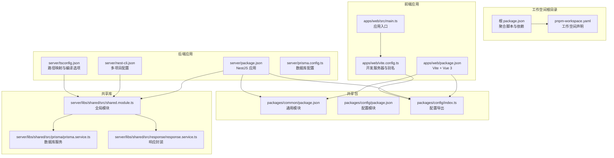
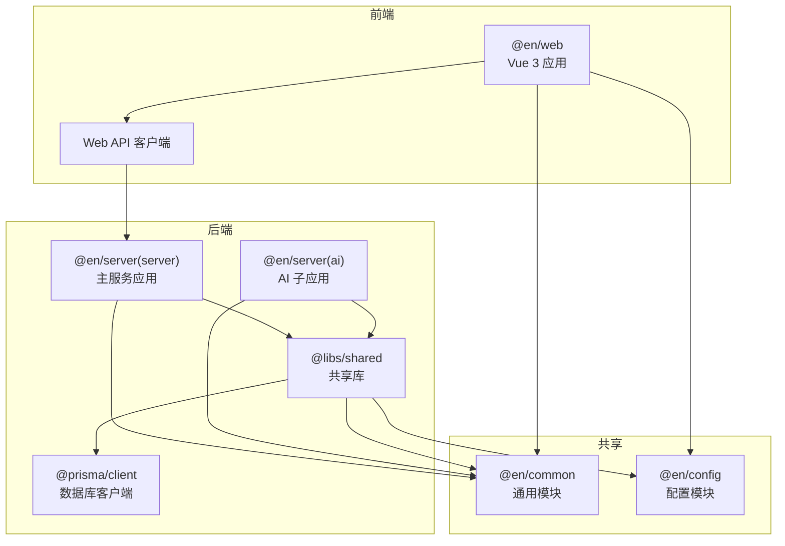
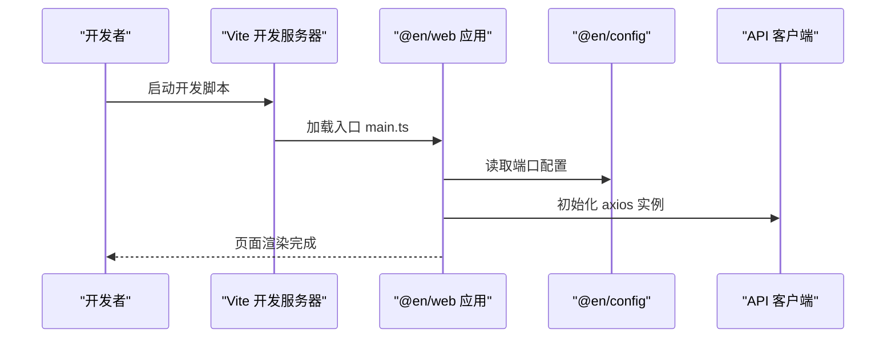
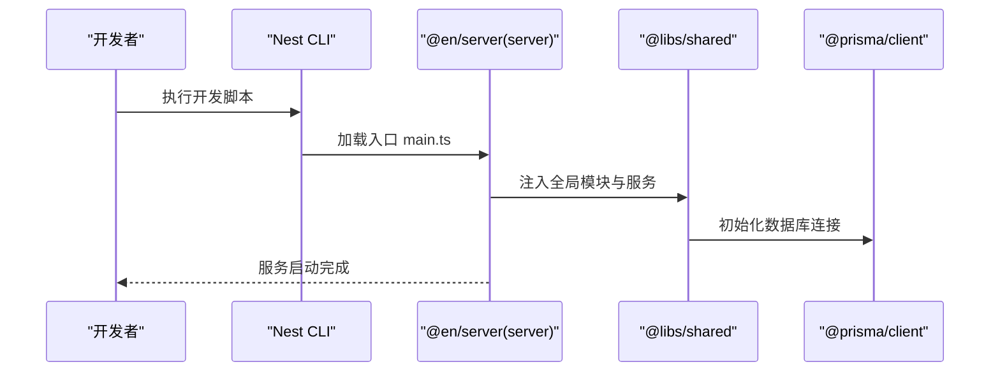
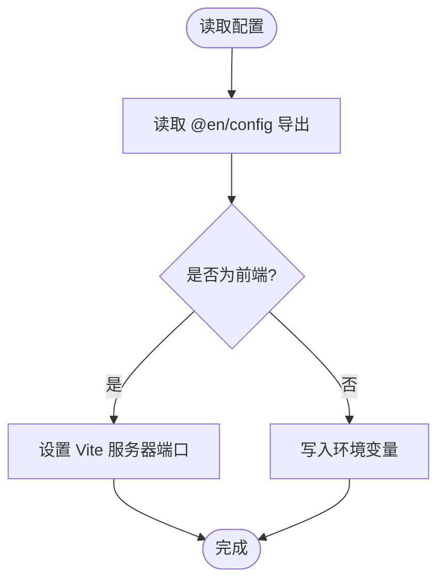
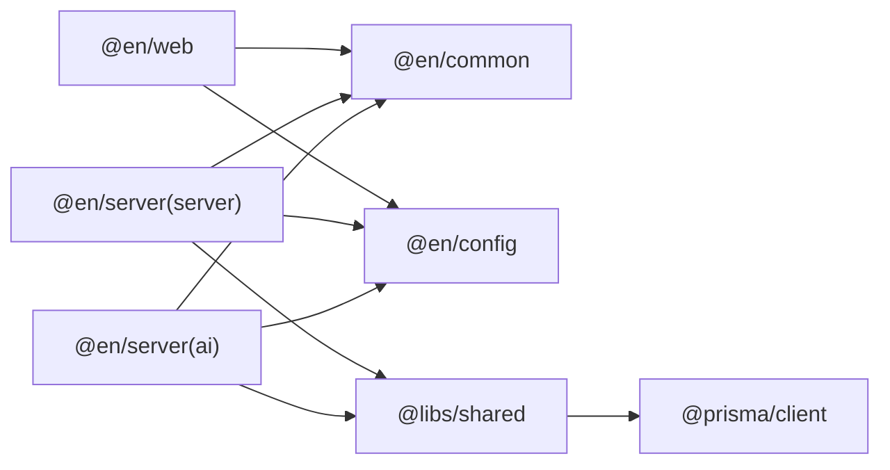

# Monorepo架构设计

<cite>
**本文档引用的文件**
- [package.json](file://package.json)
- [pnpm-workspace.yaml](file://pnpm-workspace.yaml)
- [apps/web/package.json](file://apps/web/package.json)
- [apps/web/vite.config.ts](file://apps/web/vite.config.ts)
- [apps/web/src/main.ts](file://apps/web/src/main.ts)
- [apps/web/src/apis/index.ts](file://apps/web/src/apis/index.ts)
- [apps/web/tsconfig.json](file://apps/web/tsconfig.json)
- [server/package.json](file://server/package.json)
- [server/nest-cli.json](file://server/nest-cli.json)
- [server/tsconfig.json](file://server/tsconfig.json)
- [server/prisma.config.ts](file://server/prisma.config.ts)
- [server/libs/shared/src/shared.module.ts](file://server/libs/shared/src/shared.module.ts)
- [server/libs/shared/src/prisma/prisma.service.ts](file://server/libs/shared/src/prisma/prisma.service.ts)
- [server/libs/shared/src/response/response.service.ts](file://server/libs/shared/src/response/response.service.ts)
- [packages/common/package.json](file://packages/common/package.json)
- [packages/config/package.json](file://packages/config/package.json)
- [packages/config/index.ts](file://packages/config/index.ts)
</cite>

## 目录
1. [简介](#简介)
2. [项目结构](#项目结构)
3. [核心组件](#核心组件)
4. [架构总览](#架构总览)
5. [详细组件分析](#详细组件分析)
6. [依赖关系分析](#依赖关系分析)
7. [性能考虑](#性能考虑)
8. [故障排除指南](#故障排除指南)
9. [结论](#结论)
10. [附录](#附录)

## 简介
本项目采用 pnpm workspace 的 Monorepo 架构，统一管理前端应用、后端 NestJS 应用、共享配置与通用工具包。通过工作空间的集中依赖管理与构建脚本，实现跨包复用、版本一致性与开发效率提升。本文档将深入解析 pnpm 工作空间原理、包管理策略、依赖解析机制，并对 apps/web、apps/server、packages/common、packages/config 的职责进行详细说明，同时提供配置示例与最佳实践。

## 项目结构
项目采用按功能域分层的目录组织方式：
- apps/web：基于 Vue 3 + Vite 的前端单页应用，负责用户界面与交互逻辑
- apps/server：基于 NestJS 的后端应用，包含多个子项目（ai、server）与共享库（shared）
- packages/common：通用业务与工具模块，供前后端复用
- packages/config：统一配置中心，提供端口等运行时配置

**图表来源**
- [pnpm-workspace.yaml:1-10](file://pnpm-workspace.yaml#L1-L10)
- [apps/web/package.json:1-45](file://apps/web/package.json#L1-L45)
- [apps/web/vite.config.ts:1-25](file://apps/web/vite.config.ts#L1-L25)
- [apps/web/src/main.ts:1-21](file://apps/web/src/main.ts#L1-L21)
- [server/package.json:1-52](file://server/package.json#L1-L52)
- [server/nest-cli.json:1-43](file://server/nest-cli.json#L1-L43)
- [server/tsconfig.json:1-35](file://server/tsconfig.json#L1-L35)
- [server/prisma.config.ts:1-15](file://server/prisma.config.ts#L1-L15)
- [packages/config/package.json:1-24](file://packages/config/package.json#L1-L24)
- [packages/config/index.ts:1-8](file://packages/config/index.ts#L1-L8)
- [server/libs/shared/src/shared.module.ts:1-13](file://server/libs/shared/src/shared.module.ts#L1-L13)
- [server/libs/shared/src/prisma/prisma.service.ts:1-18](file://server/libs/shared/src/prisma/prisma.service.ts#L1-L18)
- [server/libs/shared/src/response/response.service.ts:1-29](file://server/libs/shared/src/response/response.service.ts#L1-L29)

**章节来源**
- [pnpm-workspace.yaml:1-10](file://pnpm-workspace.yaml#L1-L10)
- [package.json:1-15](file://package.json#L1-L15)

## 核心组件
- pnpm 工作空间：通过 pnpm-workspace.yaml 声明 apps/*、packages/*、server 为工作空间成员，启用本地包链接与共享缓存，减少磁盘占用并加速安装。
- 前端应用（apps/web）：基于 Vite + Vue 3，使用 Pinia 状态管理、Element Plus 组件库与 TailwindCSS 样式框架；通过 workspace:* 依赖 packages/common 与 packages/config。
- 后端应用（apps/server）：基于 NestJS，包含 ai 与 server 两个应用以及 shared 共享库；通过 workspace:* 依赖 packages/common 与 packages/config。
- 共享包（packages/common、packages/config）：common 提供通用业务模块，config 提供统一配置导出（如端口），支持在前端与后端之间共享。
- 共享库（server/libs/shared）：提供全局模块、Prisma 数据库服务与统一响应封装，供后端各应用复用。

**章节来源**
- [apps/web/package.json:13-29](file://apps/web/package.json#L13-L29)
- [server/package.json:22-35](file://server/package.json#L22-L35)
- [packages/common/package.json:1-21](file://packages/common/package.json#L1-L21)
- [packages/config/package.json:1-24](file://packages/config/package.json#L1-L24)

## 架构总览
下图展示了 Monorepo 中各包之间的依赖流向与运行时交互：

**图表来源**
- [apps/web/package.json:13-29](file://apps/web/package.json#L13-L29)
- [apps/web/src/apis/index.ts:1-6](file://apps/web/src/apis/index.ts#L1-L6)
- [server/package.json:22-35](file://server/package.json#L22-L35)
- [server/libs/shared/src/shared.module.ts:1-13](file://server/libs/shared/src/shared.module.ts#L1-L13)
- [server/libs/shared/src/prisma/prisma.service.ts:1-18](file://server/libs/shared/src/prisma/prisma.service.ts#L1-L18)
- [packages/config/index.ts:1-8](file://packages/config/index.ts#L1-L8)

## 详细组件分析

### 前端应用（apps/web）
- 包管理与脚本：通过 workspace:* 依赖 packages/common 与 packages/config，确保版本一致性与本地开发调试。
- 开发配置：Vite 配置读取 @en/config 中的端口设置，设置路径别名 @ 指向 src，集成 Vue 插件与 TailwindCSS。
- 应用入口：初始化 Pinia（含持久化插件）、Element Plus、路由并挂载应用。
- API 客户端：基于 axios 创建带基础路径与超时的实例，指向后端服务端口。

**图表来源**
- [apps/web/vite.config.ts:10-24](file://apps/web/vite.config.ts#L10-L24)
- [apps/web/src/main.ts:1-21](file://apps/web/src/main.ts#L1-L21)
- [apps/web/src/apis/index.ts:1-6](file://apps/web/src/apis/index.ts#L1-L6)
- [packages/config/index.ts:1-8](file://packages/config/index.ts#L1-L8)

**章节来源**
- [apps/web/package.json:13-29](file://apps/web/package.json#L13-L29)
- [apps/web/vite.config.ts:1-25](file://apps/web/vite.config.ts#L1-L25)
- [apps/web/src/main.ts:1-21](file://apps/web/src/main.ts#L1-L21)
- [apps/web/src/apis/index.ts:1-6](file://apps/web/src/apis/index.ts#L1-L6)

### 后端应用（apps/server）
- 多项目配置：nest-cli.json 声明 ai、server 两个应用与 shared 共享库，支持 monorepo 模式。
- 脚本与构建：提供开发、调试、测试与构建脚本，使用 Nest CLI 编译 TypeScript。
- 共享库：shared 模块导出全局服务与模块，PrismaService 使用环境变量连接数据库，ResponseService 提供统一响应格式。
- 配置：prisma.config.ts 从环境变量加载 DATABASE_URL，指定 schema 与 migrations 路径。

**图表来源**
- [server/nest-cli.json:14-42](file://server/nest-cli.json#L14-L42)
- [server/libs/shared/src/shared.module.ts:1-13](file://server/libs/shared/src/shared.module.ts#L1-L13)
- [server/libs/shared/src/prisma/prisma.service.ts:1-18](file://server/libs/shared/src/prisma/prisma.service.ts#L1-L18)
- [server/prisma.config.ts:1-15](file://server/prisma.config.ts#L1-L15)

**章节来源**
- [server/package.json:8-21](file://server/package.json#L8-L21)
- [server/nest-cli.json:1-43](file://server/nest-cli.json#L1-L43)
- [server/libs/shared/src/shared.module.ts:1-13](file://server/libs/shared/src/shared.module.ts#L1-L13)
- [server/libs/shared/src/prisma/prisma.service.ts:1-18](file://server/libs/shared/src/prisma/prisma.service.ts#L1-L18)
- [server/prisma.config.ts:1-15](file://server/prisma.config.ts#L1-L15)

### 共享包（packages/common 与 packages/config）
- packages/common：作为通用模块，供前端与后端复用，建议存放跨应用的业务实体、工具函数或常量定义。
- packages/config：集中导出运行时配置（如端口），前端通过 Vite 配置读取，后端通过环境变量与 Prisma 配置使用。

**图表来源**
- [packages/config/index.ts:1-8](file://packages/config/index.ts#L1-L8)
- [apps/web/vite.config.ts:10-18](file://apps/web/vite.config.ts#L10-L18)
- [server/prisma.config.ts:6-14](file://server/prisma.config.ts#L6-L14)

**章节来源**
- [packages/common/package.json:1-21](file://packages/common/package.json#L1-L21)
- [packages/config/package.json:1-24](file://packages/config/package.json#L1-L24)
- [packages/config/index.ts:1-8](file://packages/config/index.ts#L1-L8)

## 依赖关系分析
- 本地包链接：apps/web 与 apps/server 通过 workspace:* 依赖 packages/common 与 packages/config，避免重复安装并保证版本一致。
- 跨应用依赖：后端共享库 shared 同时被 ai 与 server 应用依赖，PrismaService 与 ResponseService 在共享模块中集中管理。
- 类型与路径：server/tsconfig.json 定义了 @libs/shared 路径映射，便于在 NestJS 应用中引用共享库源码。

**图表来源**
- [apps/web/package.json:15-16](file://apps/web/package.json#L15-L16)
- [apps/web/package.json:23-24](file://apps/web/package.json#L23-L24)
- [server/package.json:23-24](file://server/package.json#L23-L24)
- [server/package.json:25-26](file://server/package.json#L25-L26)
- [server/tsconfig.json:25-32](file://server/tsconfig.json#L25-L32)

**章节来源**
- [apps/web/package.json:13-29](file://apps/web/package.json#L13-L29)
- [server/package.json:22-35](file://server/package.json#L22-L35)
- [server/tsconfig.json:25-32](file://server/tsconfig.json#L25-L32)

## 性能考虑
- 依赖去重与共享缓存：pnpm 通过硬链接与符号链接减少重复依赖，显著降低磁盘占用与安装时间。
- 本地包链接：workspace:* 依赖避免复制安装，提升开发时的热更新与调试效率。
- 并行构建：根 package.json 提供并发启动脚本，可同时启动前端与后端服务，缩短联调等待时间。
- 编译优化：前端使用 Vite 快速冷启动与热更新；后端使用 Nest CLI 编译，结合 tsconfig 的严格模式与增量编译提升构建稳定性。

## 故障排除指南
- 端口冲突：前端与后端端口由 @en/config 统一管理，若启动失败请检查配置导出与环境变量是否正确加载。
- 数据库连接失败：确认 DATABASE_URL 环境变量已正确设置，Prisma 配置文件指向正确的 schema 与 migrations 路径。
- 路径解析错误：检查 server/tsconfig.json 中 @libs/shared 的路径映射，确保与实际目录结构一致。
- 依赖未解析：执行 pnpm install 后清理 node_modules 并重新安装，确保 workspace:* 依赖正确解析。

**章节来源**
- [packages/config/index.ts:1-8](file://packages/config/index.ts#L1-L8)
- [server/prisma.config.ts:6-14](file://server/prisma.config.ts#L6-L14)
- [server/tsconfig.json:25-32](file://server/tsconfig.json#L25-L32)

## 结论
本项目的 Monorepo 架构通过 pnpm workspace 将前端、后端与共享模块有机整合，实现了依赖统一管理、版本一致性与高效开发体验。配合 NestJS 的模块化设计与 Vite 的快速开发能力，能够支撑从原型到生产的全链路迭代。建议持续完善共享模块的抽象与测试覆盖，规范配置管理与环境变量治理，以进一步提升系统的可维护性与扩展性。

## 附录
- 常用命令
  - 启动前端：pnpm run web
  - 启动后端主服务：pnpm run server
  - 启动 AI 子服务：pnpm run ai
  - 同时启动全部：pnpm run all
- 配置要点
  - pnpm-workspace.yaml 声明工作空间成员与允许构建的包
  - apps/web/vite.config.ts 读取 @en/config 端口配置
  - server/nest-cli.json 声明多项目与共享库
  - server/prisma.config.ts 从环境变量加载数据库连接