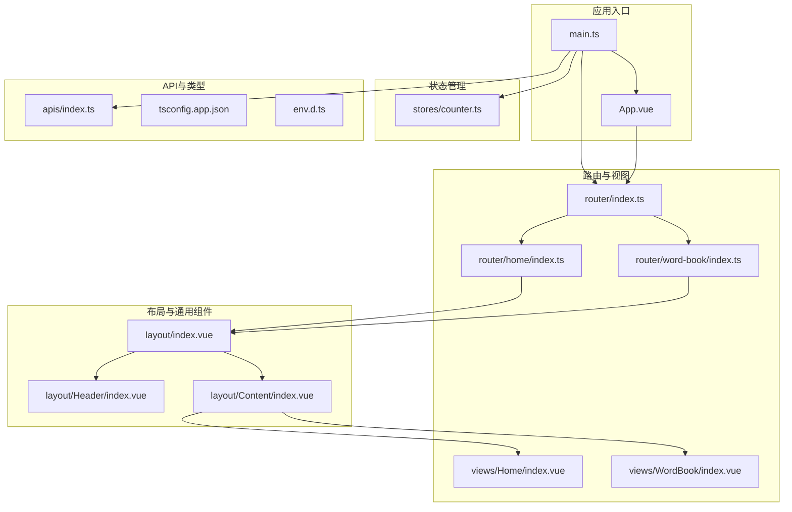
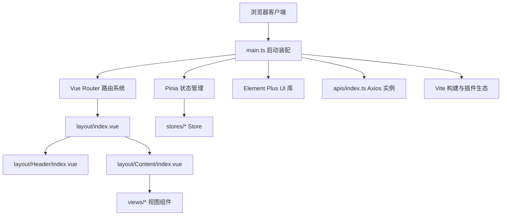
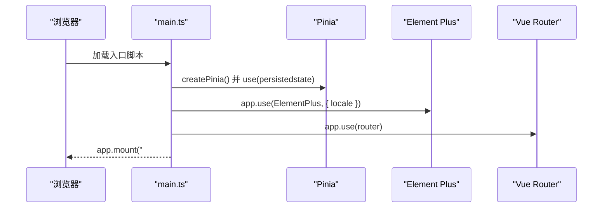
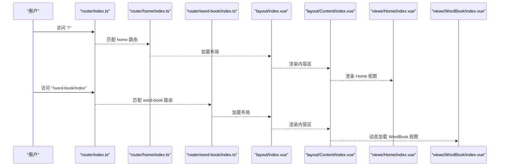
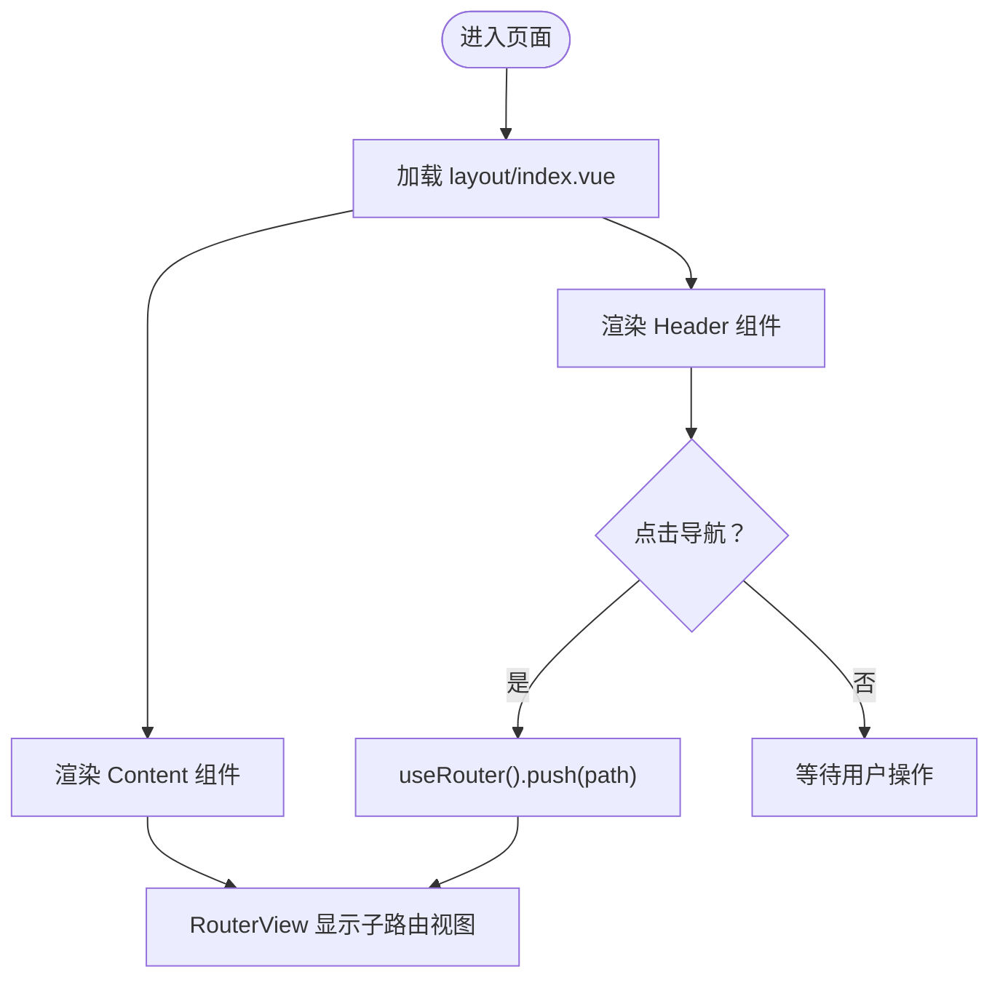
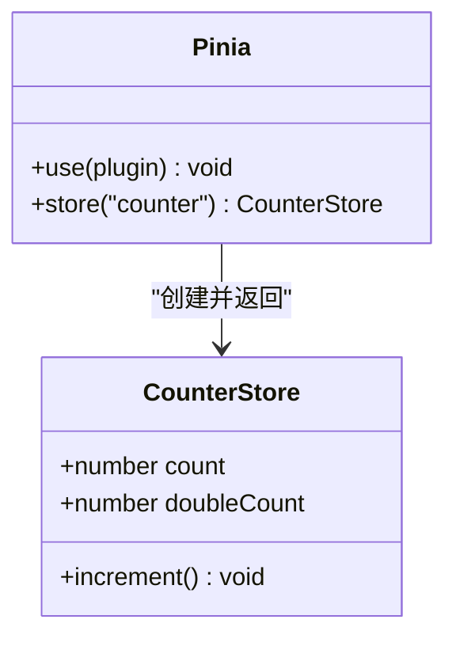
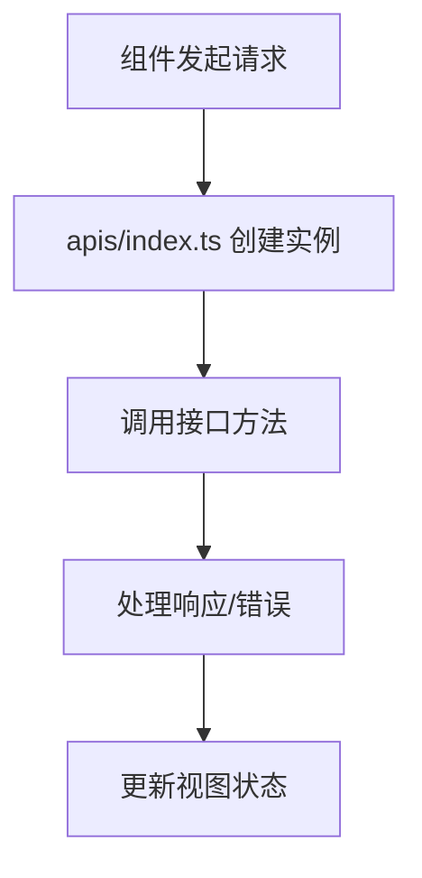
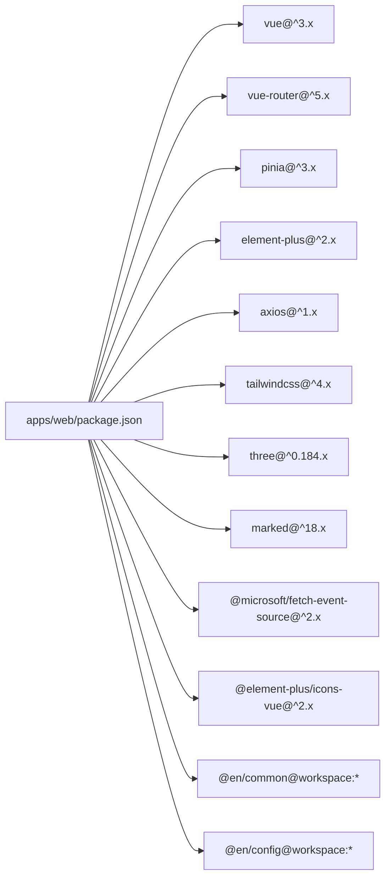

# 前端架构设计

<cite>
**本文引用的文件**
- [apps/web/package.json](file://apps/web/package.json)
- [apps/web/vite.config.ts](file://apps/web/vite.config.ts)
- [apps/web/src/main.ts](file://apps/web/src/main.ts)
- [apps/web/src/App.vue](file://apps/web/src/App.vue)
- [apps/web/src/stores/counter.ts](file://apps/web/src/stores/counter.ts)
- [apps/web/src/router/index.ts](file://apps/web/src/router/index.ts)
- [apps/web/src/router/home/index.ts](file://apps/web/src/router/home/index.ts)
- [apps/web/src/router/word-book/index.ts](file://apps/web/src/router/word-book/index.ts)
- [apps/web/src/layout/index.vue](file://apps/web/src/layout/index.vue)
- [apps/web/src/layout/Header/index.vue](file://apps/web/src/layout/Header/index.vue)
- [apps/web/src/layout/Content/index.vue](file://apps/web/src/layout/Content/index.vue)
- [apps/web/src/views/Home/index.vue](file://apps/web/src/views/Home/index.vue)
- [apps/web/src/views/WordBook/index.vue](file://apps/web/src/views/WordBook/index.vue)
- [apps/web/src/apis/index.ts](file://apps/web/src/apis/index.ts)
- [apps/web/env.d.ts](file://apps/web/env.d.ts)
- [apps/web/tsconfig.app.json](file://apps/web/tsconfig.app.json)
</cite>

## 目录
1. [引言](#引言)
2. [项目结构](#项目结构)
3. [核心组件](#核心组件)
4. [架构总览](#架构总览)
5. [详细组件分析](#详细组件分析)
6. [依赖分析](#依赖分析)
7. [性能考虑](#性能考虑)
8. [故障排查指南](#故障排查指南)
9. [结论](#结论)
10. [附录](#附录)

## 引言
本文件面向英语学习平台的前端架构，围绕基于 Vue 3 的单页应用进行系统化梳理。内容涵盖应用启动流程、路由与布局体系、状态管理（Pinia）、API 集成模式、TypeScript 类型支持、构建与开发工具链，以及可扩展的设计原则与最佳实践。目标是帮助开发者快速理解整体设计，并在现有基础上进行功能扩展与维护。

## 项目结构
该前端工程位于 apps/web，采用“按功能域分层”的目录组织方式：
- 根入口与运行时：main.ts、App.vue
- 路由与视图：router、views
- 布局与通用组件：layout、components
- 状态管理：stores
- API 客户端：apis
- 构建与类型配置：vite.config.ts、tsconfig.*、env.d.ts
- 依赖与脚本：package.json

图表来源
- [apps/web/src/main.ts:1-21](file://apps/web/src/main.ts#L1-L21)
- [apps/web/src/App.vue:1-11](file://apps/web/src/App.vue#L1-L11)
- [apps/web/src/router/index.ts:1-13](file://apps/web/src/router/index.ts#L1-L13)
- [apps/web/src/router/home/index.ts:1-12](file://apps/web/src/router/home/index.ts#L1-L12)
- [apps/web/src/router/word-book/index.ts:1-11](file://apps/web/src/router/word-book/index.ts#L1-L11)
- [apps/web/src/layout/index.vue:1-8](file://apps/web/src/layout/index.vue#L1-L8)
- [apps/web/src/layout/Header/index.vue:1-54](file://apps/web/src/layout/Header/index.vue#L1-L54)
- [apps/web/src/layout/Content/index.vue:1-7](file://apps/web/src/layout/Content/index.vue#L1-L7)
- [apps/web/src/views/Home/index.vue:1-7](file://apps/web/src/views/Home/index.vue#L1-L7)
- [apps/web/src/views/WordBook/index.vue:1-7](file://apps/web/src/views/WordBook/index.vue#L1-L7)
- [apps/web/src/stores/counter.ts:1-13](file://apps/web/src/stores/counter.ts#L1-L13)
- [apps/web/src/apis/index.ts:1-6](file://apps/web/src/apis/index.ts#L1-L6)
- [apps/web/tsconfig.app.json:1-15](file://apps/web/tsconfig.app.json#L1-L15)
- [apps/web/env.d.ts:1-2](file://apps/web/env.d.ts#L1-L2)

章节来源
- [apps/web/package.json:1-45](file://apps/web/package.json#L1-L45)
- [apps/web/vite.config.ts:1-25](file://apps/web/vite.config.ts#L1-L25)
- [apps/web/src/main.ts:1-21](file://apps/web/src/main.ts#L1-L21)
- [apps/web/src/App.vue:1-11](file://apps/web/src/App.vue#L1-L11)

## 核心组件
- 应用启动与全局配置：在入口中初始化 Vue 实例、挂载 Pinia、注册 Element Plus 并注入路由。
- 路由系统：集中式路由注册，主路由聚合子模块路由；首页与词库页面通过统一布局容器承载。
- 布局体系：顶部导航 Header + 内容区 Content 的双层布局，Content 使用 RouterView 承载当前视图。
- 状态管理：基于 Composition API 的 Pinia Store，示例包含计数器与派生计算。
- API 客户端：基于 axios 的基础实例，统一配置基础路径与超时。
- 类型支持：tsconfig 中启用 Vue DOM 类型与 Element Plus 全局类型，路径别名配置便于模块导入。

章节来源
- [apps/web/src/main.ts:1-21](file://apps/web/src/main.ts#L1-L21)
- [apps/web/src/router/index.ts:1-13](file://apps/web/src/router/index.ts#L1-L13)
- [apps/web/src/layout/index.vue:1-8](file://apps/web/src/layout/index.vue#L1-L8)
- [apps/web/src/layout/Header/index.vue:1-54](file://apps/web/src/layout/Header/index.vue#L1-L54)
- [apps/web/src/layout/Content/index.vue:1-7](file://apps/web/src/layout/Content/index.vue#L1-L7)
- [apps/web/src/stores/counter.ts:1-13](file://apps/web/src/stores/counter.ts#L1-L13)
- [apps/web/src/apis/index.ts:1-6](file://apps/web/src/apis/index.ts#L1-L6)
- [apps/web/tsconfig.app.json:1-15](file://apps/web/tsconfig.app.json#L1-L15)
- [apps/web/env.d.ts:1-2](file://apps/web/env.d.ts#L1-L2)

## 架构总览
应用采用“入口装配 + 路由驱动 + 统一布局 + 状态持久化”的架构风格。Element Plus 提供 UI 基础能力，TailwindCSS 提供样式工具集，Vite 提供开发与构建支持。

图表来源
- [apps/web/src/main.ts:1-21](file://apps/web/src/main.ts#L1-L21)
- [apps/web/src/router/index.ts:1-13](file://apps/web/src/router/index.ts#L1-L13)
- [apps/web/src/layout/index.vue:1-8](file://apps/web/src/layout/index.vue#L1-L8)
- [apps/web/src/layout/Header/index.vue:1-54](file://apps/web/src/layout/Header/index.vue#L1-L54)
- [apps/web/src/layout/Content/index.vue:1-7](file://apps/web/src/layout/Content/index.vue#L1-L7)
- [apps/web/src/views/Home/index.vue:1-7](file://apps/web/src/views/Home/index.vue#L1-L7)
- [apps/web/src/views/WordBook/index.vue:1-7](file://apps/web/src/views/WordBook/index.vue#L1-L7)
- [apps/web/src/stores/counter.ts:1-13](file://apps/web/src/stores/counter.ts#L1-L13)
- [apps/web/src/apis/index.ts:1-6](file://apps/web/src/apis/index.ts#L1-L6)
- [apps/web/vite.config.ts:1-25](file://apps/web/vite.config.ts#L1-L25)

## 详细组件分析

### 应用入口与全局装配
- 初始化顺序：创建应用实例 → 注册 Pinia（含持久化插件）→ 注册 Element Plus（本地化）→ 注册路由 → 挂载根节点。
- 路径别名：@ 指向 src，简化模块导入。
- 插件生态：Vue 开发工具、TailwindCSS 集成。

图表来源
- [apps/web/src/main.ts:1-21](file://apps/web/src/main.ts#L1-L21)

章节来源
- [apps/web/src/main.ts:1-21](file://apps/web/src/main.ts#L1-L21)
- [apps/web/vite.config.ts:1-25](file://apps/web/vite.config.ts#L1-L25)

### 路由系统与页面组织
- 路由聚合：主路由文件引入 home 与 word-book 子路由，形成模块化路由结构。
- 布局嵌套：各页面均包裹统一布局组件，子路由通过 RouterView 渲染具体视图。
- 动态加载：词库页面采用动态导入以优化首屏体积。

图表来源
- [apps/web/src/router/index.ts:1-13](file://apps/web/src/router/index.ts#L1-L13)
- [apps/web/src/router/home/index.ts:1-12](file://apps/web/src/router/home/index.ts#L1-L12)
- [apps/web/src/router/word-book/index.ts:1-11](file://apps/web/src/router/word-book/index.ts#L1-L11)
- [apps/web/src/layout/index.vue:1-8](file://apps/web/src/layout/index.vue#L1-L8)
- [apps/web/src/layout/Content/index.vue:1-7](file://apps/web/src/layout/Content/index.vue#L1-L7)
- [apps/web/src/views/Home/index.vue:1-7](file://apps/web/src/views/Home/index.vue#L1-L7)
- [apps/web/src/views/WordBook/index.vue:1-7](file://apps/web/src/views/WordBook/index.vue#L1-L7)

章节来源
- [apps/web/src/router/index.ts:1-13](file://apps/web/src/router/index.ts#L1-L13)
- [apps/web/src/router/home/index.ts:1-12](file://apps/web/src/router/home/index.ts#L1-L12)
- [apps/web/src/router/word-book/index.ts:1-11](file://apps/web/src/router/word-book/index.ts#L1-L11)
- [apps/web/src/layout/index.vue:1-8](file://apps/web/src/layout/index.vue#L1-L8)
- [apps/web/src/layout/Content/index.vue:1-7](file://apps/web/src/layout/Content/index.vue#L1-L7)
- [apps/web/src/views/Home/index.vue:1-7](file://apps/web/src/views/Home/index.vue#L1-L7)
- [apps/web/src/views/WordBook/index.vue:1-7](file://apps/web/src/views/WordBook/index.vue#L1-L7)

### 布局架构与导航
- Header：包含品牌标识、主导航项（主页、AI、词库、课程、设置），以及用户信息区域。
- Content：作为 RouterView 的承载容器，负责渲染当前路由对应的视图。
- 导航交互：通过 vue-router 的 useRouter 进行编程式导航。

图表来源
- [apps/web/src/layout/index.vue:1-8](file://apps/web/src/layout/index.vue#L1-L8)
- [apps/web/src/layout/Header/index.vue:1-54](file://apps/web/src/layout/Header/index.vue#L1-L54)
- [apps/web/src/layout/Content/index.vue:1-7](file://apps/web/src/layout/Content/index.vue#L1-L7)

章节来源
- [apps/web/src/layout/index.vue:1-8](file://apps/web/src/layout/index.vue#L1-L8)
- [apps/web/src/layout/Header/index.vue:1-54](file://apps/web/src/layout/Header/index.vue#L1-L54)
- [apps/web/src/layout/Content/index.vue:1-7](file://apps/web/src/layout/Content/index.vue#L1-L7)

### 状态管理（Pinia）
- Store 设计：使用 Composition API 风格的 defineStore，导出可组合函数以便在组件中直接使用。
- 示例：计数器 Store 包含响应式状态、派生状态与动作方法。
- 持久化：通过 pinia-plugin-persistedstate 将状态写入持久化存储，提升用户体验。

图表来源
- [apps/web/src/stores/counter.ts:1-13](file://apps/web/src/stores/counter.ts#L1-L13)
- [apps/web/src/main.ts:1-21](file://apps/web/src/main.ts#L1-L21)

章节来源
- [apps/web/src/stores/counter.ts:1-13](file://apps/web/src/stores/counter.ts#L1-L13)
- [apps/web/src/main.ts:1-21](file://apps/web/src/main.ts#L1-L21)

### API 集成模式
- Axios 实例：统一配置 baseURL 与超时时间，便于后续拦截器与错误处理扩展。
- 使用建议：在 views 或 composables 中封装业务请求，避免直接在组件内分散调用。

图表来源
- [apps/web/src/apis/index.ts:1-6](file://apps/web/src/apis/index.ts#L1-L6)

章节来源
- [apps/web/src/apis/index.ts:1-6](file://apps/web/src/apis/index.ts#L1-L6)

### TypeScript 与类型支持
- tsconfig.app.json：启用 Vue DOM 类型、Element Plus 全局类型、路径别名与复合编译。
- env.d.ts：声明 Vite 环境类型，确保开发时类型提示完整。

章节来源
- [apps/web/tsconfig.app.json:1-15](file://apps/web/tsconfig.app.json#L1-L15)
- [apps/web/env.d.ts:1-2](file://apps/web/env.d.ts#L1-L2)

## 依赖分析
- 运行时依赖：Vue 3、Vue Router、Pinia、Element Plus、axios、TailwindCSS、Three.js、marked、@microsoft/fetch-event-source 等。
- 开发依赖：Vite、@vitejs/plugin-vue、vue-tsc、vite-plugin-vue-devtools、@tsconfig/node24、typescript 等。
- 工作空间依赖：@en/common、@en/config，通过工作区协议共享公共代码与配置。

图表来源
- [apps/web/package.json:1-45](file://apps/web/package.json#L1-L45)

章节来源
- [apps/web/package.json:1-45](file://apps/web/package.json#L1-L45)

## 性能考虑
- 代码分割与懒加载：路由级动态导入可降低首屏包体，提升初始渲染速度。
- 状态持久化：对关键状态启用持久化，减少刷新后数据丢失与重复请求。
- 图标与第三方库：仅按需引入图标与组件，避免全量打包。
- 构建优化：利用 Vite 的原生 ES 模块与热更新能力，结合 TailwindCSS 的工具类减少运行时开销。
- API 层面：设置合理超时与重试策略，避免阻塞 UI。

## 故障排查指南
- 路由不生效或空白页
  - 检查路由历史模式与 BASE_URL 配置是否正确。
  - 确认子路由数组展开语法与路径匹配规则。
- 布局不显示或视图未渲染
  - 确保 Content 组件包含 RouterView。
  - 检查路由 children 是否正确指向对应视图组件。
- 状态未持久化
  - 确认已安装并注册 pinia-plugin-persistedstate 插件。
  - 检查浏览器存储是否被清理或禁用。
- UI 组件样式异常
  - 确认 Element Plus 已正确注册并设置本地化。
  - 检查 TailwindCSS 插件是否启用且无冲突。
- 类型报错
  - 确认 tsconfig.app.json 中包含必要的类型声明与路径映射。
  - 检查 env.d.ts 是否存在并被 tsconfig 引入。

章节来源
- [apps/web/src/router/index.ts:1-13](file://apps/web/src/router/index.ts#L1-L13)
- [apps/web/src/layout/Content/index.vue:1-7](file://apps/web/src/layout/Content/index.vue#L1-L7)
- [apps/web/src/main.ts:1-21](file://apps/web/src/main.ts#L1-L21)
- [apps/web/tsconfig.app.json:1-15](file://apps/web/tsconfig.app.json#L1-L15)
- [apps/web/env.d.ts:1-2](file://apps/web/env.d.ts#L1-L2)

## 结论
该前端架构以 Vue 3 为核心，结合 Vue Router 的模块化路由、统一布局与 Pinia 的轻量状态管理，形成了清晰的层次结构与可扩展的开发范式。配合 Element Plus 的组件体系与 TailwindCSS 的样式工具，能够快速搭建高质量的英语学习平台界面。建议在后续迭代中完善 API 层封装、接入拦截器与错误处理、补充单元测试与类型约束，持续提升稳定性与可维护性。

## 附录
- 开发命令
  - dev：启动开发服务器
  - build：类型检查 + 构建
  - preview：预览构建产物
  - build-only：仅构建
- 构建端口：来源于 @en/config 的 ports.web 配置，可在 Vite server.port 中查看。
- 路径别名：@ 指向 src，便于跨层级模块导入。

章节来源
- [apps/web/package.json:1-45](file://apps/web/package.json#L1-L45)
- [apps/web/vite.config.ts:1-25](file://apps/web/vite.config.ts#L1-L25)