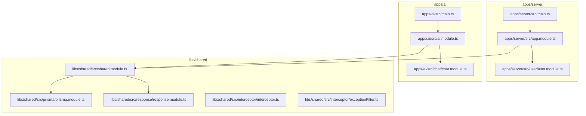
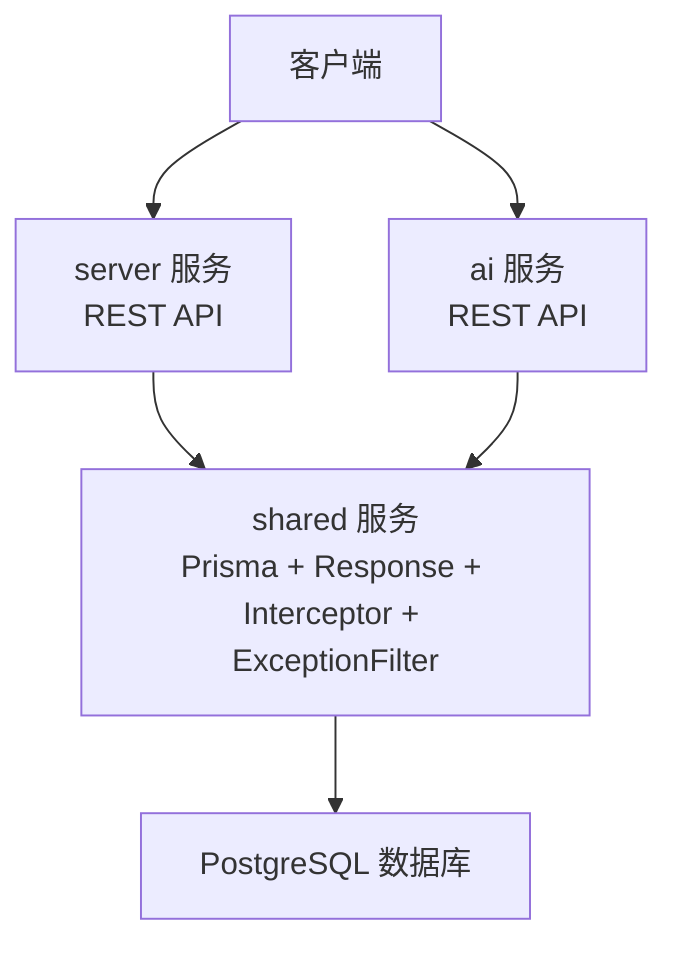
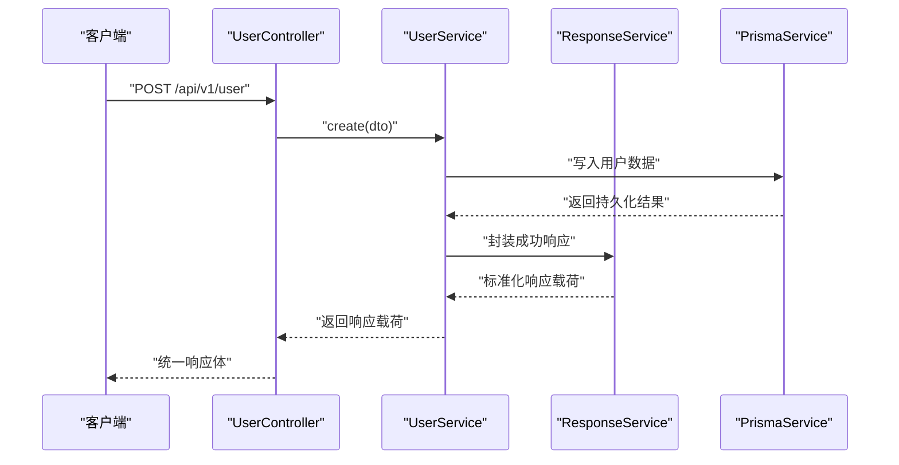
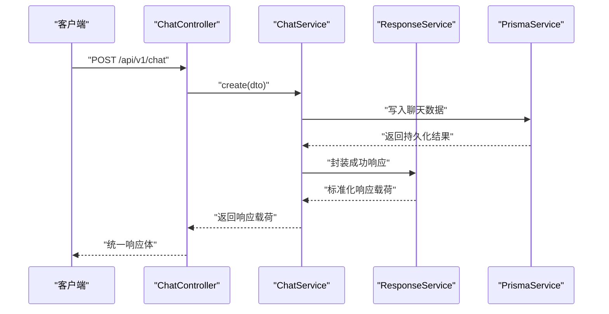
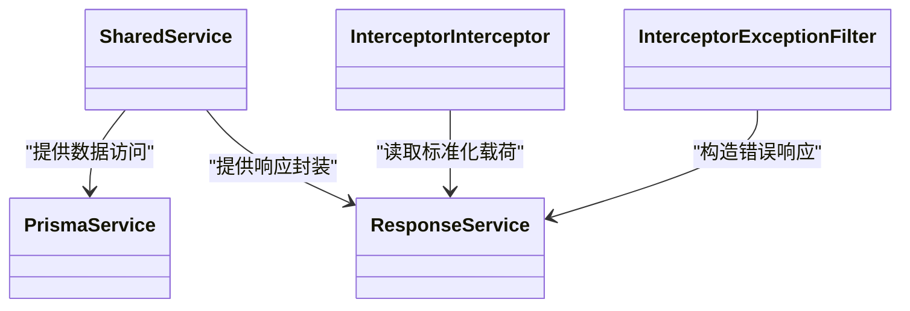
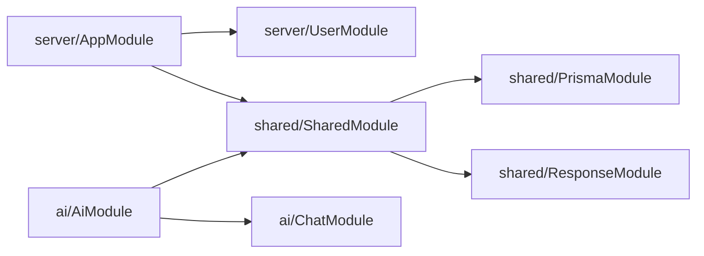

# 后端架构设计

<cite>
**本文引用的文件**
- [server/apps/server/src/app.module.ts](file://server/apps/server/src/app.module.ts)
- [server/apps/ai/src/ai.module.ts](file://server/apps/ai/src/ai.module.ts)
- [server/libs/shared/src/shared.module.ts](file://server/libs/shared/src/shared.module.ts)
- [server/apps/server/src/main.ts](file://server/apps/server/src/main.ts)
- [server/apps/ai/src/main.ts](file://server/apps/ai/src/main.ts)
- [server/apps/server/src/user/user.module.ts](file://server/apps/server/src/user/user.module.ts)
- [server/apps/ai/src/chat/chat.module.ts](file://server/apps/ai/src/chat/chat.module.ts)
- [server/libs/shared/src/prisma/prisma.module.ts](file://server/libs/shared/src/prisma/prisma.module.ts)
- [server/libs/shared/src/response/response.module.ts](file://server/libs/shared/src/response/response.module.ts)
- [server/libs/shared/src/interceptor/interceptor.ts](file://server/libs/shared/src/interceptor/interceptor.ts)
- [server/libs/shared/src/interceptor/exceptionFilter.ts](file://server/libs/shared/src/interceptor/exceptionFilter.ts)
- [server/libs/shared/src/response/response.service.ts](file://server/libs/shared/src/response/response.service.ts)
- [server/libs/shared/src/prisma/prisma.service.ts](file://server/libs/shared/src/prisma/prisma.service.ts)
- [server/apps/server/src/user/user.controller.ts](file://server/apps/server/src/user/user.controller.ts)
- [server/apps/ai/src/chat/chat.controller.ts](file://server/apps/ai/src/chat/chat.controller.ts)
</cite>

## 目录
1. [引言](#引言)
2. [项目结构](#项目结构)
3. [核心组件](#核心组件)
4. [架构总览](#架构总览)
5. [详细组件分析](#详细组件分析)
6. [依赖关系分析](#依赖关系分析)
7. [性能与可扩展性](#性能与可扩展性)
8. [故障排查指南](#故障排查指南)
9. [结论](#结论)
10. [附录：REST 设计与三层架构规范](#附录rest-设计与三层架构规范)

## 引言
本文件面向英语学习平台后端，系统化梳理基于 NestJS 的微服务架构设计与实现。重点覆盖以下方面：
- 微服务拆分：server 与 ai 两大服务的职责边界与交互方式
- 模块化组织与依赖注入：模块导入导出、全局拦截器与异常过滤器、共享模块设计
- 数据访问层：Prisma 集成与数据库适配
- 响应标准化：统一响应体结构与错误返回格式
- 控制器-服务-仓储三层架构与 RESTful 设计原则
- 服务间通信、负载均衡与扩展性建议

## 项目结构
后端采用多应用（apps）+ 多包（packages）的 monorepo 结构：
- apps/server：用户管理等通用业务服务
- apps/ai：AI 聊天相关业务服务
- libs/shared：跨服务共享能力（Prisma、响应封装、拦截器、异常过滤器）
- packages/config：配置中心（如端口、环境变量等）

图示来源
- [server/apps/server/src/main.ts:1-20](file://server/apps/server/src/main.ts#L1-L20)
- [server/apps/server/src/app.module.ts:1-13](file://server/apps/server/src/app.module.ts#L1-L13)
- [server/apps/ai/src/main.ts:1-14](file://server/apps/ai/src/main.ts#L1-L14)
- [server/apps/ai/src/ai.module.ts:1-12](file://server/apps/ai/src/ai.module.ts#L1-L12)
- [server/libs/shared/src/shared.module.ts:1-13](file://server/libs/shared/src/shared.module.ts#L1-L13)

章节来源
- [server/apps/server/src/main.ts:1-20](file://server/apps/server/src/main.ts#L1-L20)
- [server/apps/ai/src/main.ts:1-14](file://server/apps/ai/src/main.ts#L1-L14)
- [server/apps/server/src/app.module.ts:1-13](file://server/apps/server/src/app.module.ts#L1-L13)
- [server/apps/ai/src/ai.module.ts:1-12](file://server/apps/ai/src/ai.module.ts#L1-L12)
- [server/libs/shared/src/shared.module.ts:1-13](file://server/libs/shared/src/shared.module.ts#L1-L13)

## 核心组件
- 应用入口与启动
  - server 与 ai 服务各自在 main.ts 中创建 NestFactory 实例，注册全局拦截器与异常过滤器，设置全局前缀与 URI 版本控制。
- 模块与依赖注入
  - AppModule 导入 UserModule 与 SharedModule；AiModule 导入 ChatModule 并由 SharedModule 提供跨服务能力。
- 共享模块（SharedModule）
  - 通过 @Global() 在全局范围内暴露 SharedService，并导出 PrismaModule 与 ResponseModule，确保各服务可复用数据访问与响应封装能力。

章节来源
- [server/apps/server/src/main.ts:8-18](file://server/apps/server/src/main.ts#L8-L18)
- [server/apps/ai/src/main.ts:7-11](file://server/apps/ai/src/main.ts#L7-L11)
- [server/apps/server/src/app.module.ts:7-11](file://server/apps/server/src/app.module.ts#L7-L11)
- [server/apps/ai/src/ai.module.ts:6-9](file://server/apps/ai/src/ai.module.ts#L6-L9)
- [server/libs/shared/src/shared.module.ts:6-11](file://server/libs/shared/src/shared.module.ts#L6-L11)

## 架构总览
整体采用“双服务 + 共享库”的微服务架构：
- server 服务：负责用户相关业务（用户增删改查），通过统一响应体与异常处理对外提供 REST 接口。
- ai 服务：负责聊天相关业务（聊天记录增删改查），同样遵循统一响应与异常处理。
- shared 服务：提供 Prisma 数据访问与 Response 统一封装，拦截器统一输出结构，异常过滤器统一错误结构。

图示来源
- [server/apps/server/src/main.ts:10-16](file://server/apps/server/src/main.ts#L10-L16)
- [server/apps/ai/src/main.ts:8-11](file://server/apps/ai/src/main.ts#L8-L11)
- [server/libs/shared/src/prisma/prisma.service.ts:1-18](file://server/libs/shared/src/prisma/prisma.service.ts#L1-L18)
- [server/libs/shared/src/response/response.service.ts:1-29](file://server/libs/shared/src/response/response.service.ts#L1-L29)
- [server/libs/shared/src/interceptor/interceptor.ts:64-84](file://server/libs/shared/src/interceptor/interceptor.ts#L64-L84)
- [server/libs/shared/src/interceptor/exceptionFilter.ts:9-21](file://server/libs/shared/src/interceptor/exceptionFilter.ts#L9-L21)

## 详细组件分析

### server 服务
- 模块边界
  - AppModule 导入 UserModule 与 SharedModule，统一注册全局拦截器与异常过滤器，启用 URI 版本控制与全局前缀。
  - UserModule 仅包含 UserController 与 UserService，遵循控制器-服务-仓储三层架构。
- 控制器-服务-仓储
  - UserController：定义用户资源的 REST 接口（创建、查询列表、按 id 查询、更新、删除）。
  - UserService：承载业务逻辑，调用共享的 ResponseService 与 PrismaService 完成数据持久化与响应封装。
- 统一响应与异常
  - InterceptorInterceptor：将任意返回值标准化为统一响应体结构，自动填充时间戳、路径、消息、状态码与数据字段。
  - InterceptorExceptionFilter：捕获 HttpException，统一输出错误响应体，包含时间戳、路径、消息与状态码。

图示来源
- [server/apps/server/src/user/user.controller.ts:10-13](file://server/apps/server/src/user/user.controller.ts#L10-L13)
- [server/apps/server/src/user/user.module.ts:1-10](file://server/apps/server/src/user/user.module.ts#L1-L10)
- [server/libs/shared/src/response/response.service.ts:14-20](file://server/libs/shared/src/response/response.service.ts#L14-L20)
- [server/libs/shared/src/prisma/prisma.service.ts:1-18](file://server/libs/shared/src/prisma/prisma.service.ts#L1-L18)
- [server/apps/server/src/main.ts:10-11](file://server/apps/server/src/main.ts#L10-L11)

章节来源
- [server/apps/server/src/app.module.ts:7-11](file://server/apps/server/src/app.module.ts#L7-L11)
- [server/apps/server/src/main.ts:8-18](file://server/apps/server/src/main.ts#L8-L18)
- [server/apps/server/src/user/user.controller.ts:1-35](file://server/apps/server/src/user/user.controller.ts#L1-L35)
- [server/apps/server/src/user/user.module.ts:1-10](file://server/apps/server/src/user/user.module.ts#L1-L10)
- [server/libs/shared/src/response/response.service.ts:1-29](file://server/libs/shared/src/response/response.service.ts#L1-L29)
- [server/libs/shared/src/interceptor/interceptor.ts:64-84](file://server/libs/shared/src/interceptor/interceptor.ts#L64-L84)
- [server/libs/shared/src/interceptor/exceptionFilter.ts:9-21](file://server/libs/shared/src/interceptor/exceptionFilter.ts#L9-L21)

### ai 服务
- 模块边界
  - AiModule 导入 ChatModule，并通过 SharedModule 获取 Prisma 与 Response 能力。
  - ChatModule 仅包含 ChatController 与 ChatService，遵循与 server 一致的三层架构。
- 控制器-服务-仓储
  - ChatController：定义聊天资源的 REST 接口（创建、查询列表、按 id 查询、更新、删除）。
  - ChatService：承载业务逻辑，调用 ResponseService 与 PrismaService 完成数据持久化与响应封装。
- 统一响应与异常
  - 与 server 服务一致，使用 InterceptorInterceptor 与 InterceptorExceptionFilter。

图示来源
- [server/apps/ai/src/chat/chat.controller.ts:10-13](file://server/apps/ai/src/chat/chat.controller.ts#L10-L13)
- [server/apps/ai/src/chat/chat.module.ts:1-10](file://server/apps/ai/src/chat/chat.module.ts#L1-L10)
- [server/libs/shared/src/response/response.service.ts:14-20](file://server/libs/shared/src/response/response.service.ts#L14-L20)
- [server/libs/shared/src/prisma/prisma.service.ts:1-18](file://server/libs/shared/src/prisma/prisma.service.ts#L1-L18)
- [server/apps/ai/src/main.ts:8-11](file://server/apps/ai/src/main.ts#L8-L11)

章节来源
- [server/apps/ai/src/ai.module.ts:6-9](file://server/apps/ai/src/ai.module.ts#L6-L9)
- [server/apps/ai/src/chat/chat.controller.ts:1-35](file://server/apps/ai/src/chat/chat.controller.ts#L1-L35)
- [server/apps/ai/src/chat/chat.module.ts:1-10](file://server/apps/ai/src/chat/chat.module.ts#L1-L10)
- [server/libs/shared/src/response/response.service.ts:1-29](file://server/libs/shared/src/response/response.service.ts#L1-L29)
- [server/libs/shared/src/interceptor/interceptor.ts:64-84](file://server/libs/shared/src/interceptor/interceptor.ts#L64-L84)
- [server/libs/shared/src/interceptor/exceptionFilter.ts:9-21](file://server/libs/shared/src/interceptor/exceptionFilter.ts#L9-L21)

### shared 共享模块
- 设计目的
  - 将跨服务通用能力集中于 SharedModule，包括 Prisma 数据访问、统一响应封装、全局拦截器与异常过滤器。
- Prisma 集成
  - PrismaModule 导出 PrismaService，后者继承 PrismaClient 并通过适配器连接 PostgreSQL。
- 响应处理机制
  - ResponseService 提供 success/error 两种便捷方法，统一返回 { data, code, message } 结构，配合 InterceptorInterceptor 自动包装为最终响应体。

图示来源
- [server/libs/shared/src/shared.module.ts:1-13](file://server/libs/shared/src/shared.module.ts#L1-L13)
- [server/libs/shared/src/prisma/prisma.module.ts:1-9](file://server/libs/shared/src/prisma/prisma.module.ts#L1-L9)
- [server/libs/shared/src/response/response.module.ts:1-9](file://server/libs/shared/src/response/response.module.ts#L1-L9)
- [server/libs/shared/src/prisma/prisma.service.ts:1-18](file://server/libs/shared/src/prisma/prisma.service.ts#L1-L18)
- [server/libs/shared/src/response/response.service.ts:1-29](file://server/libs/shared/src/response/response.service.ts#L1-L29)
- [server/libs/shared/src/interceptor/interceptor.ts:64-84](file://server/libs/shared/src/interceptor/interceptor.ts#L64-L84)
- [server/libs/shared/src/interceptor/exceptionFilter.ts:9-21](file://server/libs/shared/src/interceptor/exceptionFilter.ts#L9-L21)

章节来源
- [server/libs/shared/src/shared.module.ts:6-11](file://server/libs/shared/src/shared.module.ts#L6-L11)
- [server/libs/shared/src/prisma/prisma.module.ts:1-9](file://server/libs/shared/src/prisma/prisma.module.ts#L1-L9)
- [server/libs/shared/src/response/response.module.ts:1-9](file://server/libs/shared/src/response/response.module.ts#L1-L9)
- [server/libs/shared/src/prisma/prisma.service.ts:1-18](file://server/libs/shared/src/prisma/prisma.service.ts#L1-L18)
- [server/libs/shared/src/response/response.service.ts:1-29](file://server/libs/shared/src/response/response.service.ts#L1-L29)
- [server/libs/shared/src/interceptor/interceptor.ts:28-84](file://server/libs/shared/src/interceptor/interceptor.ts#L28-L84)
- [server/libs/shared/src/interceptor/exceptionFilter.ts:9-21](file://server/libs/shared/src/interceptor/exceptionFilter.ts#L9-L21)

## 依赖关系分析
- 服务内依赖
  - server：AppModule -> UserModule -> SharedModule（Prisma/Response/Interceptor/ExceptionFilter）
  - ai：AiModule -> ChatModule -> SharedModule
- 服务间通信
  - 当前仓库未包含服务间直接通信代码，建议通过网关或外部代理（如 Nginx、Envoy、Kong）进行路由与负载均衡，或在上层引入消息队列/事件总线实现异步解耦。
- 外部依赖
  - Prisma 通过适配器连接 PostgreSQL，需确保 DATABASE_URL 环境变量正确配置。

图示来源
- [server/apps/server/src/app.module.ts:7-11](file://server/apps/server/src/app.module.ts#L7-L11)
- [server/apps/ai/src/ai.module.ts:6-9](file://server/apps/ai/src/ai.module.ts#L6-L9)
- [server/libs/shared/src/shared.module.ts:6-11](file://server/libs/shared/src/shared.module.ts#L6-L11)

章节来源
- [server/apps/server/src/app.module.ts:7-11](file://server/apps/server/src/app.module.ts#L7-L11)
- [server/apps/ai/src/ai.module.ts:6-9](file://server/apps/ai/src/ai.module.ts#L6-L9)
- [server/libs/shared/src/shared.module.ts:6-11](file://server/libs/shared/src/shared.module.ts#L6-L11)

## 性能与可扩展性
- 性能特性
  - 统一拦截器对响应进行标准化与数据类型转换（如 BigInt -> String），避免序列化问题，提升前端解析稳定性。
  - Prisma 通过适配器连接数据库，具备良好的 ORM 能力与类型安全。
- 扩展性建议
  - 服务拆分：server 与 ai 已实现清晰边界，后续可按领域进一步细分微服务。
  - 负载均衡：通过反向代理或容器编排实现多实例部署与健康检查。
  - 缓存：在共享层引入缓存中间件，减少重复查询。
  - 监控与日志：统一接入链路追踪与指标采集，结合拦截器增强可观测性。
  - 数据库优化：针对高频查询建立索引，必要时引入只读副本或读写分离。

## 故障排查指南
- 常见问题定位
  - 响应格式异常：检查 InterceptorInterceptor 是否正确包裹返回值，确认返回对象包含 data/code/message 字段。
  - 错误信息不统一：确认是否抛出 HttpException，以及 InterceptorExceptionFilter 是否生效。
  - 数据库连接失败：核对 DATABASE_URL 环境变量与网络连通性。
- 关键流程验证
  - 请求进入：确认 main.ts 中已注册全局拦截器与异常过滤器。
  - 版本控制：确认 URI 版本控制已启用，默认版本为 v1。
  - 全局前缀：确认 setGlobalPrefix 已设置为 api。

章节来源
- [server/apps/server/src/main.ts:10-16](file://server/apps/server/src/main.ts#L10-L16)
- [server/apps/ai/src/main.ts:8-11](file://server/apps/ai/src/main.ts#L8-L11)
- [server/libs/shared/src/interceptor/interceptor.ts:64-84](file://server/libs/shared/src/interceptor/interceptor.ts#L64-L84)
- [server/libs/shared/src/interceptor/exceptionFilter.ts:9-21](file://server/libs/shared/src/interceptor/exceptionFilter.ts#L9-L21)
- [server/libs/shared/src/prisma/prisma.service.ts:1-18](file://server/libs/shared/src/prisma/prisma.service.ts#L1-L18)

## 结论
该后端架构以 NestJS 微服务为核心，通过 server 与 ai 双服务实现业务解耦，借助 shared 模块沉淀通用能力，形成“统一响应、统一异常、统一数据访问”的工程化标准。配合 URI 版本控制与全局前缀，满足 RESTful 设计原则。未来可在服务间通信、缓存与监控等方面持续演进，以支撑更大规模的业务增长。

## 附录：REST 设计与三层架构规范
- REST 设计原则
  - 资源命名：使用名词复数形式，如 /user、/chat
  - 动作映射：POST 创建、GET 列表/单个、PATCH 更新、DELETE 删除
  - 版本控制：通过 URI 路径版本化，如 /api/v1/{resource}
  - 统一响应：响应体包含时间戳、路径、消息、状态码与数据字段
  - 统一错误：错误响应包含时间戳、路径、消息与状态码
- 三层架构
  - 控制器层：接收请求、参数校验、调用服务层
  - 服务层：编排业务逻辑、调用仓储层、返回标准化结果
  - 仓储层：封装数据访问细节，统一由 PrismaService 提供