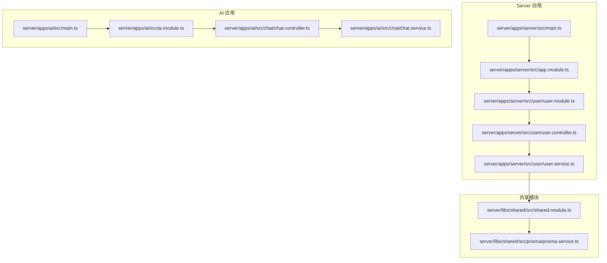
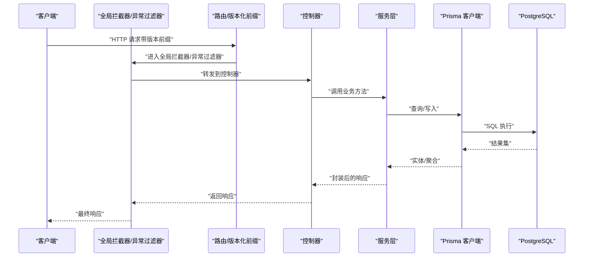
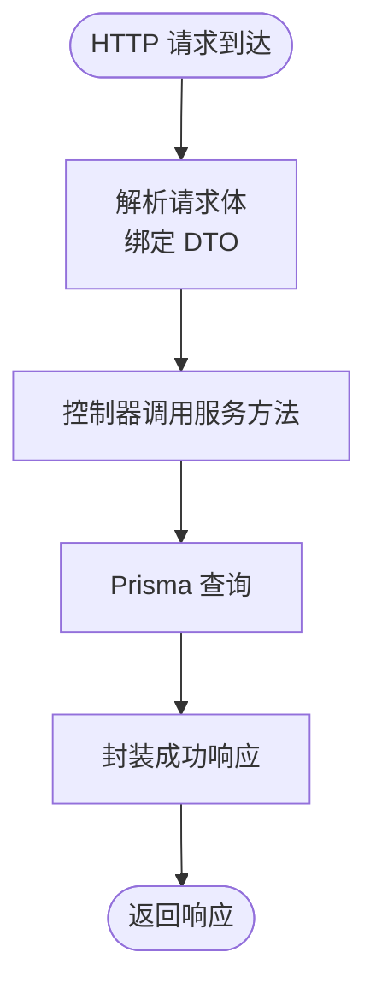
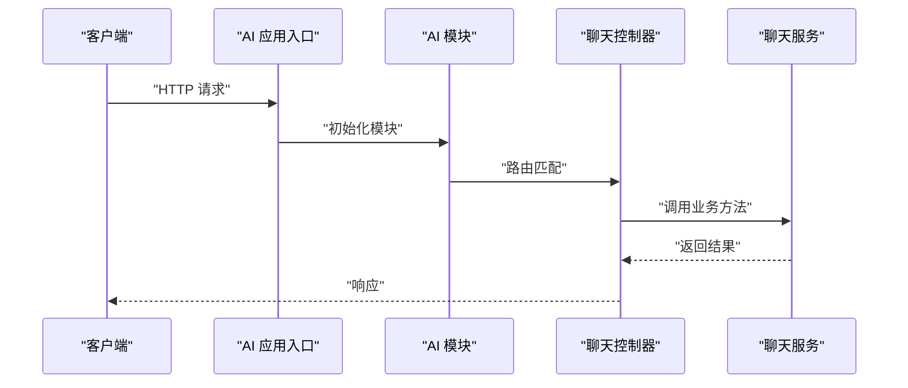
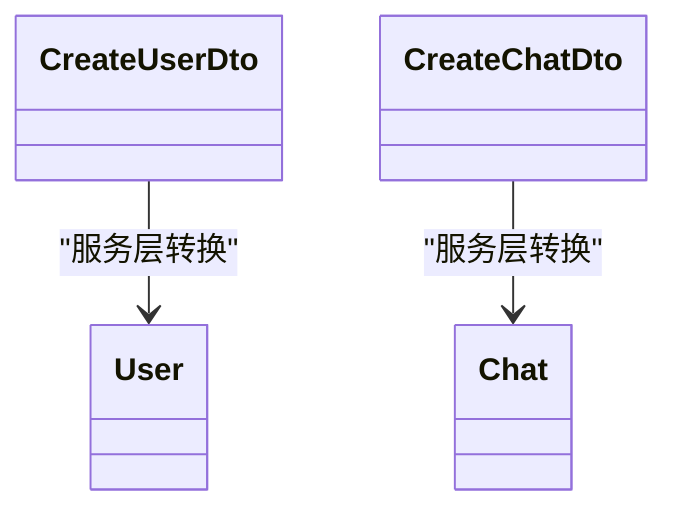
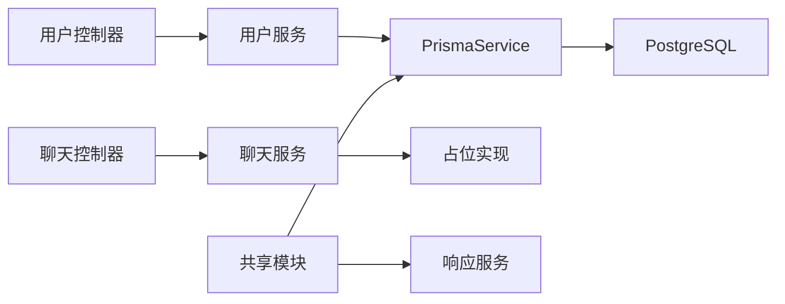

# 数据流设计

<cite>
**本文引用的文件**
- [server/apps/server/src/main.ts](file://server/apps/server/src/main.ts)
- [server/apps/server/src/app.module.ts](file://server/apps/server/src/app.module.ts)
- [server/apps/server/src/user/user.module.ts](file://server/apps/server/src/user/user.module.ts)
- [server/apps/server/src/user/user.controller.ts](file://server/apps/server/src/user/user.controller.ts)
- [server/apps/server/src/user/user.service.ts](file://server/apps/server/src/user/user.service.ts)
- [server/apps/server/src/user/dto/create-user.dto.ts](file://server/apps/server/src/user/dto/create-user.dto.ts)
- [server/apps/server/src/user/entities/user.entity.ts](file://server/apps/server/src/user/entities/user.entity.ts)
- [server/libs/shared/src/shared.module.ts](file://server/libs/shared/src/shared.module.ts)
- [server/libs/shared/src/prisma/prisma.service.ts](file://server/libs/shared/src/prisma/prisma.service.ts)
- [server/apps/ai/src/main.ts](file://server/apps/ai/src/main.ts)
- [server/apps/ai/src/ai.module.ts](file://server/apps/ai/src/ai.module.ts)
- [server/apps/ai/src/chat/chat.controller.ts](file://server/apps/ai/src/chat/chat.controller.ts)
- [server/apps/ai/src/chat/chat.service.ts](file://server/apps/ai/src/chat/chat.service.ts)
- [server/apps/ai/src/chat/dto/create-chat.dto.ts](file://server/apps/ai/src/chat/dto/create-chat.dto.ts)
</cite>

## 目录
1. [引言](#引言)
2. [项目结构](#项目结构)
3. [核心组件](#核心组件)
4. [架构总览](#架构总览)
5. [详细组件分析](#详细组件分析)
6. [依赖分析](#依赖分析)
7. [性能考虑](#性能考虑)
8. [故障排查指南](#故障排查指南)
9. [结论](#结论)
10. [附录](#附录)

## 引言
本文件面向英语学习平台后端服务，聚焦“从前端请求到数据库存储”的完整数据流设计。内容涵盖：
- HTTP 请求处理链路与版本化路由
- 控制器、服务层与数据传输对象（DTO）的职责边界
- 实体模型与 DTO 的映射关系现状与建议
- 数据持久化路径（Prisma 客户端 → PostgreSQL）
- 全局拦截器与异常过滤器对数据流的影响
- 错误处理、数据验证与安全防护的落地点
- 时序图与数据流图，帮助开发者快速理解系统数据处理逻辑

## 项目结构
后端采用 NestJS 多应用架构：
- 应用层：server（用户相关）、ai（聊天相关）
- 共享层：shared（Prisma、响应封装、拦截器与异常过滤器）
- 配置：通过环境变量注入数据库连接等参数

**图表来源**
- [server/apps/server/src/main.ts:1-20](file://server/apps/server/src/main.ts#L1-L20)
- [server/apps/server/src/app.module.ts:1-13](file://server/apps/server/src/app.module.ts#L1-L13)
- [server/apps/server/src/user/user.module.ts:1-10](file://server/apps/server/src/user/user.module.ts#L1-L10)
- [server/apps/server/src/user/user.controller.ts:1-35](file://server/apps/server/src/user/user.controller.ts#L1-L35)
- [server/apps/server/src/user/user.service.ts:1-34](file://server/apps/server/src/user/user.service.ts#L1-L34)
- [server/apps/ai/src/main.ts:1-14](file://server/apps/ai/src/main.ts#L1-L14)
- [server/apps/ai/src/ai.module.ts:1-12](file://server/apps/ai/src/ai.module.ts#L1-L12)
- [server/apps/ai/src/chat/chat.controller.ts:1-35](file://server/apps/ai/src/chat/chat.controller.ts#L1-L35)
- [server/apps/ai/src/chat/chat.service.ts:1-27](file://server/apps/ai/src/chat/chat.service.ts#L1-L27)
- [server/libs/shared/src/shared.module.ts:1-13](file://server/libs/shared/src/shared.module.ts#L1-L13)
- [server/libs/shared/src/prisma/prisma.service.ts:1-18](file://server/libs/shared/src/prisma/prisma.service.ts#L1-L18)

**章节来源**
- [server/apps/server/src/main.ts:1-20](file://server/apps/server/src/main.ts#L1-L20)
- [server/apps/ai/src/main.ts:1-14](file://server/apps/ai/src/main.ts#L1-L14)
- [server/libs/shared/src/shared.module.ts:1-13](file://server/libs/shared/src/shared.module.ts#L1-L13)

## 核心组件
- 全局引导与版本化路由
  - 服务器启动在主入口完成，设置全局前缀与 URI 版本化，便于未来演进。
- 控制器与服务
  - 用户模块控制器负责接收 HTTP 请求，调用对应服务方法；服务层负责业务逻辑与数据访问。
- 数据访问层
  - 共享模块导出 PrismaService，作为统一的数据库客户端；通过环境变量配置连接字符串。

**章节来源**
- [server/apps/server/src/main.ts:8-18](file://server/apps/server/src/main.ts#L8-L18)
- [server/apps/server/src/user/user.controller.ts:1-35](file://server/apps/server/src/user/user.controller.ts#L1-L35)
- [server/apps/server/src/user/user.service.ts:1-34](file://server/apps/server/src/user/user.service.ts#L1-L34)
- [server/libs/shared/src/prisma/prisma.service.ts:1-18](file://server/libs/shared/src/prisma/prisma.service.ts#L1-L18)

## 架构总览
下图展示从浏览器到数据库的典型请求路径，包括版本化路由、控制器、服务与数据库交互。

**图表来源**
- [server/apps/server/src/main.ts:10-16](file://server/apps/server/src/main.ts#L10-L16)
- [server/apps/server/src/user/user.controller.ts:10-13](file://server/apps/server/src/user/user.controller.ts#L10-L13)
- [server/apps/server/src/user/user.service.ts:17-20](file://server/apps/server/src/user/user.service.ts#L17-L20)
- [server/libs/shared/src/prisma/prisma.service.ts:6-15](file://server/libs/shared/src/prisma/prisma.service.ts#L6-L15)

## 详细组件分析

### 用户模块数据流
- 控制器接收请求并透传 DTO 给服务层
- 服务层调用 Prisma 客户端进行数据读取，并通过共享响应服务进行统一封装
- 当前实体与 DTO 为空实现，建议后续补充字段与校验装饰器

**图表来源**
- [server/apps/server/src/user/user.controller.ts:10-13](file://server/apps/server/src/user/user.controller.ts#L10-L13)
- [server/apps/server/src/user/user.service.ts:17-20](file://server/apps/server/src/user/user.service.ts#L17-L20)
- [server/libs/shared/src/prisma/prisma.service.ts:6-15](file://server/libs/shared/src/prisma/prisma.service.ts#L6-L15)

**章节来源**
- [server/apps/server/src/user/user.controller.ts:1-35](file://server/apps/server/src/user/user.controller.ts#L1-L35)
- [server/apps/server/src/user/user.service.ts:17-20](file://server/apps/server/src/user/user.service.ts#L17-L20)
- [server/apps/server/src/user/dto/create-user.dto.ts:1-2](file://server/apps/server/src/user/dto/create-user.dto.ts#L1-L2)
- [server/apps/server/src/user/entities/user.entity.ts:1-2](file://server/apps/server/src/user/entities/user.entity.ts#L1-L2)

### 聊天模块数据流（AI 应用）
- AI 应用独立于用户应用，路由前缀与用户应用隔离
- 聊天控制器与服务同构，当前为占位实现，建议后续接入外部大模型或本地推理引擎

**图表来源**
- [server/apps/ai/src/main.ts:7-11](file://server/apps/ai/src/main.ts#L7-L11)
- [server/apps/ai/src/ai.module.ts:1-12](file://server/apps/ai/src/ai.module.ts#L1-L12)
- [server/apps/ai/src/chat/chat.controller.ts:10-13](file://server/apps/ai/src/chat/chat.controller.ts#L10-L13)
- [server/apps/ai/src/chat/chat.service.ts:7-9](file://server/apps/ai/src/chat/chat.service.ts#L7-L9)

**章节来源**
- [server/apps/ai/src/chat/chat.controller.ts:1-35](file://server/apps/ai/src/chat/chat.controller.ts#L1-L35)
- [server/apps/ai/src/chat/chat.service.ts:1-27](file://server/apps/ai/src/chat/chat.service.ts#L1-L27)
- [server/apps/ai/src/chat/dto/create-chat.dto.ts:1-2](file://server/apps/ai/src/chat/dto/create-chat.dto.ts#L1-L2)

### DTO 与实体模型映射
- 当前 DTO 与实体类为空实现，未体现字段与约束
- 建议在 DTO 中加入校验装饰器，在服务层进行 DTO 到实体的转换，确保数据一致性与可维护性

**图表来源**
- [server/apps/server/src/user/dto/create-user.dto.ts:1-2](file://server/apps/server/src/user/dto/create-user.dto.ts#L1-L2)
- [server/apps/server/src/user/entities/user.entity.ts:1-2](file://server/apps/server/src/user/entities/user.entity.ts#L1-L2)
- [server/apps/ai/src/chat/dto/create-chat.dto.ts:1-2](file://server/apps/ai/src/chat/dto/create-chat.dto.ts#L1-L2)

**章节来源**
- [server/apps/server/src/user/dto/create-user.dto.ts:1-2](file://server/apps/server/src/user/dto/create-user.dto.ts#L1-L2)
- [server/apps/server/src/user/entities/user.entity.ts:1-2](file://server/apps/server/src/user/entities/user.entity.ts#L1-L2)
- [server/apps/ai/src/chat/dto/create-chat.dto.ts:1-2](file://server/apps/ai/src/chat/dto/create-chat.dto.ts#L1-L2)

## 依赖分析
- 模块耦合
  - 用户模块仅依赖共享模块提供的 Prisma 与响应服务，保持低耦合
  - AI 模块依赖聊天子模块，形成清晰的职责划分
- 外部依赖
  - Prisma 通过适配器连接 PostgreSQL，连接信息来自环境变量
- 可能的循环依赖
  - 当前模块导入关系为单向，未见循环依赖迹象

**图表来源**
- [server/apps/server/src/user/user.controller.ts:1-35](file://server/apps/server/src/user/user.controller.ts#L1-L35)
- [server/apps/server/src/user/user.service.ts:1-34](file://server/apps/server/src/user/user.service.ts#L1-L34)
- [server/libs/shared/src/prisma/prisma.service.ts:1-18](file://server/libs/shared/src/prisma/prisma.service.ts#L1-L18)
- [server/apps/ai/src/chat/chat.controller.ts:1-35](file://server/apps/ai/src/chat/chat.controller.ts#L1-L35)
- [server/apps/ai/src/chat/chat.service.ts:1-27](file://server/apps/ai/src/chat/chat.service.ts#L1-L27)

**章节来源**
- [server/apps/server/src/user/user.module.ts:1-10](file://server/apps/server/src/user/user.module.ts#L1-L10)
- [server/libs/shared/src/shared.module.ts:1-13](file://server/libs/shared/src/shared.module.ts#L1-L13)

## 性能考虑
- 连接池与并发
  - Prisma 默认管理连接池，建议结合数据库实例规模与 QPS 进行连接数与超时参数调优
- 查询优化
  - 在服务层按需选择字段，避免 N+1 查询；必要时使用事务批量写入
- 缓存策略
  - 对热点只读数据（如用户基础信息）引入缓存中间件，降低数据库压力
- 异步处理
  - 对非关键路径操作（如日志、统计）采用异步队列，避免阻塞主请求链路

## 故障排查指南
- 全局异常过滤器
  - 启动时注册全局异常过滤器，统一捕获与格式化错误响应
- 日志与追踪
  - 建议在拦截器中记录请求上下文（如 traceId），便于定位问题
- 数据库连接
  - 确认环境变量 DATABASE_URL 正确；检查网络连通性与数据库实例状态

**章节来源**
- [server/apps/server/src/main.ts:10-11](file://server/apps/server/src/main.ts#L10-L11)
- [server/libs/shared/src/prisma/prisma.service.ts:9-11](file://server/libs/shared/src/prisma/prisma.service.ts#L9-L11)

## 结论
本平台采用清晰的多应用架构与共享层设计，实现了请求的版本化路由、统一的响应封装与数据库访问。当前 DTO 与实体仍处于占位阶段，建议尽快完善数据模型与校验规则，以提升系统的健壮性与可维护性。同时，应结合业务场景引入缓存与异步处理，持续优化整体性能与用户体验。

## 附录
- 版本化路由
  - URI 版本控制默认版本为 v1，便于后续扩展
- 全局前缀
  - 所有路由统一前缀为 api，便于前端聚合与部署

**章节来源**
- [server/apps/server/src/main.ts:12-16](file://server/apps/server/src/main.ts#L12-L16)