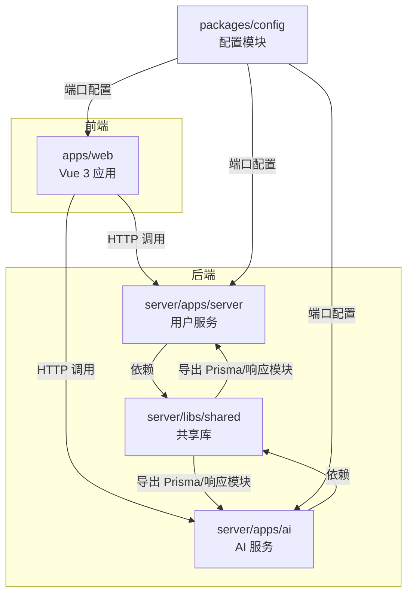
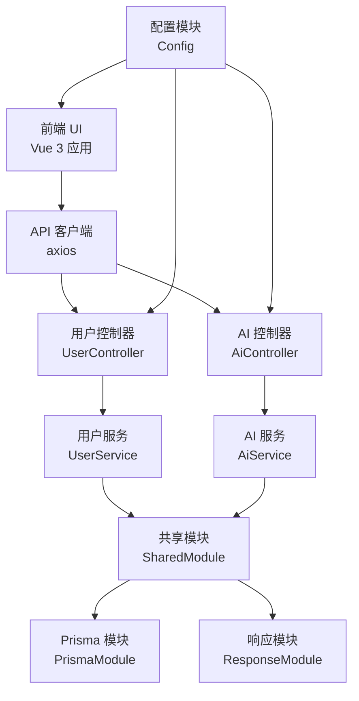
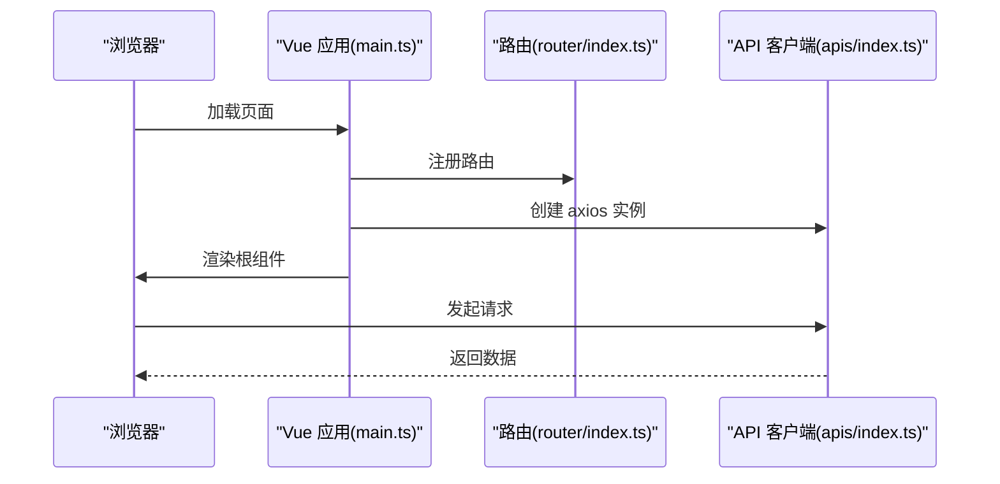
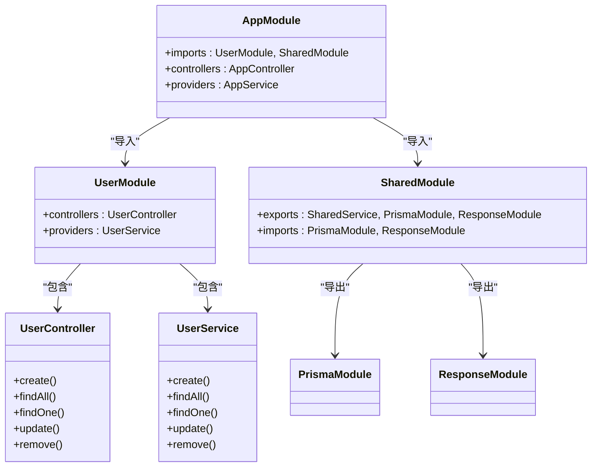
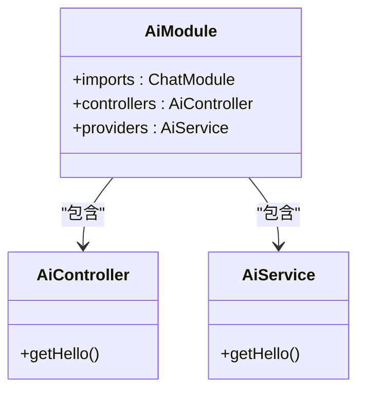
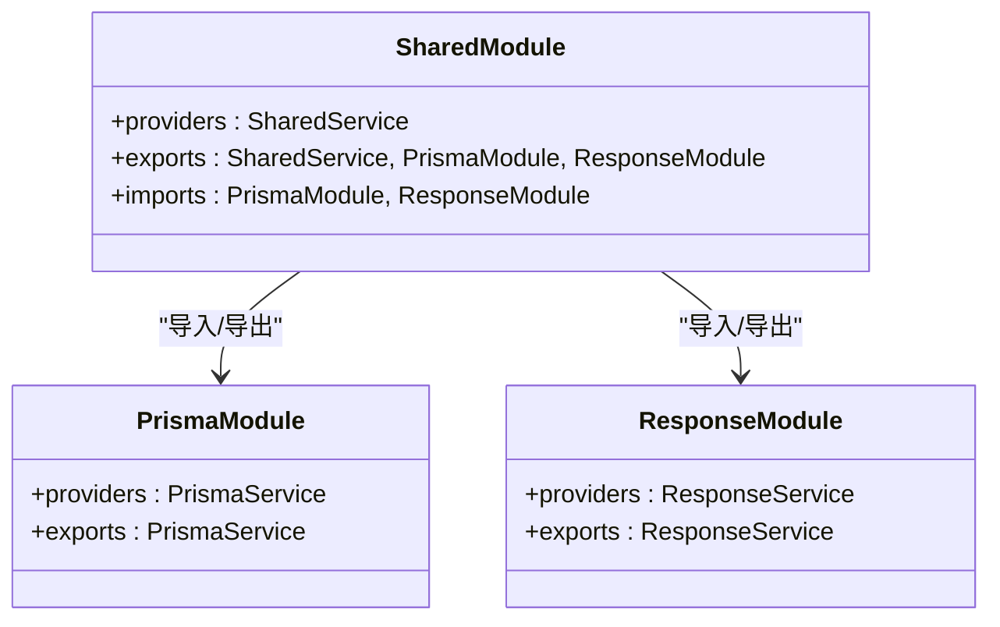
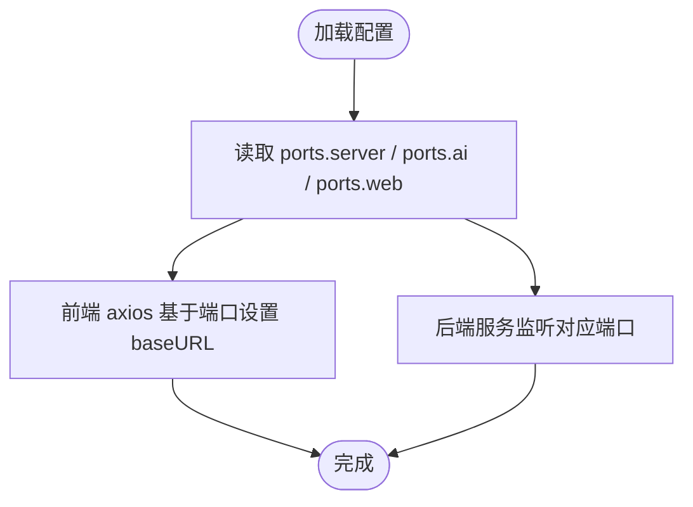
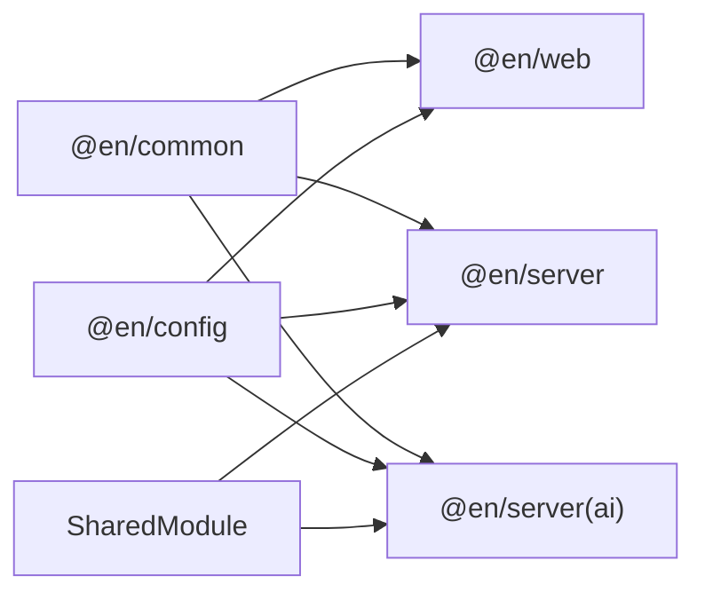

# 架构设计

<cite>
**本文引用的文件**
- [package.json](file://package.json)
- [pnpm-workspace.yaml](file://pnpm-workspace.yaml)
- [apps/web/package.json](file://apps/web/package.json)
- [packages/config/index.ts](file://packages/config/index.ts)
- [apps/web/src/apis/index.ts](file://apps/web/src/apis/index.ts)
- [apps/web/src/router/index.ts](file://apps/web/src/router/index.ts)
- [apps/web/src/main.ts](file://apps/web/src/main.ts)
- [server/apps/server/src/app.module.ts](file://server/apps/server/src/app.module.ts)
- [server/libs/shared/src/shared.module.ts](file://server/libs/shared/src/shared.module.ts)
- [server/libs/shared/src/prisma/prisma.module.ts](file://server/libs/shared/src/prisma/prisma.module.ts)
- [server/libs/shared/src/response/response.module.ts](file://server/libs/shared/src/response/response.module.ts)
- [server/apps/server/src/user/user.module.ts](file://server/apps/server/src/user/user.module.ts)
- [server/apps/server/src/user/user.controller.ts](file://server/apps/server/src/user/user.controller.ts)
- [server/apps/ai/src/ai.module.ts](file://server/apps/ai/src/ai.module.ts)
- [server/apps/ai/src/ai.controller.ts](file://server/apps/ai/src/ai.controller.ts)
</cite>

## 目录
1. [引言](#引言)
2. [项目结构](#项目结构)
3. [核心组件](#核心组件)
4. [架构总览](#架构总览)
5. [详细组件分析](#详细组件分析)
6. [依赖分析](#依赖分析)
7. [性能考虑](#性能考虑)
8. [故障排查指南](#故障排查指南)
9. [结论](#结论)
10. [附录](#附录)

## 引言
本文件面向英语学习平台的架构设计与实现，基于 Monorepo 的组织方式，围绕前端 Vue.js 应用、后端 NestJS 服务（含用户服务与 AI 服务）、共享库与配置模块展开，系统性阐述分层架构、模块化设计与依赖注入机制，明确系统边界、技术选型理由、性能与可扩展性设计，并通过多种图示帮助开发者快速理解整体结构与协作方式。

## 项目结构
该仓库采用 pnpm workspace 的 Monorepo 管理，主要目录与职责如下：
- apps/web：前端 Vue 3 应用，使用 Vite 构建，集成路由、状态管理与 UI 组件库。
- server/apps/server：后端主服务（用户服务），基于 NestJS，使用 Prisma 进行数据库访问。
- server/apps/ai：独立的 AI 服务，同样基于 NestJS，提供 AI 相关接口。
- server/libs/shared：共享库，封装通用能力（如 Prisma 数据访问、统一响应包装等）。
- packages/config：全局配置模块，集中管理各子系统端口等配置项。
- 根目录脚本：通过 pnpm filter 启动多服务，支持并发启动。

**图表来源**
- [pnpm-workspace.yaml:1-10](file://pnpm-workspace.yaml#L1-L10)
- [apps/web/package.json:1-45](file://apps/web/package.json#L1-L45)
- [server/package.json:1-52](file://server/package.json#L1-L52)
- [packages/config/index.ts:1-8](file://packages/config/index.ts#L1-L8)

**章节来源**
- [pnpm-workspace.yaml:1-10](file://pnpm-workspace.yaml#L1-L10)
- [package.json:1-15](file://package.json#L1-L15)

## 核心组件
- 前端 Web 应用
  - 初始化 Pinia 状态管理与持久化插件，注册路由与 UI 组件库，挂载应用。
  - 通过 axios 创建基础客户端，统一指向后端服务端口。
- 用户服务（server/apps/server）
  - 提供用户资源的增删改查接口，模块化组织控制器与服务。
- AI 服务（server/apps/ai）
  - 提供 AI 相关接口入口，内部聚合聊天相关模块。
- 共享库（server/libs/shared）
  - 封装 Prisma 数据访问与统一响应包装，作为全局模块在各服务中复用。
- 配置模块（packages/config）
  - 集中定义服务端口，便于前后端与多服务协调。

**章节来源**
- [apps/web/src/main.ts:1-21](file://apps/web/src/main.ts#L1-L21)
- [apps/web/src/apis/index.ts:1-6](file://apps/web/src/apis/index.ts#L1-L6)
- [server/apps/server/src/user/user.controller.ts:1-35](file://server/apps/server/src/user/user.controller.ts#L1-L35)
- [server/apps/ai/src/ai.controller.ts:1-13](file://server/apps/ai/src/ai.controller.ts#L1-L13)
- [server/libs/shared/src/shared.module.ts:1-13](file://server/libs/shared/src/shared.module.ts#L1-L13)
- [packages/config/index.ts:1-8](file://packages/config/index.ts#L1-L8)

## 架构总览
系统采用“前端单页应用 + 多后端微服务”的分层架构：
- 表现层：Vue 3 应用负责页面渲染、用户交互与状态管理。
- 控制层：NestJS 服务暴露 REST 接口，分别服务于用户与 AI 功能。
- 业务层：控制器调用服务层处理领域逻辑。
- 基础设施层：共享库提供统一的响应包装与数据访问能力；Prisma 作为 ORM 访问数据库。
- 配置层：集中配置端口，确保跨服务一致的通信地址。

**图表来源**
- [apps/web/src/apis/index.ts:1-6](file://apps/web/src/apis/index.ts#L1-L6)
- [server/apps/server/src/user/user.controller.ts:1-35](file://server/apps/server/src/user/user.controller.ts#L1-L35)
- [server/apps/ai/src/ai.controller.ts:1-13](file://server/apps/ai/src/ai.controller.ts#L1-L13)
- [server/libs/shared/src/shared.module.ts:1-13](file://server/libs/shared/src/shared.module.ts#L1-L13)
- [server/libs/shared/src/prisma/prisma.module.ts:1-9](file://server/libs/shared/src/prisma/prisma.module.ts#L1-L9)
- [server/libs/shared/src/response/response.module.ts:1-9](file://server/libs/shared/src/response/response.module.ts#L1-L9)
- [packages/config/index.ts:1-8](file://packages/config/index.ts#L1-L8)

## 详细组件分析

### 前端 Web 应用
- 初始化流程
  - 创建应用实例，注册 Pinia 并启用持久化插件，挂载路由与 UI 组件库。
  - 通过全局配置模块读取端口，构建 axios 实例指向后端服务。
- 路由与视图
  - 使用 Vue Router 定义主页与词库等页面路由，按功能拆分模块化路由。
- 状态管理
  - 使用 Pinia 管理应用状态，结合持久化插件提升用户体验。

**图表来源**
- [apps/web/src/main.ts:1-21](file://apps/web/src/main.ts#L1-L21)
- [apps/web/src/router/index.ts:1-13](file://apps/web/src/router/index.ts#L1-L13)
- [apps/web/src/apis/index.ts:1-6](file://apps/web/src/apis/index.ts#L1-L6)

**章节来源**
- [apps/web/src/main.ts:1-21](file://apps/web/src/main.ts#L1-L21)
- [apps/web/src/router/index.ts:1-13](file://apps/web/src/router/index.ts#L1-L13)
- [apps/web/src/apis/index.ts:1-6](file://apps/web/src/apis/index.ts#L1-L6)

### 用户服务（server/apps/server）
- 模块化设计
  - AppModule 导入 UserModule 与 SharedModule，控制器与服务解耦。
  - UserModule 仅包含用户控制器与服务，职责单一。
- 控制器与服务
  - UserController 提供用户资源的完整 CRUD 接口，委托 UserService 执行业务逻辑。
- 共享能力
  - SharedModule 导出 PrismaModule 与 ResponseModule，统一数据访问与响应格式。

**图表来源**
- [server/apps/server/src/app.module.ts:1-13](file://server/apps/server/src/app.module.ts#L1-L13)
- [server/apps/server/src/user/user.module.ts:1-10](file://server/apps/server/src/user/user.module.ts#L1-L10)
- [server/apps/server/src/user/user.controller.ts:1-35](file://server/apps/server/src/user/user.controller.ts#L1-L35)
- [server/libs/shared/src/shared.module.ts:1-13](file://server/libs/shared/src/shared.module.ts#L1-L13)

**章节来源**
- [server/apps/server/src/app.module.ts:1-13](file://server/apps/server/src/app.module.ts#L1-L13)
- [server/apps/server/src/user/user.module.ts:1-10](file://server/apps/server/src/user/user.module.ts#L1-L10)
- [server/apps/server/src/user/user.controller.ts:1-35](file://server/apps/server/src/user/user.controller.ts#L1-L35)
- [server/libs/shared/src/shared.module.ts:1-13](file://server/libs/shared/src/shared.module.ts#L1-L13)

### AI 服务（server/apps/ai）
- 模块化设计
  - AiModule 导入 ChatModule，并提供 AiController 作为入口。
- 控制器与服务
  - AiController 暴露 AI 相关接口，委托 AiService 执行业务逻辑。

**图表来源**
- [server/apps/ai/src/ai.module.ts:1-12](file://server/apps/ai/src/ai.module.ts#L1-L12)
- [server/apps/ai/src/ai.controller.ts:1-13](file://server/apps/ai/src/ai.controller.ts#L1-L13)

**章节来源**
- [server/apps/ai/src/ai.module.ts:1-12](file://server/apps/ai/src/ai.module.ts#L1-L12)
- [server/apps/ai/src/ai.controller.ts:1-13](file://server/apps/ai/src/ai.controller.ts#L1-L13)

### 共享库（server/libs/shared）
- 角色定位
  - 作为全局模块，向用户服务与 AI 服务提供统一的数据访问与响应包装能力。
- 模块组成
  - PrismaModule：封装 PrismaService，统一数据库访问。
  - ResponseModule：封装统一响应包装服务，保证接口一致性。

**图表来源**
- [server/libs/shared/src/shared.module.ts:1-13](file://server/libs/shared/src/shared.module.ts#L1-L13)
- [server/libs/shared/src/prisma/prisma.module.ts:1-9](file://server/libs/shared/src/prisma/prisma.module.ts#L1-L9)
- [server/libs/shared/src/response/response.module.ts:1-9](file://server/libs/shared/src/response/response.module.ts#L1-L9)

**章节来源**
- [server/libs/shared/src/shared.module.ts:1-13](file://server/libs/shared/src/shared.module.ts#L1-L13)
- [server/libs/shared/src/prisma/prisma.module.ts:1-9](file://server/libs/shared/src/prisma/prisma.module.ts#L1-L9)
- [server/libs/shared/src/response/response.module.ts:1-9](file://server/libs/shared/src/response/response.module.ts#L1-L9)

### 配置模块（packages/config）
- 设计目的
  - 在 Monorepo 中集中管理各子系统的端口等配置，避免硬编码带来的维护成本。
- 使用方式
  - 前端 axios 基于配置模块中的端口构造请求地址；后端服务亦可参考同一配置源。

**图表来源**
- [packages/config/index.ts:1-8](file://packages/config/index.ts#L1-L8)
- [apps/web/src/apis/index.ts:1-6](file://apps/web/src/apis/index.ts#L1-L6)

**章节来源**
- [packages/config/index.ts:1-8](file://packages/config/index.ts#L1-L8)
- [apps/web/src/apis/index.ts:1-6](file://apps/web/src/apis/index.ts#L1-L6)

## 依赖分析
- 工作区与包管理
  - pnpm workspace 定义了工作区范围与允许构建的包，确保 monorepo 内部依赖解析正确。
- 前端依赖
  - 依赖共享库 common 与 config，以及 UI、路由、状态管理等生态库。
- 后端依赖
  - 依赖共享库 common 与 config，以及 NestJS 核心、Prisma 与 dotenv 等基础设施。
- 模块间耦合
  - 用户服务与 AI 服务均通过共享库解耦底层数据访问与响应格式，降低重复与耦合。

**图表来源**
- [pnpm-workspace.yaml:1-10](file://pnpm-workspace.yaml#L1-L10)
- [apps/web/package.json:13-29](file://apps/web/package.json#L13-L29)
- [server/package.json:22-35](file://server/package.json#L22-L35)

**章节来源**
- [pnpm-workspace.yaml:1-10](file://pnpm-workspace.yaml#L1-L10)
- [apps/web/package.json:13-29](file://apps/web/package.json#L13-L29)
- [server/package.json:22-35](file://server/package.json#L22-L35)

## 性能考虑
- 前端
  - 使用 Vite 构建与开发，具备快速冷启动与热更新优势；Pinia 持久化插件减少刷新丢失状态。
- 后端
  - NestJS 模块化与依赖注入降低运行时开销；Prisma 通过连接池与查询优化提升数据库访问效率。
- 通信与缓存
  - 建议在前端对常用接口进行缓存策略设计；后端可引入响应式缓存或本地缓存以减轻数据库压力。
- 可扩展性
  - 新增服务可通过模块化快速接入共享库；配置模块集中化便于横向扩展与环境切换。

## 故障排查指南
- 端口冲突
  - 检查配置模块中的端口定义是否与其他进程冲突；必要时调整端口或停止占用进程。
- 请求失败
  - 确认前端 axios 的 baseURL 与后端服务端口一致；检查跨域与网络连通性。
- 数据访问异常
  - 检查 Prisma 配置与数据库连接字符串；确认迁移与 schema 最新。
- 依赖缺失
  - 确保 pnpm workspace 正常安装依赖；检查包名与版本号是否匹配。

**章节来源**
- [packages/config/index.ts:1-8](file://packages/config/index.ts#L1-L8)
- [apps/web/src/apis/index.ts:1-6](file://apps/web/src/apis/index.ts#L1-L6)
- [server/libs/shared/src/prisma/prisma.module.ts:1-9](file://server/libs/shared/src/prisma/prisma.module.ts#L1-L9)

## 结论
本架构以 Monorepo 为基础，通过清晰的分层与模块化设计，实现了前端与多后端服务的协同。共享库统一了数据访问与响应格式，提升了可维护性与可扩展性；配置模块集中化管理端口，降低了跨服务协调成本。建议在后续迭代中完善缓存策略、监控与可观测性，并持续优化模块边界与依赖注入的使用规范。

## 附录
- 快速启动
  - 使用根脚本一键启动前端、用户服务与 AI 服务，便于本地联调。
- 技术栈要点
  - 前端：Vue 3 + Pinia + Vue Router + Axios。
  - 后端：NestJS + Prisma + 共享库。
  - 配置：集中式端口管理。

**章节来源**
- [package.json:2-7](file://package.json#L2-L7)