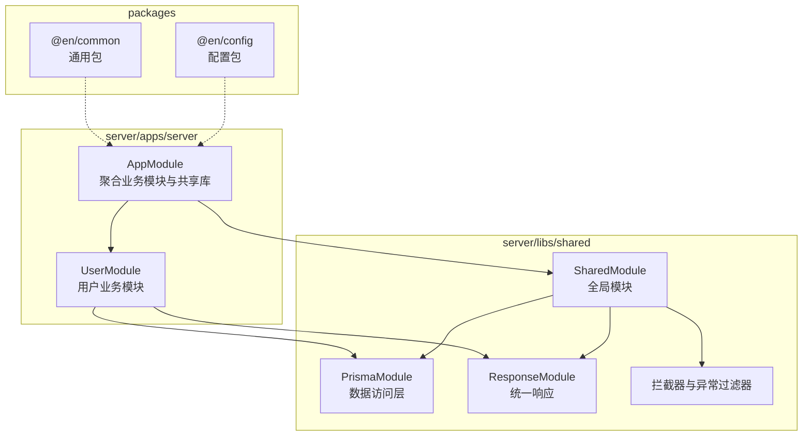
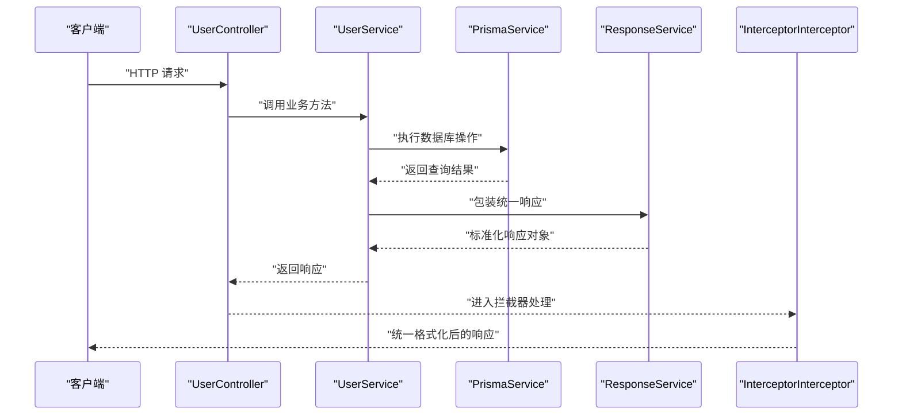
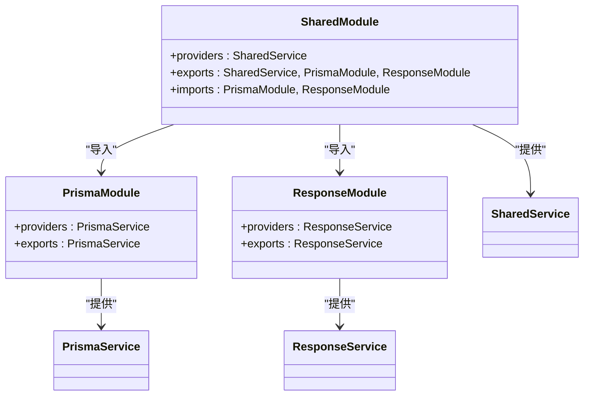
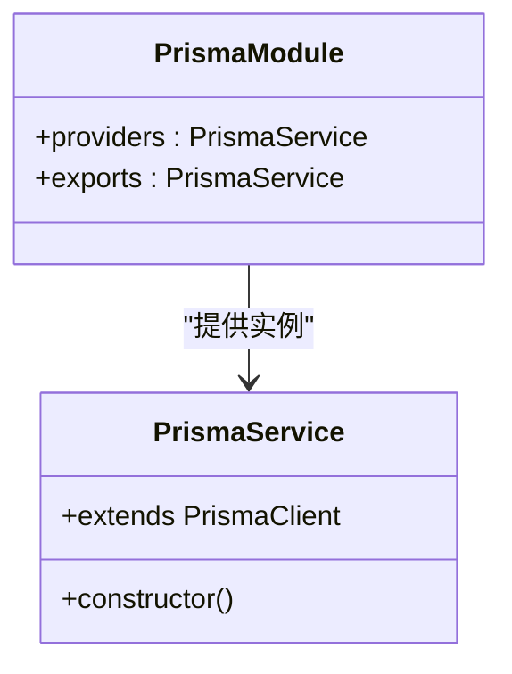
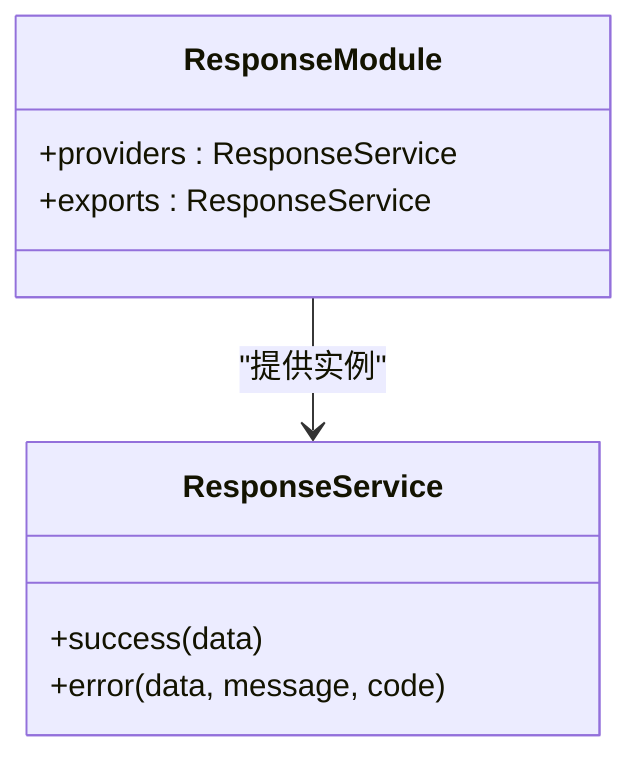
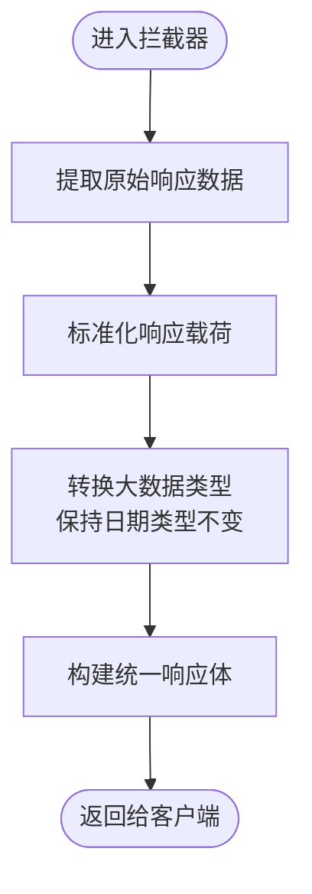
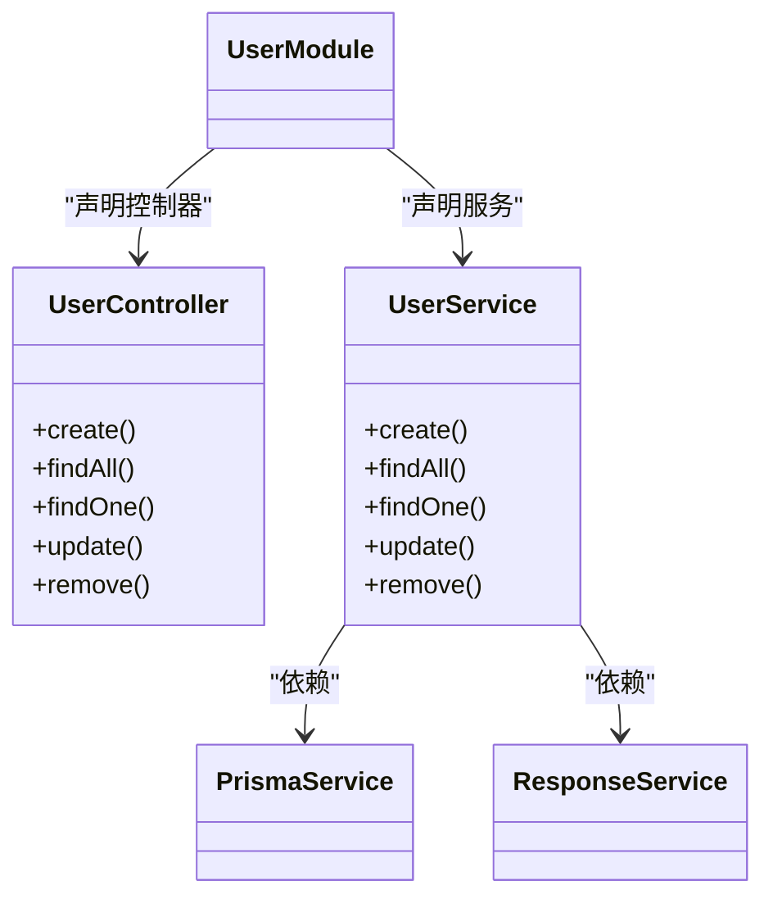
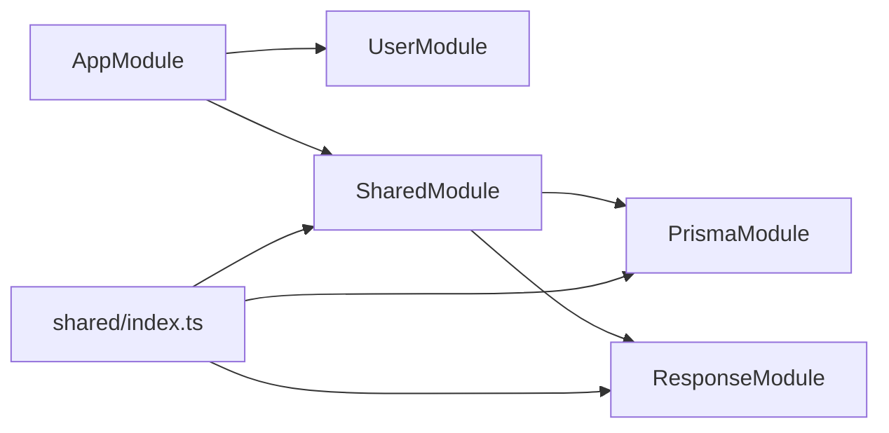

# 模块化系统设计

<cite>
**本文档引用的文件**
- [packages/common/package.json](file://packages/common/package.json)
- [packages/config/package.json](file://packages/config/package.json)
- [server/libs/shared/src/shared.module.ts](file://server/libs/shared/src/shared.module.ts)
- [server/libs/shared/src/index.ts](file://server/libs/shared/src/index.ts)
- [server/libs/shared/src/shared.service.ts](file://server/libs/shared/src/shared.service.ts)
- [server/libs/shared/src/prisma/prisma.module.ts](file://server/libs/shared/src/prisma/prisma.module.ts)
- [server/libs/shared/src/prisma/prisma.service.ts](file://server/libs/shared/src/prisma/prisma.service.ts)
- [server/libs/shared/src/response/response.module.ts](file://server/libs/shared/src/response/response.module.ts)
- [server/libs/shared/src/response/response.service.ts](file://server/libs/shared/src/response/response.service.ts)
- [server/libs/shared/src/interceptor/interceptor.ts](file://server/libs/shared/src/interceptor/interceptor.ts)
- [server/libs/shared/src/interceptor/exceptionFilter.ts](file://server/libs/shared/src/interceptor/exceptionFilter.ts)
- [server/apps/server/src/app.module.ts](file://server/apps/server/src/app.module.ts)
- [server/apps/server/src/user/user.module.ts](file://server/apps/server/src/user/user.module.ts)
- [server/apps/server/src/user/user.controller.ts](file://server/apps/server/src/user/user.controller.ts)
- [server/apps/server/src/user/user.service.ts](file://server/apps/server/src/user/user.service.ts)
</cite>

## 目录
1. [简介](#简介)
2. [项目结构](#项目结构)
3. [核心组件](#核心组件)
4. [架构总览](#架构总览)
5. [详细组件分析](#详细组件分析)
6. [依赖关系分析](#依赖关系分析)
7. [性能考虑](#性能考虑)
8. [故障排除指南](#故障排除指南)
9. [结论](#结论)
10. [附录](#附录)

## 简介
本项目采用模块化架构设计，围绕 NestJS 应用构建后端服务，通过共享库（@libs/shared）实现跨模块复用与一致性。该系统强调以下核心原则：
- 单一职责：每个模块聚焦特定业务领域或基础设施能力
- 可组合性：通过模块导入与导出实现灵活装配
- 统一抽象：数据访问层（Prisma）与响应层（统一响应）在共享库中集中定义
- 可扩展性：拦截器与异常过滤器提供横切关注点的一致处理

## 项目结构
后端采用多包工作区布局，核心目录如下：
- server/apps/server：主应用模块，聚合业务模块与共享库
- server/libs/shared：共享库，提供全局模块与基础设施能力
- packages/common、packages/config：通用包，作为工具与配置的承载

**图表来源**
- [server/apps/server/src/app.module.ts:1-13](file://server/apps/server/src/app.module.ts#L1-L13)
- [server/apps/server/src/user/user.module.ts:1-10](file://server/apps/server/src/user/user.module.ts#L1-L10)
- [server/libs/shared/src/shared.module.ts:1-13](file://server/libs/shared/src/shared.module.ts#L1-L13)

**章节来源**
- [server/apps/server/src/app.module.ts:1-13](file://server/apps/server/src/app.module.ts#L1-L13)
- [server/libs/shared/src/shared.module.ts:1-13](file://server/libs/shared/src/shared.module.ts#L1-L13)

## 核心组件
- 全局共享模块（SharedModule）
  - 角色：向整个应用提供可注入的共享能力，包括数据访问与统一响应
  - 导出：SharedService、PrismaModule、ResponseModule
  - 使用：在任意模块中通过导入 SharedModule 即可获得上述能力

- 数据访问层（Prisma）
  - PrismaModule：封装 PrismaService 的提供与导出
  - PrismaService：基于适配器连接数据库，继承 PrismaClient

- 统一响应层（Response）
  - ResponseModule：封装 ResponseService 的提供与导出
  - ResponseService：提供 success/error 两种响应格式，统一返回结构

- 拦截器与异常过滤器
  - InterceptorInterceptor：标准化所有控制器返回体，统一字段与数据类型处理
  - InterceptorExceptionFilter：捕获 HttpException 并输出统一错误响应

**章节来源**
- [server/libs/shared/src/shared.module.ts:1-13](file://server/libs/shared/src/shared.module.ts#L1-L13)
- [server/libs/shared/src/prisma/prisma.module.ts:1-9](file://server/libs/shared/src/prisma/prisma.module.ts#L1-L9)
- [server/libs/shared/src/prisma/prisma.service.ts:1-18](file://server/libs/shared/src/prisma/prisma.service.ts#L1-L18)
- [server/libs/shared/src/response/response.module.ts:1-9](file://server/libs/shared/src/response/response.module.ts#L1-L9)
- [server/libs/shared/src/response/response.service.ts:1-29](file://server/libs/shared/src/response/response.service.ts#L1-L29)
- [server/libs/shared/src/interceptor/interceptor.ts:1-86](file://server/libs/shared/src/interceptor/interceptor.ts#L1-L86)
- [server/libs/shared/src/interceptor/exceptionFilter.ts:1-23](file://server/libs/shared/src/interceptor/exceptionFilter.ts#L1-L23)

## 架构总览
下图展示了从控制器到服务再到共享库的整体调用链路，以及拦截器对响应的统一处理。

**图表来源**
- [server/apps/server/src/user/user.controller.ts:1-35](file://server/apps/server/src/user/user.controller.ts#L1-L35)
- [server/apps/server/src/user/user.service.ts:1-34](file://server/apps/server/src/user/user.service.ts#L1-L34)
- [server/libs/shared/src/prisma/prisma.service.ts:1-18](file://server/libs/shared/src/prisma/prisma.service.ts#L1-L18)
- [server/libs/shared/src/response/response.service.ts:1-29](file://server/libs/shared/src/response/response.service.ts#L1-L29)
- [server/libs/shared/src/interceptor/interceptor.ts:64-84](file://server/libs/shared/src/interceptor/interceptor.ts#L64-L84)

## 详细组件分析

### 共享模块（SharedModule）设计
- 设计理念
  - 全局模块：通过 @Global() 注解确保在整个应用范围内可用
  - 职责分离：将数据访问与响应处理抽象为独立模块，便于替换与扩展
  - 明确导出：仅导出必要的服务与模块，避免污染其他模块的命名空间

- 生命周期与依赖
  - 在应用启动时由 NestJS 初始化，PrismaService 与 ResponseService 作为单例注入
  - 依赖注入链：SharedModule -> PrismaModule/ResponseModule -> PrismaService/ResponseService

**图表来源**
- [server/libs/shared/src/shared.module.ts:1-13](file://server/libs/shared/src/shared.module.ts#L1-L13)
- [server/libs/shared/src/prisma/prisma.module.ts:1-9](file://server/libs/shared/src/prisma/prisma.module.ts#L1-L9)
- [server/libs/shared/src/response/response.module.ts:1-9](file://server/libs/shared/src/response/response.module.ts#L1-L9)
- [server/libs/shared/src/shared.service.ts:1-5](file://server/libs/shared/src/shared.service.ts#L1-L5)

**章节来源**
- [server/libs/shared/src/shared.module.ts:1-13](file://server/libs/shared/src/shared.module.ts#L1-L13)
- [server/libs/shared/src/shared.service.ts:1-5](file://server/libs/shared/src/shared.service.ts#L1-L5)

### Prisma 模块的数据访问层抽象
- 抽象层次
  - 适配器模式：通过适配器连接数据库，隐藏底层差异
  - 客户端封装：继承 PrismaClient，统一初始化与连接参数

- 复杂度与性能
  - 初始化复杂度：O(1)，连接建立发生在构造函数中
  - 查询复杂度：遵循 Prisma 原生特性，具体取决于数据库与索引设计

- 错误处理
  - 连接失败：由 Prisma 适配器抛出异常，交由上层异常过滤器处理
  - 业务异常：建议在服务层捕获并转换为统一响应

**图表来源**
- [server/libs/shared/src/prisma/prisma.service.ts:1-18](file://server/libs/shared/src/prisma/prisma.service.ts#L1-L18)
- [server/libs/shared/src/prisma/prisma.module.ts:1-9](file://server/libs/shared/src/prisma/prisma.module.ts#L1-L9)

**章节来源**
- [server/libs/shared/src/prisma/prisma.service.ts:1-18](file://server/libs/shared/src/prisma/prisma.service.ts#L1-L18)
- [server/libs/shared/src/prisma/prisma.module.ts:1-9](file://server/libs/shared/src/prisma/prisma.module.ts#L1-L9)

### Response 模块的统一响应处理机制
- 设计目标
  - 统一成功与错误响应结构，减少前端适配成本
  - 提供简洁的 API，便于在服务层快速包装响应

- 关键行为
  - success(data)：返回包含 data、code、message 的对象
  - error(data, message, code)：允许自定义 code 与 message，默认使用错误状态码

**图表来源**
- [server/libs/shared/src/response/response.service.ts:1-29](file://server/libs/shared/src/response/service.ts#L1-L29)
- [server/libs/shared/src/response/response.module.ts:1-9](file://server/libs/shared/src/response/response.module.ts#L1-L9)

**章节来源**
- [server/libs/shared/src/response/response.service.ts:1-29](file://server/libs/shared/src/response/response.service.ts#L1-L29)
- [server/libs/shared/src/response/response.module.ts:1-9](file://server/libs/shared/src/response/response.module.ts#L1-L9)

### 拦截器与异常过滤器
- InterceptorInterceptor
  - 功能：标准化所有控制器返回体，自动填充时间戳、路径、状态码等字段
  - 数据处理：对 bigint 进行字符串转换，保持日期类型不变
  - 返回形态：统一为包含 timestamp、path、message、code、success、data 的结构

- InterceptorExceptionFilter
  - 功能：捕获 HttpException，输出统一错误响应
  - 字段：timestamp、path、message、code、success（false）

**图表来源**
- [server/libs/shared/src/interceptor/interceptor.ts:28-84](file://server/libs/shared/src/interceptor/interceptor.ts#L28-L84)

**章节来源**
- [server/libs/shared/src/interceptor/interceptor.ts:1-86](file://server/libs/shared/src/interceptor/interceptor.ts#L1-L86)
- [server/libs/shared/src/interceptor/exceptionFilter.ts:1-23](file://server/libs/shared/src/interceptor/exceptionFilter.ts#L1-L23)

### 业务模块（以 UserModule 为例）
- 结构
  - UserModule：声明 UserController 与 UserService
  - UserController：暴露 REST 接口，委派给 UserService
  - UserService：依赖 PrismaService 与 ResponseService 执行业务逻辑

- 依赖关系
  - UserModule 通过导入 SharedModule 获得 PrismaService 与 ResponseService
  - UserService 在构造函数中接收 PrismaService 与 ResponseService

**图表来源**
- [server/apps/server/src/user/user.module.ts:1-10](file://server/apps/server/src/user/user.module.ts#L1-L10)
- [server/apps/server/src/user/user.controller.ts:1-35](file://server/apps/server/src/user/user.controller.ts#L1-L35)
- [server/apps/server/src/user/user.service.ts:1-34](file://server/apps/server/src/user/user.service.ts#L1-L34)

**章节来源**
- [server/apps/server/src/user/user.module.ts:1-10](file://server/apps/server/src/user/user.module.ts#L1-L10)
- [server/apps/server/src/user/user.controller.ts:1-35](file://server/apps/server/src/user/user.controller.ts#L1-L35)
- [server/apps/server/src/user/user.service.ts:1-34](file://server/apps/server/src/user/user.service.ts#L1-L34)

## 依赖关系分析
- 模块耦合
  - AppModule 聚合 UserModule 与 SharedModule，体现高层聚合
  - UserModule 通过 SharedModule 获取共享能力，降低重复依赖

- 导入/导出约定
  - shared/index.ts 统一导出共享模块与服务，便于外部按需引入
  - shared.module.ts 将 PrismaModule 与 ResponseModule 作为子模块导入，形成复合模块

**图表来源**
- [server/apps/server/src/app.module.ts:1-13](file://server/apps/server/src/app.module.ts#L1-L13)
- [server/libs/shared/src/shared.module.ts:1-13](file://server/libs/shared/src/shared.module.ts#L1-L13)
- [server/libs/shared/src/index.ts:1-7](file://server/libs/shared/src/index.ts#L1-L7)

**章节来源**
- [server/apps/server/src/app.module.ts:1-13](file://server/apps/server/src/app.module.ts#L1-L13)
- [server/libs/shared/src/index.ts:1-7](file://server/libs/shared/src/index.ts#L1-L7)

## 性能考虑
- 模块加载
  - 全局模块在应用启动阶段初始化，建议将重型初始化逻辑放在服务层惰性执行
- 数据访问
  - 合理使用事务与批量操作，避免 N+1 查询
  - 对高频查询建立索引，优化查询计划
- 响应处理
  - 拦截器对所有响应进行统一封装，注意避免对大对象进行不必要的深拷贝
- 异常处理
  - 将异常过滤器置于拦截器之后，确保错误响应也符合统一格式

## 故障排除指南
- 数据库连接失败
  - 检查环境变量 DATABASE_URL 是否正确
  - 确认 Prisma 适配器初始化是否成功
- 响应格式异常
  - 确保服务层返回值被 ResponseService 包装
  - 检查拦截器是否正确识别并转换响应载荷
- 异常未被捕获
  - 确认异常过滤器已注册并优先级正确
  - 检查控制器是否抛出了 HttpException

**章节来源**
- [server/libs/shared/src/prisma/prisma.service.ts:1-18](file://server/libs/shared/src/prisma/prisma.service.ts#L1-L18)
- [server/libs/shared/src/response/response.service.ts:1-29](file://server/libs/shared/src/response/response.service.ts#L1-L29)
- [server/libs/shared/src/interceptor/exceptionFilter.ts:1-23](file://server/libs/shared/src/interceptor/exceptionFilter.ts#L1-L23)

## 结论
本模块化系统通过共享库实现了跨模块的能力复用与一致性约束，Prisma 模块提供了稳定的数据访问抽象，Response 模块保证了统一的响应格式。拦截器与异常过滤器进一步增强了系统的可观测性与可维护性。建议在后续迭代中完善测试覆盖与文档，持续优化性能与扩展性。

## 附录
- 通用包（packages/common、packages/config）
  - 当前仓库中的通用包未包含具体实现，建议在此基础上添加通用工具函数与配置项，以便在多个应用间共享
- 开发规范与测试策略
  - 遵循单一职责与高内聚低耦合原则
  - 为共享模块编写单元测试与集成测试
  - 使用 TypeScript 类型系统强化契约约束
- 热更新与懒加载
  - NestJS 支持开发模式下的热重载；生产环境建议通过容器编排实现滚动更新
  - 对于大型共享模块，可考虑按需导入与延迟初始化策略

**章节来源**
- [packages/common/package.json:1-21](file://packages/common/package.json#L1-L21)
- [packages/config/package.json:1-24](file://packages/config/package.json#L1-L24)