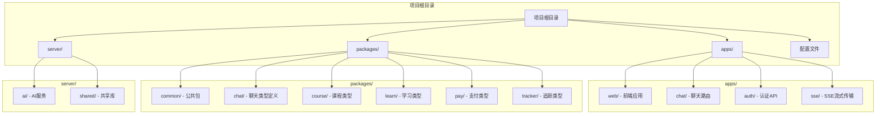
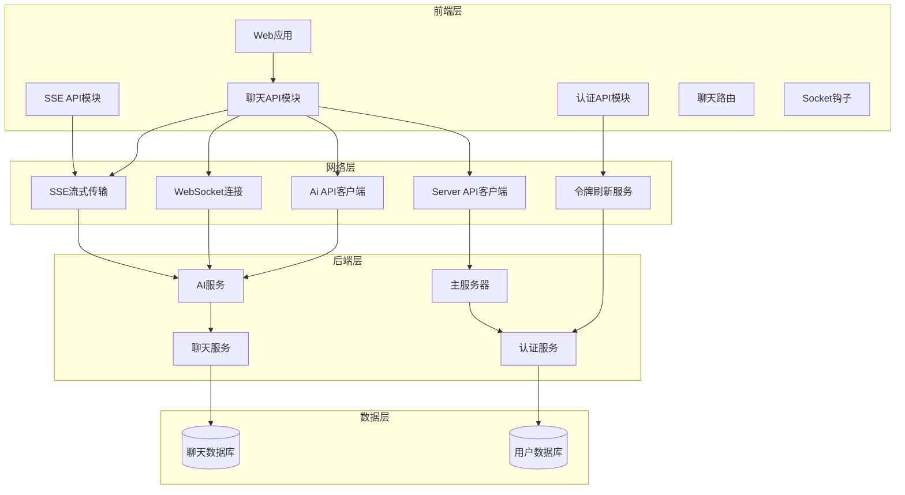
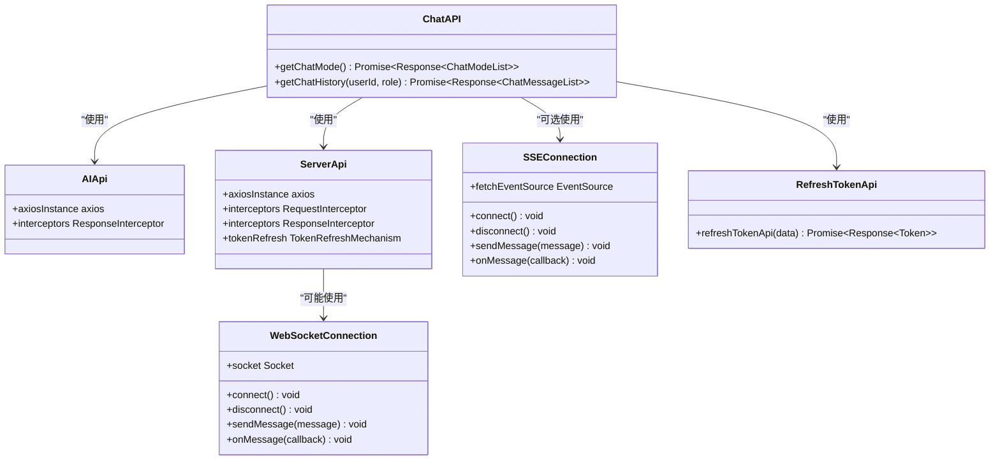
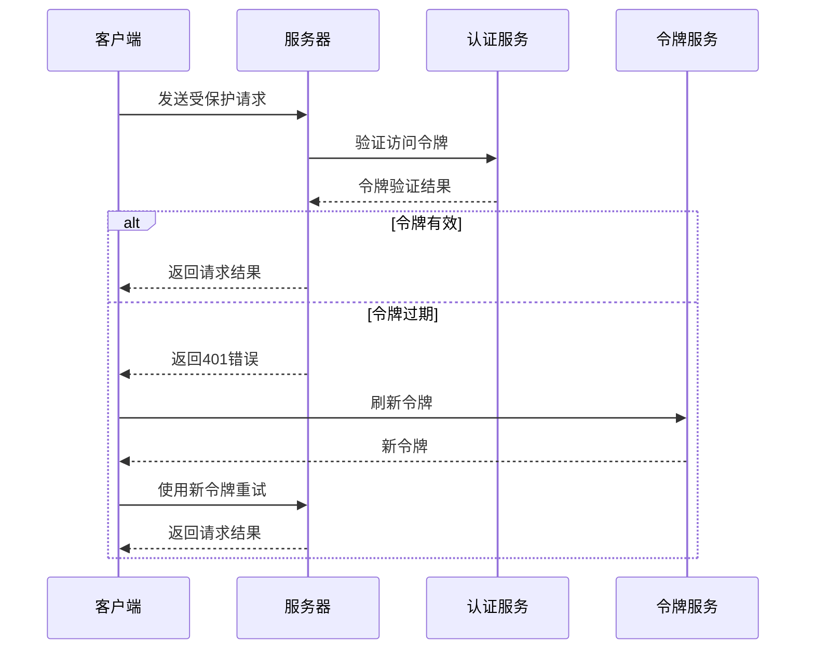

# 聊天管理模块

<cite>
**本文档引用的文件**
- [packages/common/chat/index.ts](file://packages/common/chat/index.ts)
- [apps/web/src/apis/chat/index.ts](file://apps/web/src/apis/chat/index.ts)
- [apps/web/src/apis/index.ts](file://apps/web/src/apis/index.ts)
- [apps/web/src/apis/sse/index.ts](file://apps/web/src/apis/sse/index.ts)
- [apps/web/src/apis/auth/index.ts](file://apps/web/src/apis/auth/index.ts)
- [apps/web/src/router/chat/index.ts](file://apps/web/src/router/chat/index.ts)
- [apps/web/src/router/index.ts](file://apps/web/src/router/index.ts)
- [package.json](file://package.json)
- [pnpm-workspace.yaml](file://pnpm-workspace.yaml)
</cite>

## 更新摘要
**所做的更改**
- 新增完整的聊天角色系统和消息类型机制的详细说明
- 补充对话管理模式的完整实现细节，包括新的聊天角色类型
- 完善认证授权机制的技术规范，包括令牌刷新流程
- 增加SSE流式传输和WebSocket集成方案的详细说明
- 扩展最佳实践指南和故障排除建议
- 添加聊天数据传输对象(ChatDto)的详细说明

## 目录
1. [项目概述](#项目概述)
2. [项目结构](#项目结构)
3. [核心组件](#核心组件)
4. [架构概览](#架构概览)
5. [详细组件分析](#详细组件分析)
6. [依赖关系分析](#依赖关系分析)
7. [性能考虑](#性能考虑)
8. [故障排除指南](#故障排除指南)
9. [结论](#结论)

## 项目概述

这是一个AI英语学习网站项目，主要功能是提供每日英语单词练习和智能聊天辅助学习。项目采用前后端分离架构，前端使用Vue.js技术栈，后端使用NestJS框架。聊天管理模块作为核心功能之一，通过智能聊天系统帮助用户进行英语学习和词汇记忆。

根据项目描述，这是一个专注于英语学习的AI应用，通过智能聊天功能帮助用户重新记忆英语单词，提供个性化的学习体验。

**章节来源**
- [package.json:1-15](file://package.json#L1-L15)

## 项目结构

项目采用monorepo架构，主要包含以下核心目录：



**图表来源**
- [pnpm-workspace.yaml:1-12](file://pnpm-workspace.yaml#L1-L12)
- [packages/common/chat/index.ts:1-34](file://packages/common/chat/index.ts#L1-L34)

**章节来源**
- [pnpm-workspace.yaml:1-12](file://pnpm-workspace.yaml#L1-L12)
- [packages/common/chat/index.ts:1-34](file://packages/common/chat/index.ts#L1-L34)

## 核心组件

### 聊天API模块

聊天管理模块主要由前端API层组成，负责与AI服务进行通信。当前实现包含两个核心功能：

1. **获取聊天模式列表** - 通过`getChatMode()`函数获取预定义的对话场景列表
2. **获取聊天历史记录** - 通过`getChatHistory()`函数按用户ID和角色类型检索对话历史

这些功能通过统一的AI API客户端进行访问，支持WebSocket连接用于实时通信。

### 类型定义系统

项目实现了完整的类型定义系统，确保前后端数据交互的一致性和安全性：

- **聊天角色类型** (`ChatRoleType`): normal、master、business、qilinge、xiaoman
- **消息类型** (`ChatMessageType`): reasoning（思维推理）、chat（聊天）
- **消息结构** (`ChatMessage`): 包含角色、内容、可选的推理内容和消息类型
- **聊天模式** (`ChatMode`): 包含标签、ID和角色信息
- **聊天数据传输对象** (`ChatDto`): 包含深度思考、网络搜索、角色、内容和用户ID

### API客户端配置

项目使用Axios创建了两个主要的API客户端：

- `serverApi`: 用于与主服务器通信，包含完整的认证和错误处理机制
- `aiApi`: 专门用于AI服务通信，简化了AI相关请求的处理

**章节来源**
- [apps/web/src/apis/chat/index.ts:1-15](file://apps/web/src/apis/chat/index.ts#L1-L15)
- [apps/web/src/apis/index.ts:88-107](file://apps/web/src/apis/index.ts#L88-L107)
- [packages/common/chat/index.ts:1-34](file://packages/common/chat/index.ts#L1-L34)

## 架构概览



**图表来源**
- [apps/web/src/apis/chat/index.ts:1-15](file://apps/web/src/apis/chat/index.ts#L1-L15)
- [apps/web/src/apis/index.ts:17-107](file://apps/web/src/apis/index.ts#L17-L107)
- [apps/web/src/router/chat/index.ts:1-11](file://apps/web/src/router/chat/index.ts#L1-L11)

## 详细组件分析

### 聊天API接口设计



**图表来源**
- [apps/web/src/apis/chat/index.ts:1-15](file://apps/web/src/apis/chat/index.ts#L1-L15)
- [apps/web/src/apis/index.ts:17-107](file://apps/web/src/apis/index.ts#L17-L107)
- [apps/web/src/apis/sse/index.ts:1-27](file://apps/web/src/apis/sse/index.ts#L1-L27)

### 聊天角色系统

聊天角色系统定义了五种不同的对话角色类型，每种角色都有特定的学习目标和交互模式：

- **normal（普通模式）**: 标准的英语学习对话，适合日常词汇练习
- **master（专家模式）**: 高级英语对话，包含复杂的语法结构和专业术语
- **business（商务模式）**: 商务英语场景，专注于职场沟通表达
- **qilinge（趣味模式）**: 轻松有趣的对话形式，提高学习兴趣
- **xiaoman（小白模式）**: 适合英语初学者的基础对话

**章节来源**
- [packages/common/chat/index.ts:2-7](file://packages/common/chat/index.ts#L2-L7)

### 消息类型机制

消息类型机制区分了两种不同性质的对话内容：

- **reasoning（思维推理）**: AI助手的思考过程和推理内容，通常不直接显示给用户
- **chat（聊天）**: 真正的对话内容，用户可以直接看到和交互

这种设计允许AI在保持透明度的同时，为用户提供更丰富的学习体验。

**章节来源**
- [packages/common/chat/index.ts:8](file://packages/common/chat/index.ts#L8)

### 对话管理模式

聊天模式列表功能提供了预定义的对话场景，用户可以根据不同的学习需求选择合适的对话模式。每个模式都包含：

- **label（标签）**: 模式的中文名称，便于用户理解
- **id（标识符）**: 模式的唯一标识符，用于程序识别
- **role（角色）**: 模式对应的聊天角色类型

**章节来源**
- [packages/common/chat/index.ts:19-25](file://packages/common/chat/index.ts#L19-L25)

### 聊天历史管理

聊天历史功能允许用户按用户ID和角色类型检索之前的对话记录。这为用户提供了：

- **对话历史追踪**: 查看之前的对话内容和学习进度
- **学习进度记录**: 跟踪用户的英语学习历程
- **个性化学习路径**: 根据历史记录推荐合适的学习内容
- **错误纠正和复习**: 通过历史记录发现和纠正学习中的问题

**章节来源**
- [apps/web/src/apis/chat/index.ts:11-14](file://apps/web/src/apis/chat/index.ts#L11-L14)

### 认证和授权机制

项目实现了完整的认证流程，包括：



**图表来源**
- [apps/web/src/apis/index.ts:34-86](file://apps/web/src/apis/index.ts#L34-L86)

**章节来源**
- [apps/web/src/apis/index.ts:34-86](file://apps/web/src/apis/index.ts#L34-L86)

### 流式传输和实时通信

项目支持多种实时通信方式：

- **WebSocket**: 用于双向实时通信，支持即时消息传递
- **SSE（Server-Sent Events）**: 用于单向实时数据推送，支持流式响应
- **轮询**: 作为后备方案，确保在网络条件不佳时仍能获取数据

**章节来源**
- [apps/web/src/apis/sse/index.ts:1-27](file://apps/web/src/apis/sse/index.ts#L1-L27)

### 聊天数据传输对象

聊天数据传输对象定义了发送聊天消息所需的完整数据结构：

- **deepThink（深度思考）**: 布尔值，控制是否启用深度思考模式
- **webSearch（网络搜索）**: 布尔值，控制是否启用网络搜索功能
- **role（角色）**: 聊天角色类型，指定对话场景
- **content（内容）**: 用户输入的聊天内容
- **userId（用户ID）**: 当前用户的唯一标识符

**章节来源**
- [packages/common/chat/index.ts:27-33](file://packages/common/chat/index.ts#L27-L33)

## 依赖关系分析

```mermaid
graph LR
subgraph "外部依赖"
Axios[Axios HTTP客户端]
ElementPlus[Element Plus UI库]
Vue[Vue.js框架]
FetchEventSource[fetch-event-source]
Concurrent[并发执行库]
SocketIO[Socket.IO]
End
subgraph "内部包"
Common[@en/common 公共类型]
ChatTypes[聊天类型定义]
UserStore[用户状态管理]
Router[路由管理]
AuthAPI[认证API]
SSEAPI[SSE API]
end
subgraph "聊天模块"
ChatAPI[聊天API]
AuthAPI[认证API]
SSEAPI[SSE API]
end
Axios --> ChatAPI
ElementPlus --> ChatAPI
Vue --> ChatAPI
FetchEventSource --> SSEAPI
Concurrent --> ChatAPI
Common --> ChatAPI
ChatTypes --> ChatAPI
UserStore --> ChatAPI
Router --> ChatAPI
AuthAPI --> ChatAPI
SSEAPI --> ChatAPI
ChatAPI --> AuthAPI
ChatAPI --> SSEAPI
```

**图表来源**
- [apps/web/src/apis/chat/index.ts:1-6](file://apps/web/src/apis/chat/index.ts#L1-L6)
- [apps/web/src/apis/index.ts:1-5](file://apps/web/src/apis/index.ts#L1-L5)
- [apps/web/src/apis/sse/index.ts:1](file://apps/web/src/apis/sse/index.ts#L1)
- [package.json:8-13](file://package.json#L8-L13)

**章节来源**
- [apps/web/src/apis/chat/index.ts:1-6](file://apps/web/src/apis/chat/index.ts#L1-L6)
- [apps/web/src/apis/index.ts:1-5](file://apps/web/src/apis/index.ts#L1-L5)
- [apps/web/src/apis/sse/index.ts:1](file://apps/web/src/apis/sse/index.ts#L1)
- [package.json:8-13](file://package.json#L8-L13)

## 性能考虑

### 网络优化策略

1. **请求超时配置**: 设置合理的超时时间（50秒）以平衡响应速度和稳定性
2. **连接池管理**: 合理管理HTTP连接，避免资源泄漏
3. **缓存策略**: 实现适当的缓存机制减少重复请求
4. **WebSocket复用**: 复用WebSocket连接降低建立成本
5. **SSE连接管理**: 优化Server-Sent Events连接，支持自动重连

### 错误处理机制

项目实现了多层次的错误处理：

- **网络错误检测**: 自动识别网络连接问题
- **认证错误处理**: 自动刷新令牌并重试请求
- **服务器错误处理**: 提供友好的错误提示
- **请求队列管理**: 在令牌刷新期间排队等待的请求
- **超时处理**: 统一的超时管理和用户提示

### 实时通信优化

- **连接状态监控**: 实时监控WebSocket和SSE连接状态
- **自动重连机制**: 网络断开后的自动重连和状态恢复
- **消息去重**: 防止重复消息的处理和显示
- **流量控制**: 控制实时消息的接收频率，避免过载

## 故障排除指南

### 常见问题及解决方案

1. **聊天功能不可用**
   - 检查WebSocket连接状态和SSE连接状态
   - 验证AI服务端点可达性
   - 确认用户认证状态和令牌有效性
   - 检查网络防火墙设置

2. **聊天历史无法加载**
   - 验证用户ID格式正确且存在
   - 检查角色参数有效性（normal/master/business/qilinge/xiaoman）
   - 确认数据库连接正常
   - 验证用户权限和数据访问权限

3. **认证失败**
   - 检查访问令牌和刷新令牌的有效性
   - 验证服务器时间同步和时区设置
   - 确认网络连接稳定和代理配置正确
   - 检查用户账户状态和激活情况

4. **实时通信问题**
   - 检查浏览器对WebSocket和SSE的支持
   - 验证服务器端口开放和防火墙规则
   - 确认CDN和代理配置不影响实时通信
   - 检查客户端JavaScript错误和控制台日志

5. **性能问题**
   - 监控API响应时间和服务器负载
   - 检查数据库查询性能和索引使用
   - 分析内存使用和垃圾回收情况
   - 优化图片和静态资源加载

**章节来源**
- [apps/web/src/apis/index.ts:39-84](file://apps/web/src/apis/index.ts#L39-L84)

## 结论

聊天管理模块作为AI英语学习系统的核心组件，通过清晰的类型定义、完善的API设计、灵活的实时通信机制和可靠的认证授权体系，为用户提供了完整的智能聊天学习体验。

模块的主要优势包括：
- **完整的类型系统**: TypeScript类型定义确保开发时的类型安全
- **灵活的角色系统**: 支持多种学习场景和用户需求
- **多样的通信方式**: WebSocket、SSE和传统HTTP请求的组合使用
- **完善的错误处理**: 多层次的错误检测和自动恢复机制
- **优秀的用户体验**: 实时响应、流畅的交互和友好的错误提示

未来可以考虑的功能增强：
- **聊天内容的本地存储**: 实现离线聊天记录的本地缓存
- **聊天内容的导出功能**: 支持将学习记录导出为PDF或文本格式
- **聊天历史的搜索和过滤**: 增强聊天历史的检索能力
- **聊天内容的分享功能**: 允许用户分享学习成果和对话内容
- **多语言支持**: 扩展到更多语言的学习场景
- **AI模型选择**: 允许用户选择不同的AI模型进行对话

通过持续的优化和功能扩展，聊天管理模块将继续为AI英语学习平台提供强大的技术支持和优质的用户体验。