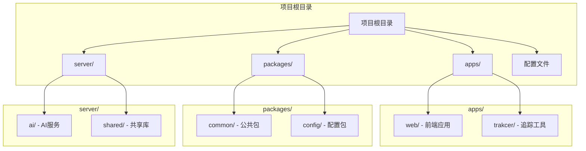
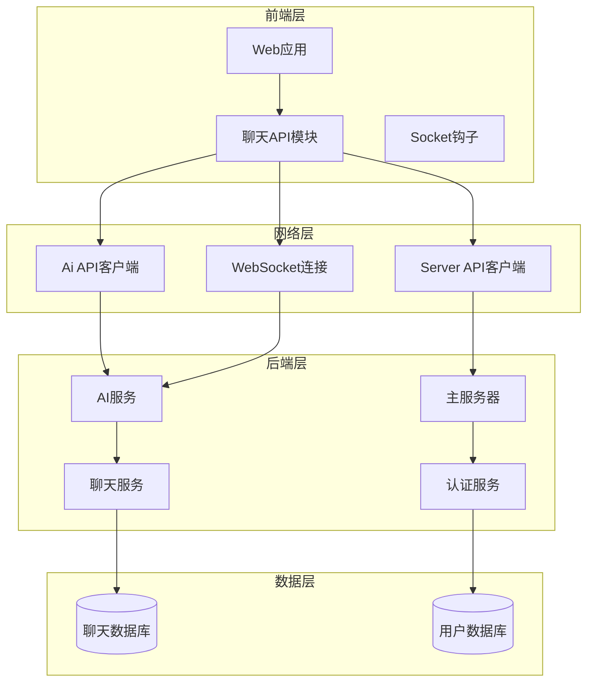
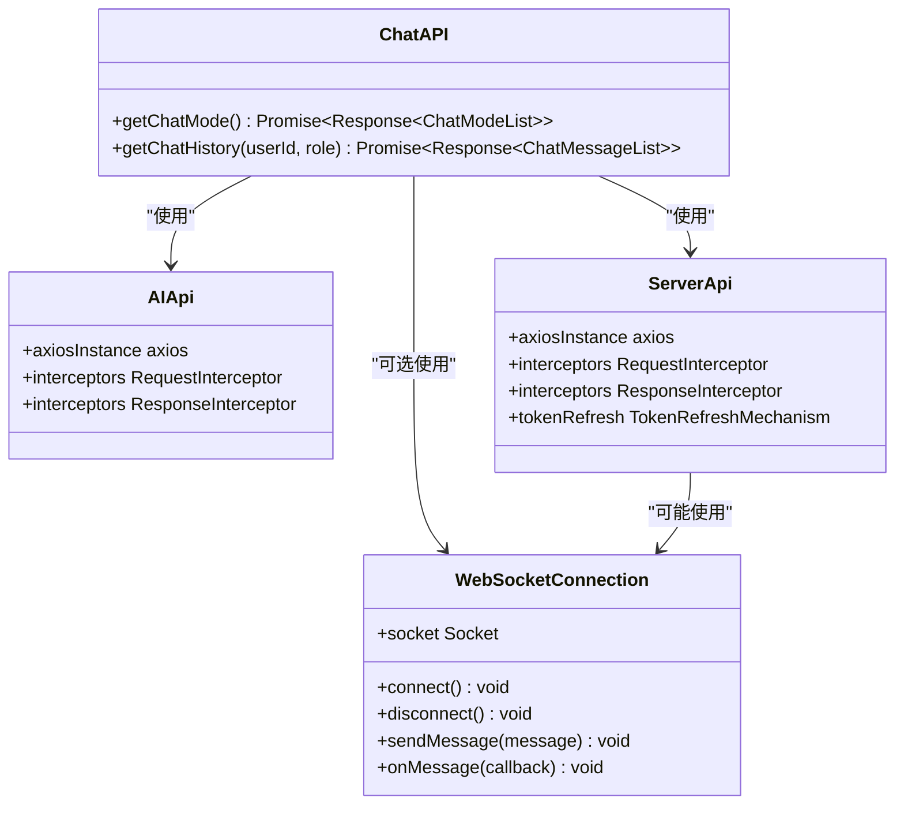
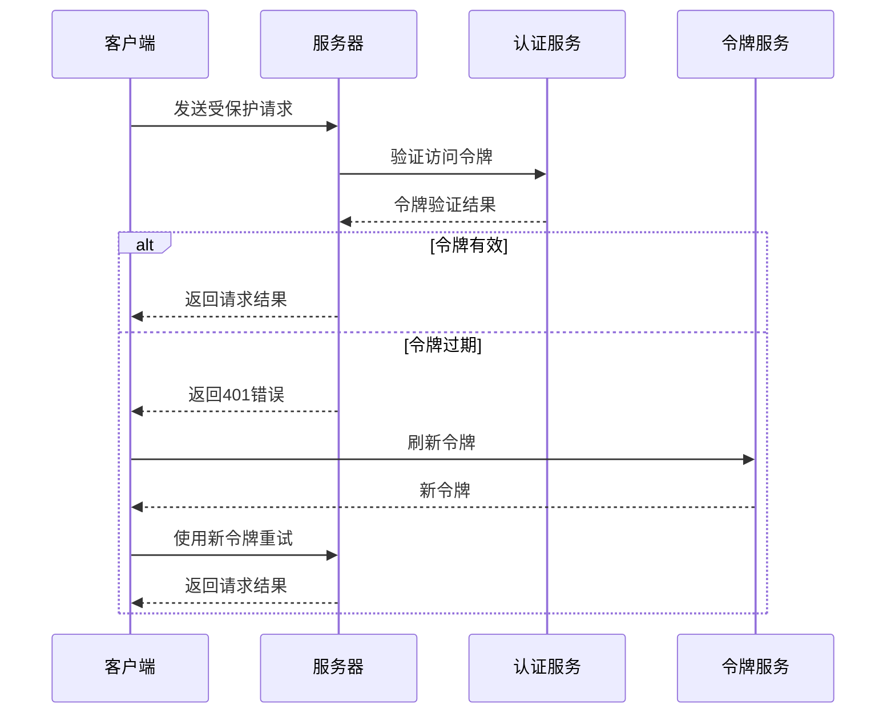

# 聊天管理模块

<cite>
**本文档引用的文件**
- [apps/web/src/apis/chat/index.ts](file://apps/web/src/apis/chat/index.ts)
- [apps/web/src/apis/index.ts](file://apps/web/src/apis/index.ts)
- [packages/common/package.json](file://packages/common/package.json)
- [README.md](file://README.md)
</cite>

## 目录
1. [项目概述](#项目概述)
2. [项目结构](#项目结构)
3. [核心组件](#核心组件)
4. [架构概览](#架构概览)
5. [详细组件分析](#详细组件分析)
6. [依赖关系分析](#依赖关系分析)
7. [性能考虑](#性能考虑)
8. [故障排除指南](#故障排除指南)
9. [结论](#结论)

## 项目概述

这是一个AI英语学习网站项目，主要功能是提供每日英语单词练习和智能聊天辅助学习。项目采用前后端分离架构，前端使用Vue.js技术栈，后端使用NestJS框架。

根据项目描述，这是一个专注于英语学习的AI应用，通过智能聊天功能帮助用户重新记忆英语单词。

**章节来源**
- [README.md:1-2](file://README.md#L1-L2)

## 项目结构

项目采用monorepo架构，主要包含以下核心目录：



**图表来源**
- [apps/web/src/apis/chat/index.ts:1-15](file://apps/web/src/apis/chat/index.ts#L1-L15)
- [apps/web/src/apis/index.ts:1-107](file://apps/web/src/apis/index.ts#L1-L107)
- [packages/common/package.json:1-21](file://packages/common/package.json#L1-L21)

**章节来源**
- [apps/web/src/apis/chat/index.ts:1-15](file://apps/web/src/apis/chat/index.ts#L1-L15)
- [apps/web/src/apis/index.ts:1-107](file://apps/web/src/apis/index.ts#L1-L107)
- [packages/common/package.json:1-21](file://packages/common/package.json#L1-L21)

## 核心组件

### 聊天API模块

聊天管理模块主要由前端API层组成，负责与AI服务进行通信。当前实现包含两个核心功能：

1. **获取聊天模式列表**
2. **获取聊天历史记录**

这些功能通过统一的AI API客户端进行访问，支持WebSocket连接用于实时通信。

### API客户端配置

项目使用Axios创建了两个主要的API客户端：

- `serverApi`: 用于与主服务器通信，包含完整的认证和错误处理机制
- `aiApi`: 专门用于AI服务通信，简化了AI相关请求的处理

**章节来源**
- [apps/web/src/apis/chat/index.ts:1-15](file://apps/web/src/apis/chat/index.ts#L1-L15)
- [apps/web/src/apis/index.ts:88-97](file://apps/web/src/apis/index.ts#L88-L97)

## 架构概览



**图表来源**
- [apps/web/src/apis/chat/index.ts:1-15](file://apps/web/src/apis/chat/index.ts#L1-L15)
- [apps/web/src/apis/index.ts:17-97](file://apps/web/src/apis/index.ts#L17-L97)

## 详细组件分析

### 聊天API接口设计



**图表来源**
- [apps/web/src/apis/chat/index.ts:1-15](file://apps/web/src/apis/chat/index.ts#L1-L15)
- [apps/web/src/apis/index.ts:17-97](file://apps/web/src/apis/index.ts#L17-L97)

### 聊天模式管理

聊天模式列表功能提供了预定义的对话场景，用户可以根据不同的学习需求选择合适的对话模式。这些模式可能包括：

- 单词练习模式
- 句子构造模式  
- 语法问答模式
- 词汇扩展模式

**章节来源**
- [apps/web/src/apis/chat/index.ts:8-9](file://apps/web/src/apis/chat/index.ts#L8-L9)

### 聊天历史管理

聊天历史功能允许用户按用户ID和角色类型检索之前的对话记录。这为用户提供了：

- 对话历史追踪
- 学习进度记录
- 个性化学习路径
- 错误纠正和复习

**章节来源**
- [apps/web/src/apis/chat/index.ts:11-14](file://apps/web/src/apis/chat/index.ts#L11-L14)

### 认证和授权机制

项目实现了完整的认证流程，包括：



**图表来源**
- [apps/web/src/apis/index.ts:34-86](file://apps/web/src/apis/index.ts#L34-L86)

**章节来源**
- [apps/web/src/apis/index.ts:34-86](file://apps/web/src/apis/index.ts#L34-L86)

## 依赖关系分析

```mermaid
graph LR
subgraph "外部依赖"
Axios[Axios HTTP客户端]
ElementPlus[Element Plus UI库]
Vue[Vue.js框架]
end
subgraph "内部包"
Common[@en/common 公共类型]
UserStore[用户状态管理]
Router[路由管理]
end
subgraph "聊天模块"
ChatAPI[聊天API]
SocketHook[Socket钩子]
AuthAPI[认证API]
end
Axios --> ChatAPI
ElementPlus --> ChatAPI
Vue --> ChatAPI
Common --> ChatAPI
UserStore --> ChatAPI
Router --> ChatAPI
ChatAPI --> SocketHook
ChatAPI --> AuthAPI
```

**图表来源**
- [apps/web/src/apis/chat/index.ts:1-6](file://apps/web/src/apis/chat/index.ts#L1-L6)
- [apps/web/src/apis/index.ts:1-5](file://apps/web/src/apis/index.ts#L1-L5)

**章节来源**
- [apps/web/src/apis/chat/index.ts:1-6](file://apps/web/src/apis/chat/index.ts#L1-L6)
- [apps/web/src/apis/index.ts:1-5](file://apps/web/src/apis/index.ts#L1-L5)

## 性能考虑

### 网络优化策略

1. **请求超时配置**: 设置合理的超时时间（50秒）以平衡响应速度和稳定性
2. **连接池管理**: 合理管理HTTP连接，避免资源泄漏
3. **缓存策略**: 实现适当的缓存机制减少重复请求
4. **WebSocket复用**: 复用WebSocket连接降低建立成本

### 错误处理机制

项目实现了多层次的错误处理：

- **网络错误检测**: 自动识别网络连接问题
- **认证错误处理**: 自动刷新令牌并重试请求
- **服务器错误处理**: 提供友好的错误提示
- **请求队列管理**: 在令牌刷新期间排队等待的请求

## 故障排除指南

### 常见问题及解决方案

1. **聊天功能不可用**
   - 检查WebSocket连接状态
   - 验证AI服务端点可达性
   - 确认用户认证状态

2. **聊天历史无法加载**
   - 验证用户ID格式正确
   - 检查角色参数有效性
   - 确认数据库连接正常

3. **认证失败**
   - 检查访问令牌和刷新令牌
   - 验证服务器时间同步
   - 确认网络连接稳定

**章节来源**
- [apps/web/src/apis/index.ts:39-84](file://apps/web/src/apis/index.ts#L39-L84)

## 结论

聊天管理模块作为AI英语学习系统的核心组件，提供了完整的对话管理和历史追踪功能。通过清晰的API设计、完善的认证机制和灵活的WebSocket集成，为用户提供了流畅的AI聊天学习体验。

模块的主要优势包括：
- 清晰的职责分离和模块化设计
- 完善的错误处理和重试机制
- 支持实时通信的WebSocket集成
- 灵活的聊天模式配置
- 用户友好的错误提示

未来可以考虑的功能增强：
- 添加聊天内容的本地存储
- 实现聊天内容的导出功能
- 增强聊天历史的搜索和过滤能力
- 添加聊天内容的分享功能