# 课程管理模块

<cite>
**本文档引用的文件**
- [README.md](file://README.md)
- [package.json](file://package.json)
- [apps/web/src/apis/course/index.ts](file://apps/web/src/apis/course/index.ts)
- [apps/web/src/apis/index.ts](file://apps/web/src/apis/index.ts)
- [apps/web/src/apis/learn/index.ts](file://apps/web/src/apis/learn/index.ts)
- [apps/web/src/apis/auth/index.ts](file://apps/web/src/apis/auth/index.ts)
- [packages/common/course/index.ts](file://packages/common/course/index.ts)
- [packages/common/pay/index.ts](file://packages/common/pay/index.ts)
- [packages/common/learn/index.ts](file://packages/common/learn/index.ts)
- [packages/common/word/index.ts](file://packages/common/word/index.ts)
- [packages/common/tracker/index.ts](file://packages/common/tracker/index.ts)
- [apps/tracker/src/pv/index.ts](file://apps/tracker/src/pv/index.ts)
- [apps/tracker/src/event/index.ts](file://apps/tracker/src/event/index.ts)
- [apps/tracker/src/error/index.ts](file://apps/tracker/src/error/index.ts)
- [apps/tracker/src/performance/index.ts](file://apps/tracker/src/performance/index.ts)
- [apps/tracker/src/uv/index.ts](file://apps/tracker/src/uv/index.ts)
- [apps/tracker/index.ts](file://apps/tracker/index.ts)
- [server/apps/server/src/tracker/dto/create-tracker.dto.ts](file://server/apps/server/src/tracker/dto/create-tracker.dto.ts)
</cite>

## 更新摘要
**所做更改**
- 新增了完整的追踪系统模块，包含用户访问(UV)、页面浏览(PV)、事件跟踪、错误报告和性能指标的端点定义
- 添加了追踪配置接口和数据传输对象的完整类型定义
- 集成了前端追踪应用，提供实时的用户行为监控能力
- 扩展了课程管理模块的可观测性支持

## 目录
1. [项目概述](#项目概述)
2. [项目结构](#项目结构)
3. [核心组件](#核心组件)
4. [架构概览](#架构概览)
5. [详细组件分析](#详细组件分析)
6. [追踪系统集成](#追踪系统集成)
7. [依赖关系分析](#依赖关系分析)
8. [性能考虑](#性能考虑)
9. [故障排除指南](#故障排除指南)
10. [结论](#结论)

## 项目概述

这是一个基于AI技术的英语学习网站项目，名为"English-Study"（每日一练重新记忆英语单词）。该项目采用现代化的前端技术栈，包括Vue 3、TypeScript、Element Plus等，为用户提供个性化的英语学习体验。

项目采用monorepo架构，通过pnpm workspace进行包管理，主要包含以下核心模块：
- Web前端应用：提供用户界面和交互功能
- 服务器端：处理业务逻辑和数据管理
- AI服务：提供智能学习辅助功能
- 公共包：共享的数据模型和工具函数
- **追踪系统**：提供完整的用户行为分析和监控能力

**章节来源**
- [README.md:1-2](file://README.md#L1-L2)
- [package.json:1-15](file://package.json#L1-L15)

## 项目结构

项目采用清晰的目录结构，主要分为以下几个部分：

```mermaid
graph TB
subgraph "项目根目录"
Root[项目根目录]
Apps[apps/ 应用目录]
Packages[packages/ 包目录]
Server[server/ 服务器目录]
Config[配置文件]
end
subgraph "apps/ 目录结构"
Web[web/ 前端应用]
Tracker[tracker/ 追踪应用]
Trakcer[trakcer/ 追踪应用(旧版本)]
subgraph "web/src"
WebApis[apis/ API接口]
WebComponents[components/ 组件]
WebHooks[hooks/ 自定义钩子]
WebStores[stores/ 状态管理]
end
subgraph "tracker/src"
TrackerModules[pv/ 页面浏览]
TrackerModules2[event/ 事件跟踪]
TrackerModules3[error/ 错误报告]
TrackerModules4[performance/ 性能监控]
TrackerModules5[uv/ 用户访问]
end
end
subgraph "packages/ 目录结构"
Common[common/ 公共包]
Common2[tracker/ 追踪配置]
ConfigPkg[config/ 配置包]
end
Root --> Apps
Root --> Packages
Root --> Server
Root --> Config
Apps --> Web
Apps --> Tracker
Apps --> Trakcer
Web --> WebApis
Web --> WebComponents
Web --> WebHooks
Web --> WebStores
Tracker --> TrackerModules
Tracker --> TrackerModules2
Tracker --> TrackerModules3
Tracker --> TrackerModules4
Tracker --> TrackerModules5
Packages --> Common
Packages --> Common2
Packages --> ConfigPkg
```

**图表来源**
- [package.json:1-15](file://package.json#L1-L15)
- [packages/config/index.ts:1-7](file://packages/config/index.ts#L1-L7)

**章节来源**
- [package.json:1-15](file://package.json#L1-L15)
- [packages/config/index.ts:1-7](file://packages/config/index.ts#L1-L7)

## 核心组件

### 课程管理API层

课程管理模块的核心是位于`apps/web/src/apis/course/`目录下的API接口，主要包含两个核心方法：

1. **获取课程列表** (`getCourseList`)
2. **获取我的课程** (`getMyCourse`)

这些API通过统一的`serverApi`实例与后端服务通信，支持自动认证和令牌刷新机制。

### 数据模型定义

课程相关的数据模型定义在`packages/common/course/`目录中，包含完整的类型定义：

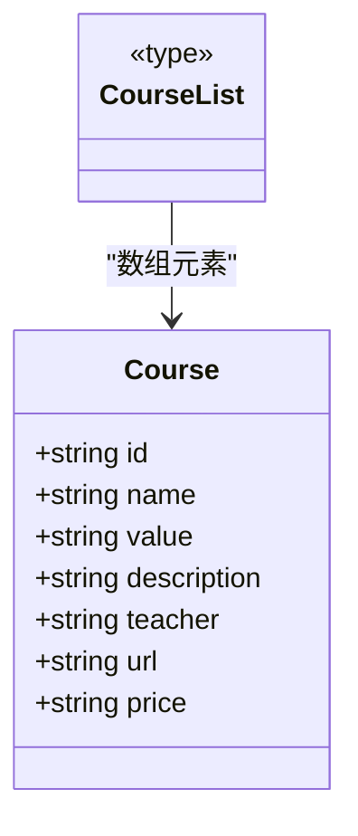

**图表来源**
- [packages/common/course/index.ts:1-12](file://packages/common/course/index.ts#L1-L12)

### 学习进度API

学习相关的API位于`apps/web/src/apis/learn/`目录，主要包含：
- 获取单词列表
- 保存单词掌握状态

### 追踪系统配置

新增的追踪系统提供了完整的用户行为分析能力，配置接口定义如下：

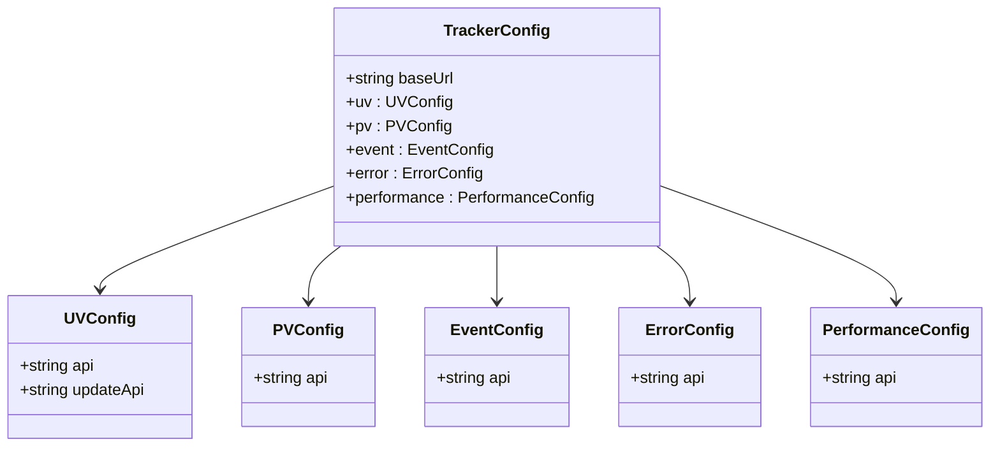

**图表来源**
- [packages/common/tracker/index.ts:1-20](file://packages/common/tracker/index.ts#L1-L20)

**章节来源**
- [apps/web/src/apis/course/index.ts:1-9](file://apps/web/src/apis/course/index.ts#L1-L9)
- [apps/web/src/apis/learn/index.ts:1-12](file://apps/web/src/apis/learn/index.ts#L1-L12)
- [packages/common/course/index.ts:1-12](file://packages/common/course/index.ts#L1-L12)
- [packages/common/tracker/index.ts:1-65](file://packages/common/tracker/index.ts#L1-L65)

## 架构概览

整个课程管理系统的架构采用分层设计，确保了良好的可维护性和扩展性，现已集成了完整的追踪监控体系：

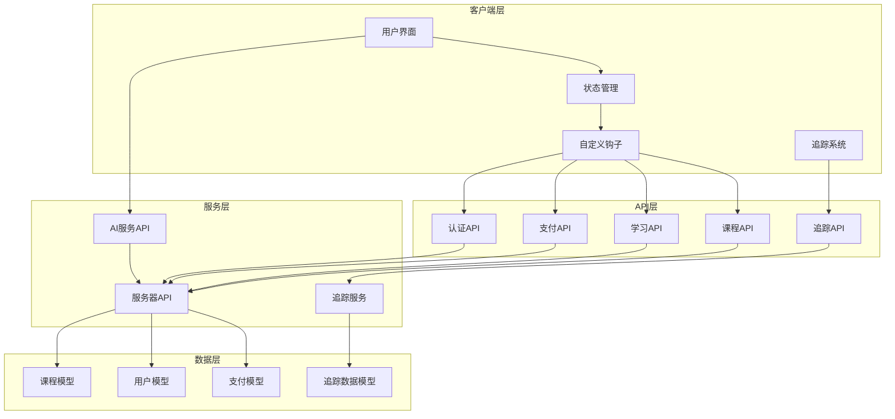

**图表来源**
- [apps/web/src/apis/index.ts:17-29](file://apps/web/src/apis/index.ts#L17-L29)
- [apps/web/src/apis/course/index.ts:1-9](file://apps/web/src/apis/course/index.ts#L1-L9)
- [apps/tracker/index.ts:7-24](file://apps/tracker/index.ts#L7-L24)

## 详细组件分析

### 课程API组件

课程API组件提供了完整的课程管理功能，包括课程列表获取和用户专属课程查询。

#### API接口设计

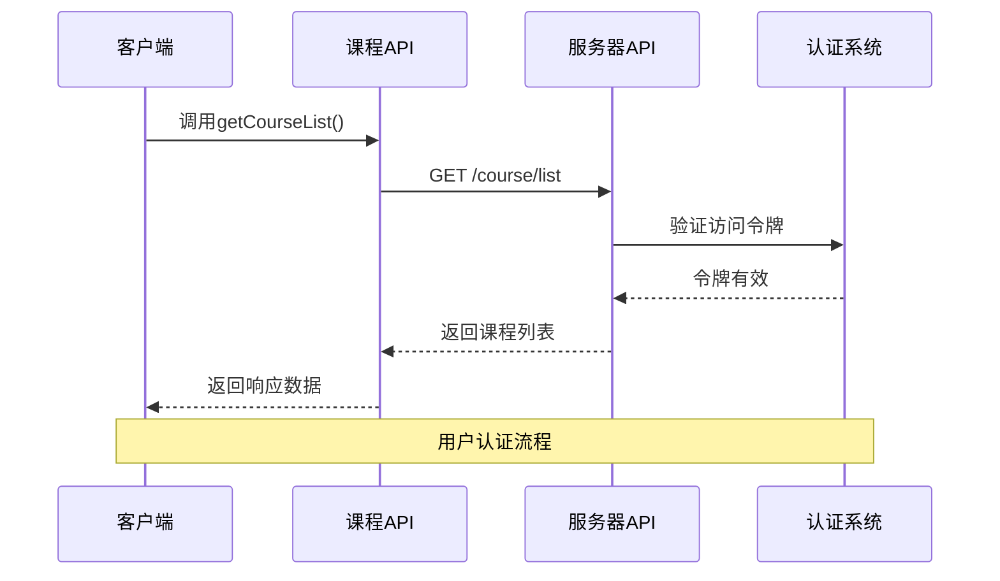

**图表来源**
- [apps/web/src/apis/course/index.ts:4-5](file://apps/web/src/apis/course/index.ts#L4-L5)
- [apps/web/src/apis/index.ts:23-29](file://apps/web/src/apis/index.ts#L23-L29)

#### 数据模型结构

课程数据模型采用TypeScript接口定义，确保类型安全和开发体验：

| 字段名 | 类型 | 必填 | 描述 |
|--------|------|------|------|
| id | string | 是 | 课程唯一标识符 |
| name | string | 是 | 课程名称 |
| value | string | 是 | 课程标识符（如:gk） |
| description | string | 否 | 课程描述信息 |
| teacher | string | 是 | 授课教师 |
| url | string | 是 | 课程视频链接 |
| price | string | 是 | 课程价格 |

**章节来源**
- [apps/web/src/apis/course/index.ts:1-9](file://apps/web/src/apis/course/index.ts#L1-L9)
- [packages/common/course/index.ts:1-12](file://packages/common/course/index.ts#L1-L12)

### 学习进度管理

学习进度管理模块提供了单词学习和掌握状态跟踪功能：

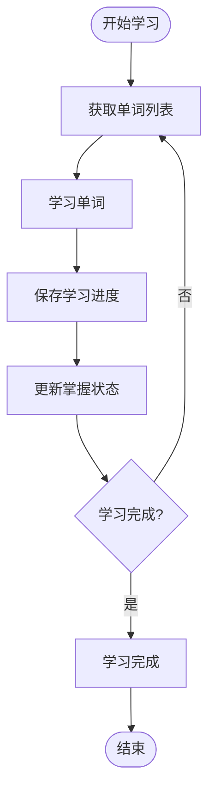

**图表来源**
- [apps/web/src/apis/learn/index.ts:5-11](file://apps/web/src/apis/learn/index.ts#L5-L11)

#### 支付集成

支付功能通过统一的DTO接口与后端服务集成：

| 字段名 | 类型 | 必填 | 描述 |
|--------|------|------|------|
| subject | string | 是 | 订单标题 |
| body | string | 是 | 订单描述信息 |
| total_amount | string | 是 | 订单总金额 |
| courseId | string | 是 | 关联的课程ID |

**章节来源**
- [apps/web/src/apis/learn/index.ts:1-12](file://apps/web/src/apis/learn/index.ts#L1-L12)
- [packages/common/pay/index.ts:1-11](file://packages/common/pay/index.ts#L1-L11)

### 认证和授权机制

系统采用JWT令牌机制进行用户认证，支持自动刷新功能：

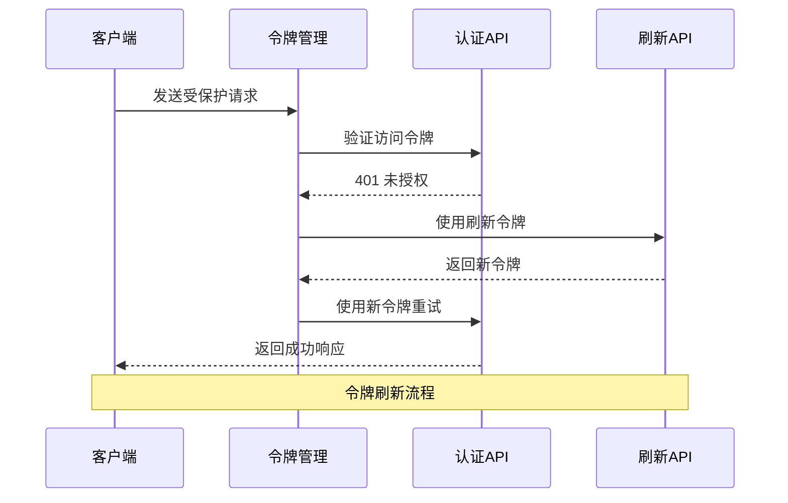

**图表来源**
- [apps/web/src/apis/index.ts:34-86](file://apps/web/src/apis/index.ts#L34-L86)

**章节来源**
- [apps/web/src/apis/index.ts:17-86](file://apps/web/src/apis/index.ts#L17-L86)

## 追踪系统集成

### 追踪配置管理

追踪系统通过统一的配置接口管理所有监控功能，支持灵活的端点配置和数据收集策略。

#### 追踪配置接口

追踪配置接口定义了完整的监控端点结构：

| 配置项 | 类型 | 必填 | 描述 |
|--------|------|------|------|
| baseUrl | string | 是 | 追踪服务基础URL |
| uv.api | string | 是 | 用户访问上报接口 |
| uv.updateApi | string | 是 | UV更新UserId接口 |
| pv.api | string | 是 | 页面浏览上报接口 |
| event.api | string | 是 | 事件上报接口 |
| error.api | string | 是 | 错误上报接口 |
| performance.api | string | 是 | 性能上报接口 |

#### 数据传输对象

追踪系统定义了完整的数据传输对象，确保前后端数据格式一致：

**UV数据模型**
| 字段名 | 类型 | 必填 | 描述 |
|--------|------|------|------|
| anonymousId | string | 是 | 匿名ID |
| userId | string | 否 | 用户ID |
| browser | string | 是 | 浏览器信息 |
| os | string | 是 | 操作系统 |
| device | string | 是 | 设备类型 |

**PV数据模型**
| 字段名 | 类型 | 必填 | 描述 |
|--------|------|------|------|
| visitorId | string | 是 | 访客ID |
| url | string | 是 | 页面URL |
| referrer | string | 是 | 来源URL |
| path | string | 是 | 页面路径 |

**事件数据模型**
| 字段名 | 类型 | 必填 | 描述 |
|--------|------|------|------|
| visitorId | string | 是 | 访客ID |
| event | string | 是 | 事件类型 |
| payload | object | 是 | 事件数据 |
| url | string | 是 | 页面URL |

**错误数据模型**
| 字段名 | 类型 | 必填 | 描述 |
|--------|------|------|------|
| visitorId | string | 是 | 访客ID |
| error | string | 是 | 错误类型 |
| message | string | 是 | 错误信息 |
| stack | string | 是 | 错误堆栈 |
| url | string | 是 | 页面URL |

**性能数据模型**
| 字段名 | 类型 | 必填 | 描述 |
|--------|------|------|------|
| visitorId | string | 是 | 访客ID |
| fp | number | 是 | 首次绘制时间(ms) |
| fcp | number | 是 | 首次内容绘制时间(ms) |
| lcp | number | 是 | 最大内容绘制时间(ms) |
| inp | number | 是 | 交互性能指标(ms) |
| cls | number | 是 | 累积布局偏移 |

### 追踪模块实现

#### UV追踪模块

UV追踪模块负责用户身份识别和设备信息收集，使用指纹技术和用户代理解析：

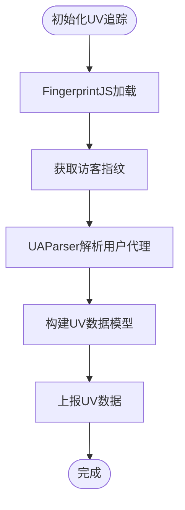

**图表来源**
- [apps/tracker/src/uv/index.ts:14-25](file://apps/tracker/src/uv/index.ts#L14-L25)

#### PV追踪模块

PV追踪模块监控页面浏览行为，支持多种路由模式：

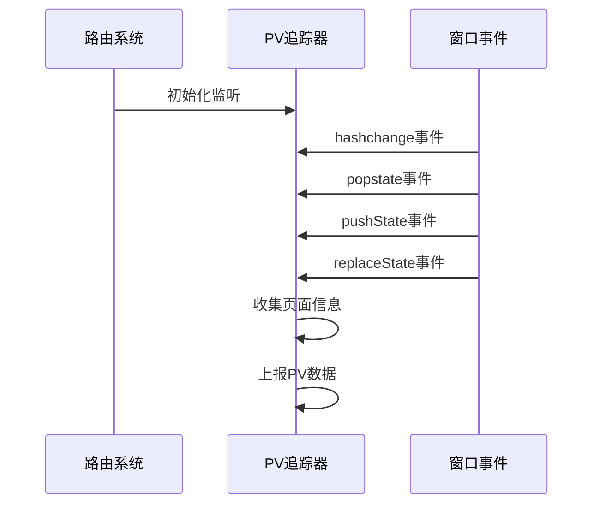

**图表来源**
- [apps/tracker/src/pv/index.ts:14-37](file://apps/tracker/src/pv/index.ts#L14-L37)

#### 事件追踪模块

事件追踪模块专注于用户交互行为监控，特别是按钮点击事件：

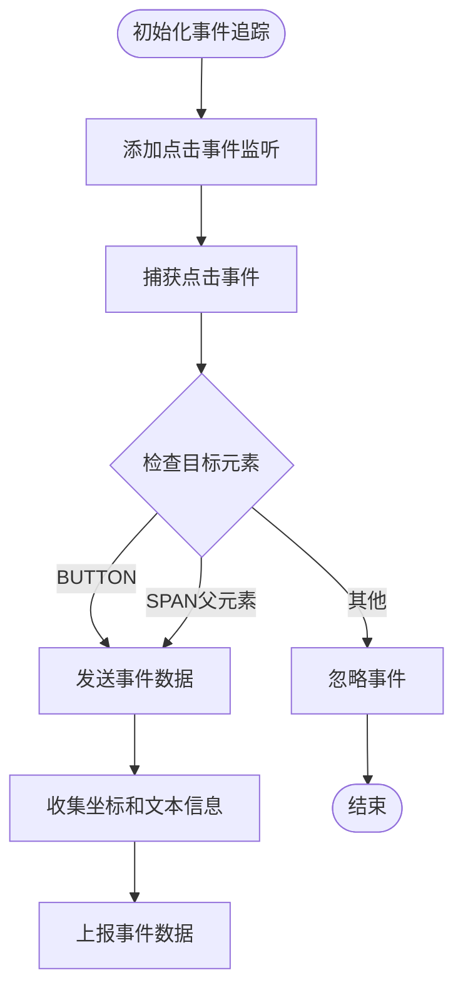

**图表来源**
- [apps/tracker/src/event/index.ts:3-32](file://apps/tracker/src/event/index.ts#L3-L32)

#### 错误追踪模块

错误追踪模块提供全局错误监控，包括JavaScript错误和Promise拒绝：

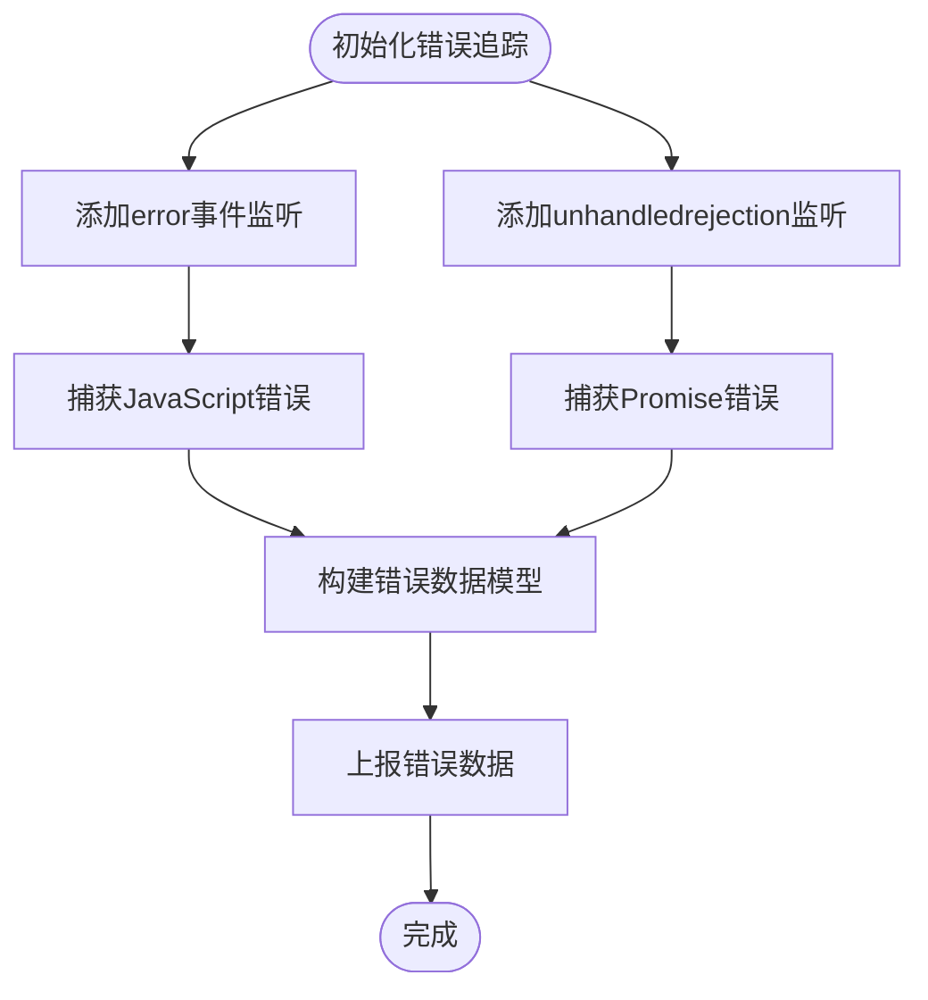

**图表来源**
- [apps/tracker/src/error/index.ts:3-28](file://apps/tracker/src/error/index.ts#L3-L28)

#### 性能追踪模块

性能追踪模块使用web-vitals库收集关键性能指标：

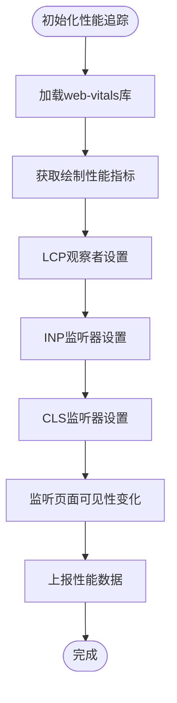

**图表来源**
- [apps/tracker/src/performance/index.ts:4-70](file://apps/tracker/src/performance/index.ts#L4-L70)

**章节来源**
- [packages/common/tracker/index.ts:1-65](file://packages/common/tracker/index.ts#L1-L65)
- [apps/tracker/src/uv/index.ts:1-26](file://apps/tracker/src/uv/index.ts#L1-L26)
- [apps/tracker/src/pv/index.ts:1-38](file://apps/tracker/src/pv/index.ts#L1-L38)
- [apps/tracker/src/event/index.ts:1-33](file://apps/tracker/src/event/index.ts#L1-L33)
- [apps/tracker/src/error/index.ts:1-29](file://apps/tracker/src/error/index.ts#L1-L29)
- [apps/tracker/src/performance/index.ts:1-71](file://apps/tracker/src/performance/index.ts#L1-L71)

## 依赖关系分析

项目采用模块化设计，各组件之间的依赖关系清晰明确，新增的追踪系统完全集成到现有架构中：

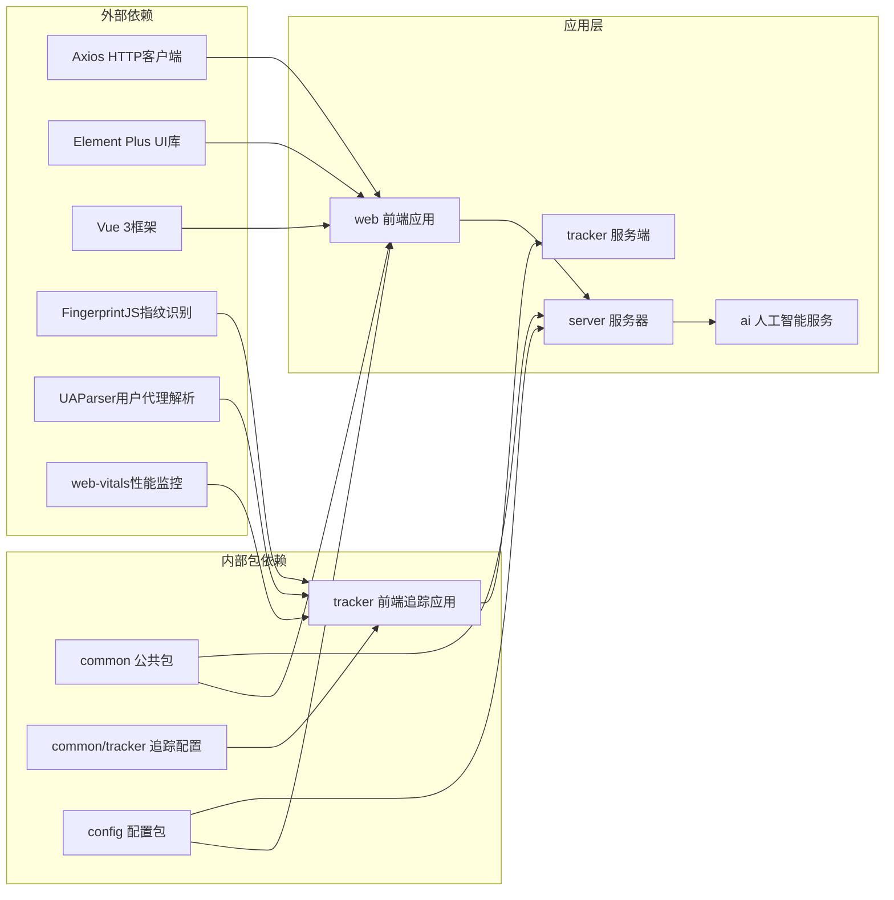

**图表来源**
- [package.json:8-13](file://package.json#L8-L13)

**章节来源**
- [package.json:1-15](file://package.json#L1-L15)

## 性能考虑

### 缓存策略

系统实现了多层次的缓存机制：
- HTTP请求缓存：利用浏览器缓存减少重复请求
- 状态缓存：使用Pinia进行状态持久化
- 图片资源缓存：CDN加速静态资源加载
- **追踪数据缓存**：本地存储临时追踪数据，网络恢复后批量上报

### 并发控制

通过队列机制避免令牌刷新时的并发问题：
- 单点刷新：防止多个刷新请求同时执行
- 请求排队：等待刷新完成后重试失败的请求
- 错误恢复：刷新失败时引导用户重新登录
- **追踪数据队列**：避免追踪请求阻塞主线程

### 性能优化建议

1. **API调用优化**
   - 实现请求去重机制，避免重复请求相同数据
   - 使用分页加载大量课程数据
   - 实施本地存储策略，缓存常用课程信息

2. **网络请求优化**
   - 设置合理的超时时间（当前50秒）
   - 实现请求重试机制
   - 优化WebSocket连接管理
   - **追踪数据异步上报**：使用后台线程处理追踪请求

3. **内存管理**
   - 及时清理不再使用的组件引用
   - 实施虚拟滚动优化长列表渲染
   - 使用懒加载策略加载图片资源
   - **追踪监听器管理**：及时移除不再需要的事件监听器

4. **追踪系统优化**
   - **采样策略**：对高频事件进行采样，减少数据量
   - **批量上报**：合并多个追踪请求，降低网络开销
   - **本地存储**：在网络不佳时缓存追踪数据
   - **性能监控**：监控追踪系统自身对页面性能的影响

## 故障排除指南

### 常见问题及解决方案

1. **网络连接错误**
   - 检查API基础URL配置
   - 验证服务器端口设置（默认3000）
   - 确认防火墙设置允许连接

2. **认证失败**
   - 检查访问令牌是否过期
   - 验证刷新令牌有效性
   - 确认用户登录状态

3. **API响应超时**
   - 调整超时时间配置（默认50秒）
   - 检查服务器性能
   - 优化数据库查询

4. **令牌刷新失败**
   - 检查刷新令牌格式和有效期
   - 验证用户会话状态
   - 确认服务器端认证服务可用性

5. **学习进度同步问题**
   - 检查网络连接稳定性
   - 验证单词ID格式正确性
   - 确认用户权限状态

6. **支付功能异常**
   - 验证订单参数完整性
   - 检查课程ID有效性
   - 确认支付网关服务状态

7. **追踪系统问题**
   - **UV追踪失败**：检查FingerprintJS加载状态和浏览器兼容性
   - **PV追踪异常**：确认路由监听器正确绑定
   - **事件追踪失效**：验证DOM元素选择器和事件绑定
   - **错误追踪不工作**：检查全局错误监听器设置
   - **性能追踪数据缺失**：确认web-vitals库加载和指标计算

8. **追踪数据上报失败**
   - 检查追踪服务端点配置
   - 验证网络连接和跨域设置
   - 确认追踪数据格式符合API要求
   - **本地缓存检查**：查看本地存储的追踪数据

**章节来源**
- [apps/web/src/apis/index.ts:39-84](file://apps/web/src/apis/index.ts#L39-L84)
- [apps/tracker/src/uv/index.ts:14-25](file://apps/tracker/src/uv/index.ts#L14-L25)
- [apps/tracker/src/pv/index.ts:14-37](file://apps/tracker/src/pv/index.ts#L14-L37)
- [apps/tracker/src/event/index.ts:3-32](file://apps/tracker/src/event/index.ts#L3-L32)
- [apps/tracker/src/error/index.ts:3-28](file://apps/tracker/src/error/index.ts#L3-L28)
- [apps/tracker/src/performance/index.ts:4-70](file://apps/tracker/src/performance/index.ts#L4-L70)

## 结论

课程管理模块展现了现代Web应用的最佳实践，通过清晰的架构设计、完善的类型系统和健壮的错误处理机制，为用户提供了优质的英语学习体验。新增的完整追踪系统进一步增强了系统的可观测性和用户行为分析能力。

模块化的设计使得代码具有良好的可维护性和扩展性，为后续的功能扩展奠定了坚实的基础。追踪系统的集成体现了现代Web应用对用户体验和性能监控的重视。

项目的整体架构体现了以下优势：
- 清晰的分层设计便于维护
- 强类型的TypeScript提升开发效率
- 完善的错误处理机制提高系统稳定性
- 模块化的包结构支持团队协作开发
- **完整的追踪监控体系提供数据驱动决策支持**

通过持续的性能优化和故障排除机制，以及新增的追踪系统支持，该模块能够稳定地支持大规模用户的英语学习需求，为教育技术的发展提供了可靠的基础设施。追踪数据的收集和分析将为产品迭代和用户体验优化提供重要依据。

**章节来源**
- [packages/common/tracker/index.ts:1-65](file://packages/common/tracker/index.ts#L1-L65)
- [apps/tracker/index.ts:7-24](file://apps/tracker/index.ts#L7-L24)
- [server/apps/server/src/tracker/dto/create-tracker.dto.ts:1-2](file://server/apps/server/src/tracker/dto/create-tracker.dto.ts#L1-L2)