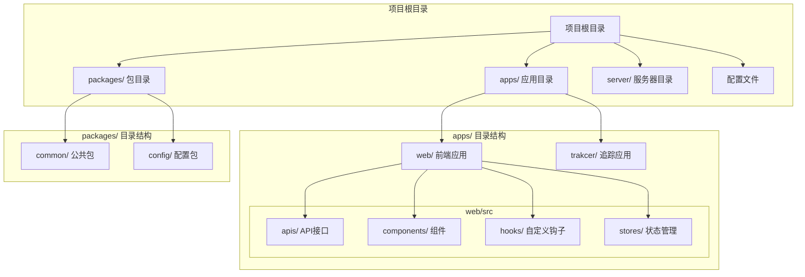
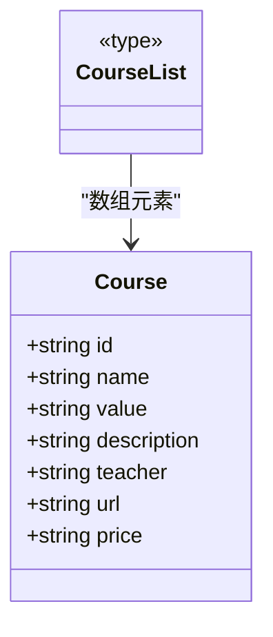
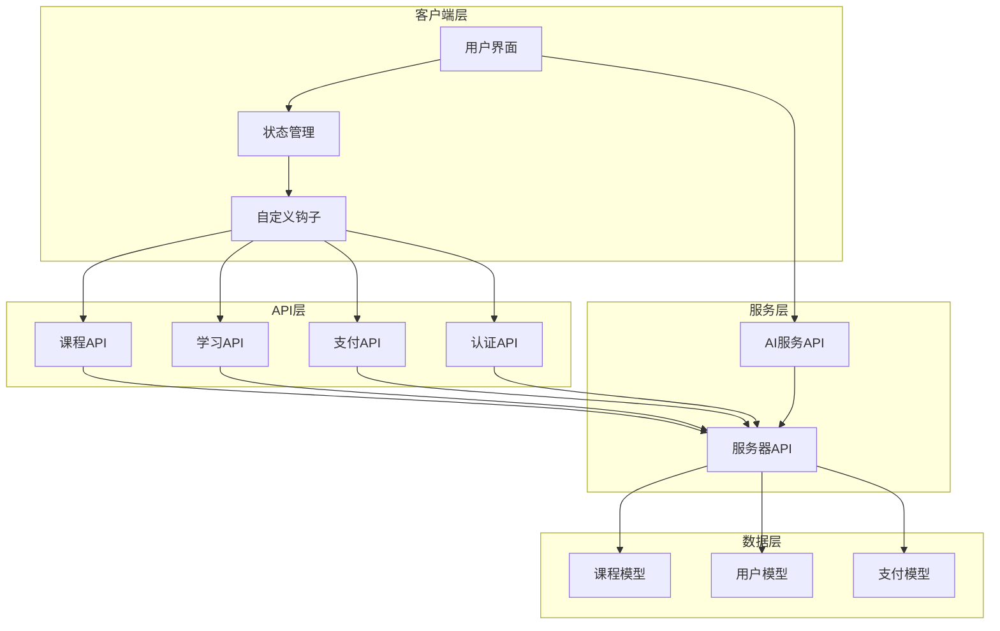
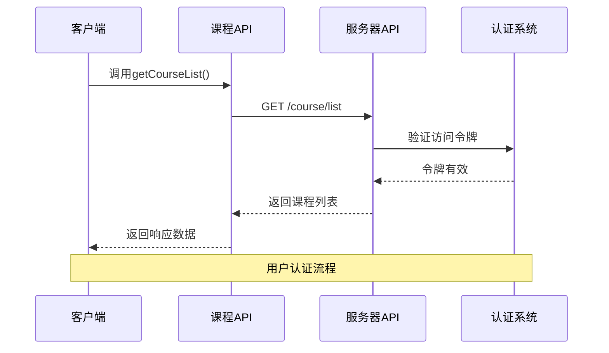
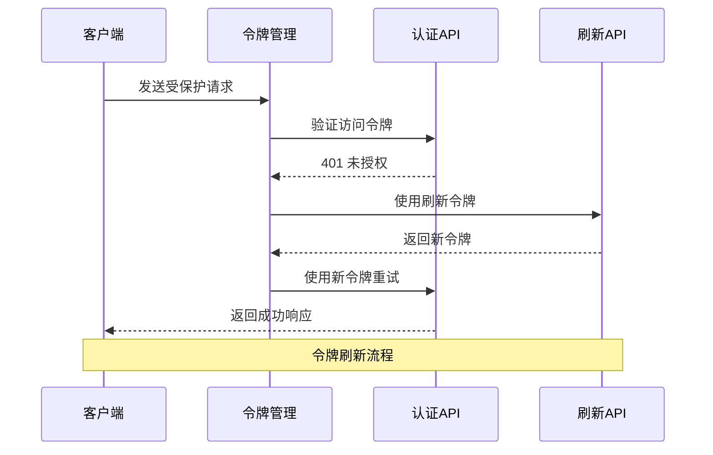
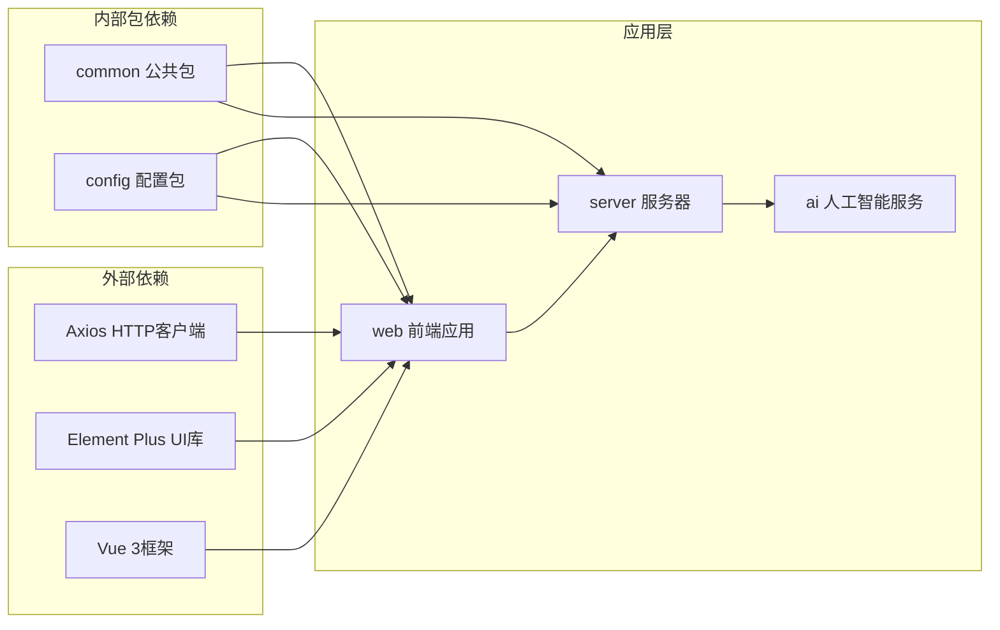

# 课程管理模块

<cite>
**本文档引用的文件**
- [README.md](file://README.md)
- [package.json](file://package.json)
- [apps/web/src/apis/course/index.ts](file://apps/web/src/apis/course/index.ts)
- [apps/web/src/apis/index.ts](file://apps/web/src/apis/index.ts)
- [apps/web/src/apis/learn/index.ts](file://apps/web/src/apis/learn/index.ts)
- [packages/common/course/index.ts](file://packages/common/course/index.ts)
- [packages/common/pay/index.ts](file://packages/common/pay/index.ts)
- [packages/common/learn/index.ts](file://packages/common/learn/index.ts)
- [packages/config/index.ts](file://packages/config/index.ts)
</cite>

## 目录
1. [项目概述](#项目概述)
2. [项目结构](#项目结构)
3. [核心组件](#核心组件)
4. [架构概览](#架构概览)
5. [详细组件分析](#详细组件分析)
6. [依赖关系分析](#依赖关系分析)
7. [性能考虑](#性能考虑)
8. [故障排除指南](#故障排除指南)
9. [结论](#结论)

## 项目概述

这是一个基于AI技术的英语学习网站项目，名为"English-Study"（每日一练重新记忆英语单词）。该项目采用现代化的前端技术栈，包括Vue 3、TypeScript、Element Plus等，为用户提供个性化的英语学习体验。

项目采用monorepo架构，通过pnpm workspace进行包管理，主要包含以下核心模块：
- Web前端应用：提供用户界面和交互功能
- 服务器端：处理业务逻辑和数据管理
- AI服务：提供智能学习辅助功能
- 公共包：共享的数据模型和工具函数

**章节来源**
- [README.md:1-2](file://README.md#L1-L2)
- [package.json:1-15](file://package.json#L1-L15)

## 项目结构

项目采用清晰的目录结构，主要分为以下几个部分：

**图表来源**
- [package.json:1-15](file://package.json#L1-L15)
- [packages/config/index.ts:1-7](file://packages/config/index.ts#L1-L7)

**章节来源**
- [package.json:1-15](file://package.json#L1-L15)
- [packages/config/index.ts:1-7](file://packages/config/index.ts#L1-L7)

## 核心组件

### 课程管理API层

课程管理模块的核心是位于`apps/web/src/apis/course/`目录下的API接口，主要包含两个核心方法：

1. **获取课程列表** (`getCourseList`)
2. **获取我的课程** (`getMyCourse`)

这些API通过统一的`serverApi`实例与后端服务通信，支持自动认证和令牌刷新机制。

### 数据模型定义

课程相关的数据模型定义在`packages/common/course/`目录中，包含完整的类型定义：

**图表来源**
- [packages/common/course/index.ts:1-12](file://packages/common/course/index.ts#L1-L12)

### 学习进度API

学习相关的API位于`apps/web/src/apis/learn/`目录，主要包含：
- 获取单词列表
- 保存单词掌握状态

**章节来源**
- [apps/web/src/apis/course/index.ts:1-9](file://apps/web/src/apis/course/index.ts#L1-L9)
- [apps/web/src/apis/learn/index.ts:1-12](file://apps/web/src/apis/learn/index.ts#L1-L12)
- [packages/common/course/index.ts:1-12](file://packages/common/course/index.ts#L1-L12)

## 架构概览

整个课程管理系统的架构采用分层设计，确保了良好的可维护性和扩展性：

**图表来源**
- [apps/web/src/apis/index.ts:17-29](file://apps/web/src/apis/index.ts#L17-L29)
- [apps/web/src/apis/course/index.ts:1-9](file://apps/web/src/apis/course/index.ts#L1-L9)

## 详细组件分析

### 课程API组件

课程API组件提供了完整的课程管理功能，包括课程列表获取和用户专属课程查询。

#### API接口设计

**图表来源**
- [apps/web/src/apis/course/index.ts:4-5](file://apps/web/src/apis/course/index.ts#L4-L5)
- [apps/web/src/apis/index.ts:23-29](file://apps/web/src/apis/index.ts#L23-L29)

#### 数据模型结构

课程数据模型采用TypeScript接口定义，确保类型安全和开发体验：

| 字段名 | 类型 | 必填 | 描述 |
|--------|------|------|------|
| id | string | 是 | 课程唯一标识符 |
| name | string | 是 | 课程名称 |
| value | string | 是 | 课程标识符（如:gk） |
| description | string | 否 | 课程描述信息 |
| teacher | string | 是 | 授课教师 |
| url | string | 是 | 课程视频链接 |
| price | string | 是 | 课程价格 |

**章节来源**
- [apps/web/src/apis/course/index.ts:1-9](file://apps/web/src/apis/course/index.ts#L1-L9)
- [packages/common/course/index.ts:1-12](file://packages/common/course/index.ts#L1-L12)

### 学习进度管理

学习进度管理模块提供了单词学习和掌握状态跟踪功能：

**图表来源**
- [apps/web/src/apis/learn/index.ts:5-11](file://apps/web/src/apis/learn/index.ts#L5-L11)

#### 支付集成

支付功能通过统一的DTO接口与后端服务集成：

| 字段名 | 类型 | 必填 | 描述 |
|--------|------|------|------|
| subject | string | 是 | 订单标题 |
| body | string | 是 | 订单描述信息 |
| total_amount | string | 是 | 订单总金额 |
| courseId | string | 是 | 关联的课程ID |

**章节来源**
- [apps/web/src/apis/learn/index.ts:1-12](file://apps/web/src/apis/learn/index.ts#L1-L12)
- [packages/common/pay/index.ts:1-11](file://packages/common/pay/index.ts#L1-L11)

### 认证和授权机制

系统采用JWT令牌机制进行用户认证，支持自动刷新功能：

**图表来源**
- [apps/web/src/apis/index.ts:34-86](file://apps/web/src/apis/index.ts#L34-L86)

**章节来源**
- [apps/web/src/apis/index.ts:17-86](file://apps/web/src/apis/index.ts#L17-L86)

## 依赖关系分析

项目采用模块化设计，各组件之间的依赖关系清晰明确：

**图表来源**
- [package.json:8-13](file://package.json#L8-L13)

**章节来源**
- [package.json:1-15](file://package.json#L1-L15)

## 性能考虑

### 缓存策略

系统实现了多层次的缓存机制：
- HTTP请求缓存：利用浏览器缓存减少重复请求
- 状态缓存：使用Pinia进行状态持久化
- 图片资源缓存：CDN加速静态资源加载

### 并发控制

通过队列机制避免令牌刷新时的并发问题：
- 单点刷新：防止多个刷新请求同时执行
- 请求排队：等待刷新完成后重试失败的请求
- 错误恢复：刷新失败时引导用户重新登录

## 故障排除指南

### 常见问题及解决方案

1. **网络连接错误**
   - 检查API基础URL配置
   - 验证服务器端口设置（默认3000）
   - 确认防火墙设置允许连接

2. **认证失败**
   - 检查访问令牌是否过期
   - 验证刷新令牌有效性
   - 确认用户登录状态

3. **API响应超时**
   - 调整超时时间配置（默认50秒）
   - 检查服务器性能
   - 优化数据库查询

**章节来源**
- [apps/web/src/apis/index.ts:39-84](file://apps/web/src/apis/index.ts#L39-L84)

## 结论

课程管理模块展现了现代Web应用的最佳实践，通过清晰的架构设计、完善的类型系统和健壮的错误处理机制，为用户提供了优质的英语学习体验。模块化的设计使得代码具有良好的可维护性和扩展性，为后续的功能扩展奠定了坚实的基础。

项目的整体架构体现了以下优势：
- 清晰的分层设计便于维护
- 强类型的TypeScript提升开发效率
- 完善的错误处理机制提高系统稳定性
- 模块化的包结构支持团队协作开发