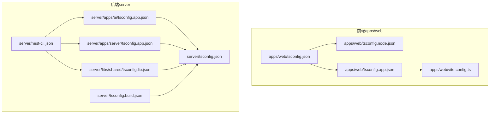
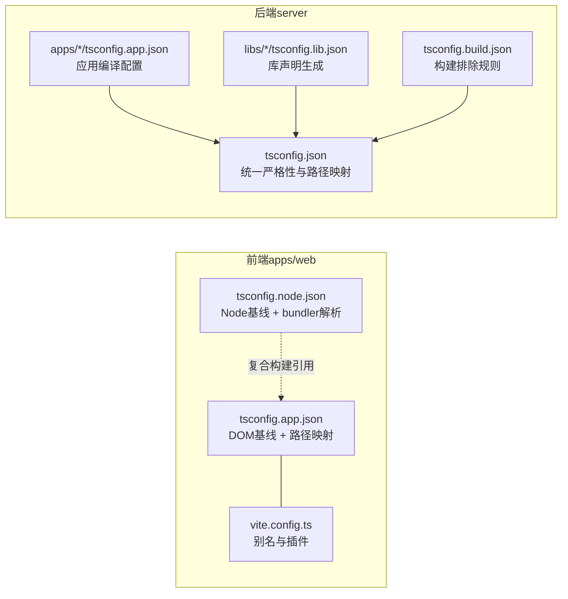
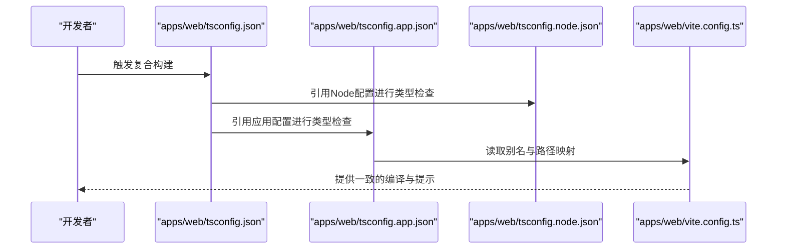
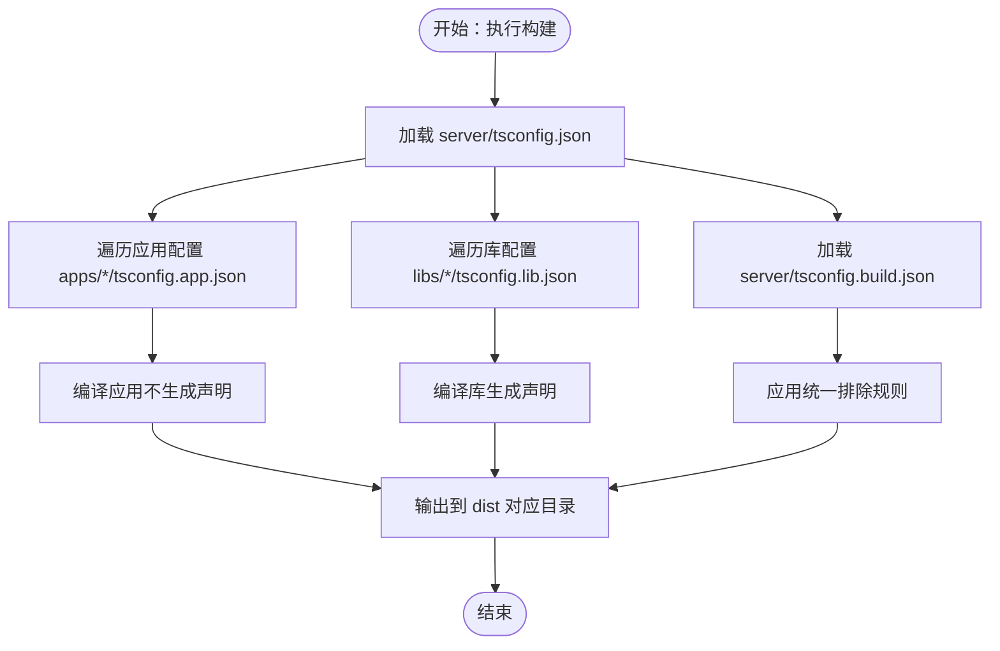
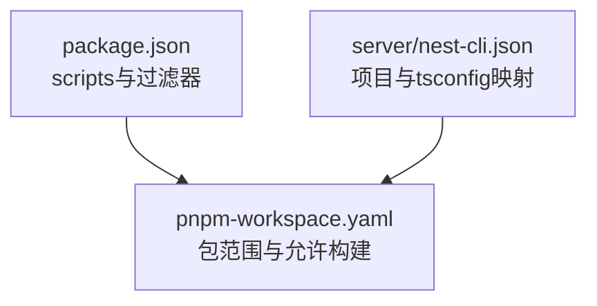

# TypeScript配置

<cite>
**本文引用的文件**
- [apps/web/tsconfig.json](file://apps/web/tsconfig.json)
- [apps/web/tsconfig.app.json](file://apps/web/tsconfig.app.json)
- [apps/web/tsconfig.node.json](file://apps/web/tsconfig.node.json)
- [apps/web/vite.config.ts](file://apps/web/vite.config.ts)
- [server/tsconfig.json](file://server/tsconfig.json)
- [server/tsconfig.build.json](file://server/tsconfig.build.json)
- [server/apps/ai/tsconfig.app.json](file://server/apps/ai/tsconfig.app.json)
- [server/apps/server/tsconfig.app.json](file://server/apps/server/tsconfig.app.json)
- [server/libs/shared/tsconfig.lib.json](file://server/libs/shared/tsconfig.lib.json)
- [server/nest-cli.json](file://server/nest-cli.json)
- [package.json](file://package.json)
- [pnpm-workspace.yaml](file://pnpm-workspace.yaml)
</cite>

## 目录
1. [简介](#简介)
2. [项目结构](#项目结构)
3. [核心组件](#核心组件)
4. [架构总览](#架构总览)
5. [详细组件分析](#详细组件分析)
6. [依赖分析](#依赖分析)
7. [性能考虑](#性能考虑)
8. [故障排除指南](#故障排除指南)
9. [结论](#结论)
10. [附录](#附录)

## 简介
本文件系统化梳理本仓库中的TypeScript配置，覆盖前端（apps/web）与后端（server）两类工程的tsconfig体系，解释编译目标、模块解析策略、路径映射与严格性设置；阐明前后端差异、子项目继承关系；并提供编译优化、路径别名与类型检查规则的实践建议及常见问题排查方法。

## 项目结构
本仓库采用Monorepo组织方式，包含前端Web应用与后端NestJS应用，分别拥有独立的TypeScript配置集：
- 前端（apps/web）：基于Vite+Vue3，使用复合构建与引用构建，区分Node环境与应用环境两套tsconfig。
- 后端（server）：基于NestJS，采用根tsconfig统一严格性，按应用与库拆分编译输出目录与声明生成。

图表来源
- [apps/web/tsconfig.json:1-12](file://apps/web/tsconfig.json#L1-L12)
- [apps/web/tsconfig.app.json:1-15](file://apps/web/tsconfig.app.json#L1-L15)
- [apps/web/tsconfig.node.json:1-28](file://apps/web/tsconfig.node.json#L1-L28)
- [apps/web/vite.config.ts:1-25](file://apps/web/vite.config.ts#L1-L25)
- [server/tsconfig.json:1-35](file://server/tsconfig.json#L1-L35)
- [server/tsconfig.build.json:1-5](file://server/tsconfig.build.json#L1-L5)
- [server/apps/ai/tsconfig.app.json:1-11](file://server/apps/ai/tsconfig.app.json#L1-L11)
- [server/apps/server/tsconfig.app.json:1-11](file://server/apps/server/tsconfig.app.json#L1-L11)
- [server/libs/shared/tsconfig.lib.json:1-10](file://server/libs/shared/tsconfig.lib.json#L1-L10)
- [server/nest-cli.json:1-43](file://server/nest-cli.json#L1-L43)

章节来源
- [pnpm-workspace.yaml:1-10](file://pnpm-workspace.yaml#L1-L10)
- [package.json:1-15](file://package.json#L1-L15)

## 核心组件
- 前端复合构建（apps/web）
  - 引用构建：通过根tsconfig引用Node与应用两套配置，实现开发时的增量类型检查与构建分离。
  - 应用配置（tsconfig.app.json）：扩展DOM相关基线，启用路径映射与类型声明，面向浏览器运行时。
  - Node配置（tsconfig.node.json）：扩展Node运行时基线，保留模块格式用于打包器解析，禁用输出，指定tsbuildinfo位置。
- 后端统一严格（server）
  - 根tsconfig集中定义模块解析、目标版本、严格性开关、路径映射等，确保跨应用一致性。
  - 应用与库各自tsconfig：应用关闭声明生成，库开启声明生成并独立输出目录，构建脚本排除测试与node_modules。

章节来源
- [apps/web/tsconfig.json:1-12](file://apps/web/tsconfig.json#L1-L12)
- [apps/web/tsconfig.app.json:1-15](file://apps/web/tsconfig.app.json#L1-L15)
- [apps/web/tsconfig.node.json:1-28](file://apps/web/tsconfig.node.json#L1-L28)
- [server/tsconfig.json:1-35](file://server/tsconfig.json#L1-L35)
- [server/apps/ai/tsconfig.app.json:1-11](file://server/apps/ai/tsconfig.app.json#L1-L11)
- [server/apps/server/tsconfig.app.json:1-11](file://server/apps/server/tsconfig.app.json#L1-L11)
- [server/libs/shared/tsconfig.lib.json:1-10](file://server/libs/shared/tsconfig.lib.json#L1-L10)

## 架构总览
前端与后端在TypeScript配置上的关键差异：
- 编译目标与模块解析
  - 前端：应用配置面向浏览器（DOM基线），Node配置面向打包器（bundler模块解析）。
  - 后端：统一使用NodeNext模块解析与目标版本，便于工具链与装饰器生态兼容。
- 路径映射与别名
  - 前端：tsconfig.app.json内定义路径映射，Vite配置同步别名，保证IDE与编译一致。
  - 后端：根tsconfig定义工作区内的库别名，供应用与库共享。
- 严格性与输出策略
  - 前端：应用配置默认严格，Node配置禁输出，配合复合构建提升开发体验。
  - 后端：根tsconfig集中严格性开关，库生成声明文件，应用不生成声明以简化产物。

图表来源
- [apps/web/tsconfig.app.json:1-15](file://apps/web/tsconfig.app.json#L1-L15)
- [apps/web/tsconfig.node.json:1-28](file://apps/web/tsconfig.node.json#L1-L28)
- [apps/web/vite.config.ts:19-23](file://apps/web/vite.config.ts#L19-L23)
- [server/tsconfig.json:25-32](file://server/tsconfig.json#L25-L32)
- [server/apps/ai/tsconfig.app.json:1-11](file://server/apps/ai/tsconfig.app.json#L1-L11)
- [server/libs/shared/tsconfig.lib.json:1-10](file://server/libs/shared/tsconfig.lib.json#L1-L10)
- [server/tsconfig.build.json:1-5](file://server/tsconfig.build.json#L1-L5)

## 详细组件分析

### 前端：apps/web 的TypeScript配置
- 根配置（tsconfig.json）
  - 使用references组织复合构建，分别指向Node与应用配置，实现增量类型检查与构建分离。
- 应用配置（tsconfig.app.json）
  - 扩展DOM基线，包含源码与类型声明，排除测试目录。
  - 定义路径映射与基础路径，为Vite别名保持一致。
  - 开启复合构建、禁输出，引入UI库类型声明。
- Node配置（tsconfig.node.json）
  - 扩展Node运行时基线，保留模块格式以便打包器处理。
  - 指定types为Node，禁输出，设置tsbuildinfo文件位置避免污染根目录。
- Vite集成
  - 别名与tsconfig路径映射保持一致，确保IDE与构建器行为一致。

图表来源
- [apps/web/tsconfig.json:3-10](file://apps/web/tsconfig.json#L3-L10)
- [apps/web/tsconfig.app.json:6-12](file://apps/web/tsconfig.app.json#L6-L12)
- [apps/web/tsconfig.node.json:14-25](file://apps/web/tsconfig.node.json#L14-L25)
- [apps/web/vite.config.ts:19-23](file://apps/web/vite.config.ts#L19-L23)

章节来源
- [apps/web/tsconfig.json:1-12](file://apps/web/tsconfig.json#L1-L12)
- [apps/web/tsconfig.app.json:1-15](file://apps/web/tsconfig.app.json#L1-L15)
- [apps/web/tsconfig.node.json:1-28](file://apps/web/tsconfig.node.json#L1-L28)
- [apps/web/vite.config.ts:1-25](file://apps/web/vite.config.ts#L1-L25)

### 后端：server 的TypeScript配置
- 根配置（tsconfig.json）
  - 统一模块解析、目标版本、严格性开关与路径映射，作为所有子项目的基线。
  - 配置工作区内库的路径别名，供应用与库共享使用。
- 应用配置（apps/*/tsconfig.app.json）
  - 继承根配置，关闭声明生成，设置各自输出目录，排除测试与node_modules。
- 库配置（libs/*/tsconfig.lib.json）
  - 继承根配置，开启声明生成，设置库专属输出目录，供其他包引用。
- 构建配置（tsconfig.build.json）
  - 继承根配置，统一排除规则，作为CI或批量构建的入口。
- NestJS集成
  - nest-cli.json为每个项目指定对应的tsconfig路径，确保编译器正确加载配置。

图表来源
- [server/tsconfig.json:1-35](file://server/tsconfig.json#L1-L35)
- [server/apps/ai/tsconfig.app.json:1-11](file://server/apps/ai/tsconfig.app.json#L1-L11)
- [server/apps/server/tsconfig.app.json:1-11](file://server/apps/server/tsconfig.app.json#L1-L11)
- [server/libs/shared/tsconfig.lib.json:1-10](file://server/libs/shared/tsconfig.lib.json#L1-L10)
- [server/tsconfig.build.json:1-5](file://server/tsconfig.build.json#L1-L5)

章节来源
- [server/tsconfig.json:1-35](file://server/tsconfig.json#L1-L35)
- [server/apps/ai/tsconfig.app.json:1-11](file://server/apps/ai/tsconfig.app.json#L1-L11)
- [server/apps/server/tsconfig.app.json:1-11](file://server/apps/server/tsconfig.app.json#L1-L11)
- [server/libs/shared/tsconfig.lib.json:1-10](file://server/libs/shared/tsconfig.lib.json#L1-L10)
- [server/tsconfig.build.json:1-5](file://server/tsconfig.build.json#L1-L5)
- [server/nest-cli.json:1-43](file://server/nest-cli.json#L1-L43)

### 路径映射与别名配置
- 前端
  - tsconfig.app.json定义路径映射，Vite配置别名与之保持一致，确保导入语句在IDE与构建器中行为一致。
- 后端
  - 根tsconfig定义工作区内库的路径映射，如“@libs/shared”及其通配形式，供应用与库共享使用。

章节来源
- [apps/web/tsconfig.app.json:6-12](file://apps/web/tsconfig.app.json#L6-L12)
- [apps/web/vite.config.ts:19-23](file://apps/web/vite.config.ts#L19-L23)
- [server/tsconfig.json:25-32](file://server/tsconfig.json#L25-L32)

### 类型检查规则与严格性
- 前端
  - 应用配置启用复合构建与类型声明，禁输出，结合Vite进行快速类型检查与增量构建。
  - Node配置禁输出，避免重复产物，同时生成tsbuildinfo提升增量检查效率。
- 后端
  - 根tsconfig集中严格性开关，如严格空值检查、大小写一致性等，确保代码质量。
  - 应用关闭声明生成，库开启声明生成，形成清晰的产物边界。

章节来源
- [apps/web/tsconfig.app.json:10-12](file://apps/web/tsconfig.app.json#L10-L12)
- [apps/web/tsconfig.node.json:20-25](file://apps/web/tsconfig.node.json#L20-L25)
- [server/tsconfig.json:16-23](file://server/tsconfig.json#L16-L23)

## 依赖分析
- Monorepo布局
  - pnpm-workspace.yaml声明包范围，前端与后端分别作为独立工作区，支持并行开发与构建。
- 脚本与过滤
  - package.json通过pnpm过滤器启动前端与后端服务，便于本地联调。
- NestJS项目映射
  - nest-cli.json为每个应用与库指定tsconfig路径，确保编译器正确解析配置。

图表来源
- [package.json:2-6](file://package.json#L2-L6)
- [pnpm-workspace.yaml:1-10](file://pnpm-workspace.yaml#L1-L10)
- [server/nest-cli.json:14-41](file://server/nest-cli.json#L14-L41)

章节来源
- [package.json:1-15](file://package.json#L1-L15)
- [pnpm-workspace.yaml:1-10](file://pnpm-workspace.yaml#L1-L10)
- [server/nest-cli.json:1-43](file://server/nest-cli.json#L1-L43)

## 性能考虑
- 复合构建与增量检查
  - 前端通过复合构建与tsbuildinfo实现增量类型检查，减少全量检查开销。
- 模块解析策略
  - 前端Node配置使用bundler解析，利于打包器处理，降低运行时模块解析成本。
  - 后端统一使用NodeNext解析，提升工具链兼容性与性能。
- 输出与声明生成
  - 应用侧禁用声明生成可减少I/O与编译时间；库侧生成声明以支持二次分发。
- 排除规则
  - 统一排除node_modules、dist与测试目录，避免不必要的扫描与检查。

章节来源
- [apps/web/tsconfig.node.json:14-25](file://apps/web/tsconfig.node.json#L14-L25)
- [server/tsconfig.build.json:3-3](file://server/tsconfig.build.json#L3-L3)
- [server/apps/ai/tsconfig.app.json:8-9](file://server/apps/ai/tsconfig.app.json#L8-L9)
- [server/apps/server/tsconfig.app.json:8-9](file://server/apps/server/tsconfig.app.json#L8-L9)
- [server/libs/shared/tsconfig.lib.json:7-8](file://server/libs/shared/tsconfig.lib.json#L7-L8)

## 故障排除指南
- 路径映射不生效
  - 确认tsconfig中的路径映射与Vite别名一致；检查根配置是否被正确引用。
- 类型检查与IDE不一致
  - 前端：确认复合构建已正确引用Node与应用配置；检查tsbuildinfo路径与权限。
  - 后端：确认nest-cli.json为项目指定了正确的tsconfig路径。
- 构建产物异常
  - 检查应用配置是否关闭声明生成，库配置是否开启声明生成；核对输出目录设置。
- 严格性导致的编译失败
  - 在根配置中调整严格性开关，或在具体应用/库配置中局部放宽，但需保持团队一致性。

章节来源
- [apps/web/tsconfig.json:3-10](file://apps/web/tsconfig.json#L3-L10)
- [apps/web/tsconfig.node.json:24-25](file://apps/web/tsconfig.node.json#L24-L25)
- [server/nest-cli.json:7-7](file://server/nest-cli.json#L7-L7)
- [server/apps/ai/tsconfig.app.json:4-6](file://server/apps/ai/tsconfig.app.json#L4-L6)
- [server/libs/shared/tsconfig.lib.json:3-5](file://server/libs/shared/tsconfig.lib.json#L3-L5)

## 结论
本仓库的TypeScript配置在前后端场景下实现了清晰的职责分离与可维护的继承关系。前端通过复合构建与别名映射提升开发体验，后端通过统一根配置与严格的声明生成策略保障可演进性与可分发性。遵循本文的配置原则与排错建议，可在新功能开发与重构中保持一致性与高性能。

## 附录
- 新增配置项指导
  - 若需新增路径映射，优先在根配置中定义工作区内库别名，再在应用/库配置中按需扩展。
  - 如需临时放宽严格性，仅在具体应用/库配置中局部调整，并记录变更原因。
- 常见问题速查
  - 路径映射不生效：检查tsconfig与Vite别名一致性。
  - 类型检查慢：确认复合构建与tsbuildinfo使用正常。
  - 构建失败：核对应用/库的声明生成与输出目录设置。