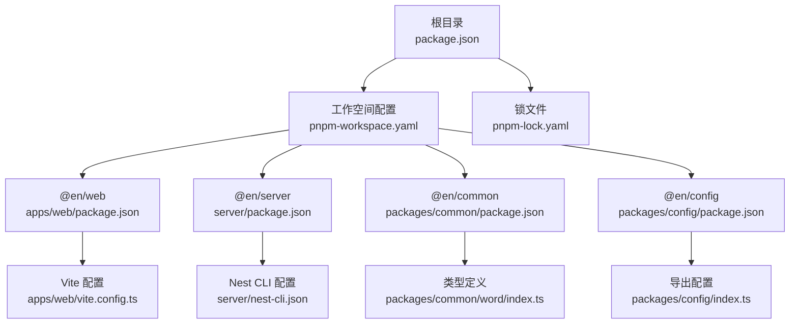
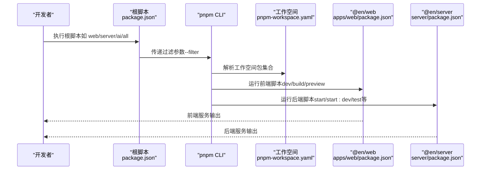
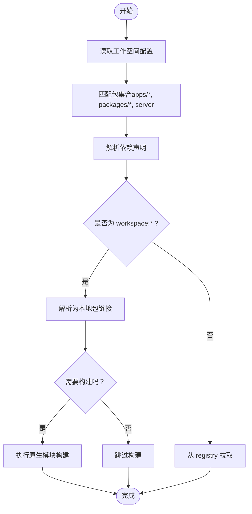
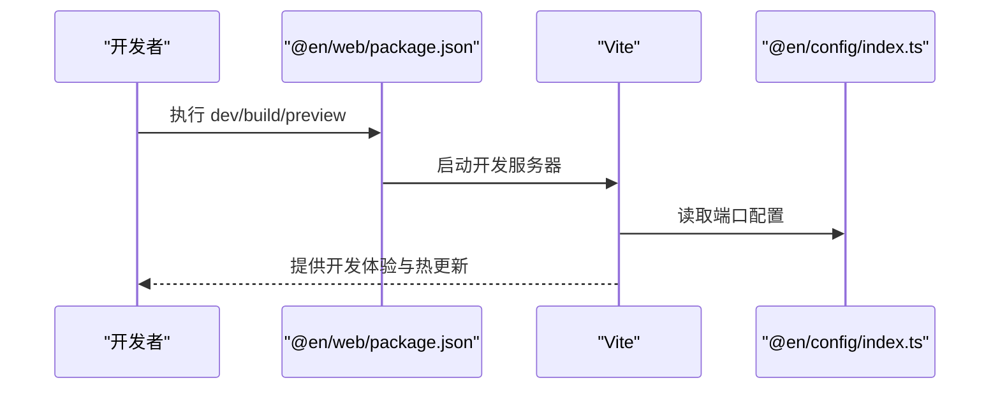
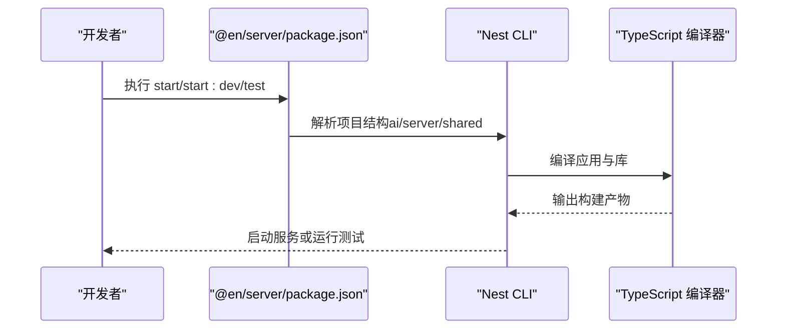
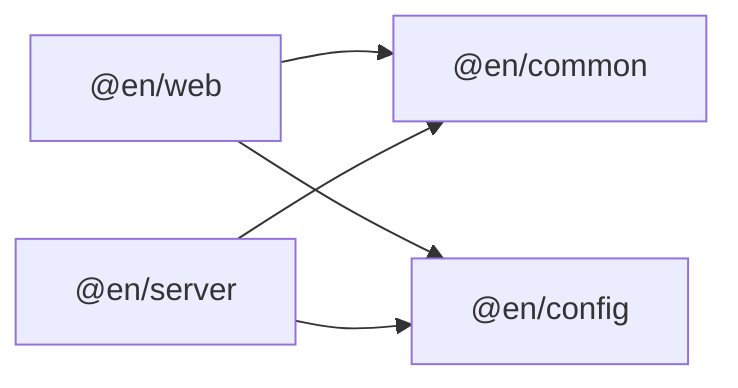
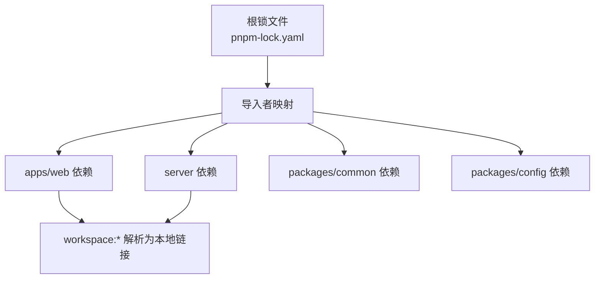

# 包管理配置

<cite>
**本文档引用的文件**
- [package.json](file://package.json)
- [pnpm-workspace.yaml](file://pnpm-workspace.yaml)
- [pnpm-lock.yaml](file://pnpm-lock.yaml)
- [apps/web/package.json](file://apps/web/package.json)
- [apps/web/vite.config.ts](file://apps/web/vite.config.ts)
- [packages/config/package.json](file://packages/config/package.json)
- [packages/config/index.ts](file://packages/config/index.ts)
- [server/package.json](file://server/package.json)
- [server/nest-cli.json](file://server/nest-cli.json)
- [packages/common/package.json](file://packages/common/package.json)
- [packages/common/word/index.ts](file://packages/common/word/index.ts)
</cite>

## 更新摘要
**所做更改**
- 新增 pnpm workspace 工作区配置的详细说明
- 更新包管理器设置与版本同步机制
- 添加 Git 工作区最佳实践指导
- 完善 monorepo 包发现规则与依赖管理策略
- 补充新增包步骤与依赖冲突解决方法

## 目录
1. [简介](#简介)
2. [项目结构](#项目结构)
3. [核心组件](#核心组件)
4. [架构总览](#架构总览)
5. [详细组件分析](#详细组件分析)
6. [依赖关系分析](#依赖关系分析)
7. [性能考虑](#性能考虑)
8. [故障排除指南](#故障排除指南)
9. [结论](#结论)
10. [附录](#附录)

## 简介
本文件系统性梳理该仓库的包管理与工作空间配置，重点覆盖以下方面：
- pnpm workspace 工作空间配置：包发现规则、依赖管理策略与版本同步机制
- monorepo 中各包的依赖关系、版本控制与发布策略建议
- 包脚本定义与执行流程：开发、构建、测试、部署命令
- 私有化配置、registry 设置与安全依赖管理
- 新增包步骤、依赖冲突解决方法与包升级最佳实践
- Git 工作区最佳实践与版本控制策略

## 项目结构
该项目采用 pnpm workspace 组织多包工程，根目录通过工作空间配置声明包集合，并在各子包内维护独立的脚本与依赖。

**图表来源**
- [pnpm-workspace.yaml](file://pnpm-workspace.yaml)
- [apps/web/package.json](file://apps/web/package.json)
- [server/package.json](file://server/package.json)
- [packages/common/package.json](file://packages/common/package.json)
- [packages/config/package.json](file://packages/config/package.json)
- [apps/web/vite.config.ts](file://apps/web/vite.config.ts)
- [server/nest-cli.json](file://server/nest-cli.json)
- [packages/config/index.ts](file://packages/config/index.ts)
- [packages/common/word/index.ts](file://packages/common/word/index.ts)

**章节来源**
- [pnpm-workspace.yaml](file://pnpm-workspace.yaml)
- [package.json](file://package.json)

## 核心组件
- 根级脚本与全局工具
  - 提供统一入口脚本以触发各子包任务，便于本地联调与一键启动。
  - 使用并发执行工具同时启动前端、后端与 AI 子服务。
- 工作空间与包发现
  - 通过工作空间配置声明包集合，支持 workspace:* 语义解析为本地包链接。
- 包别名与内部依赖
  - 内部包使用命名空间前缀进行分组，避免外部污染与命名冲突。
- 脚本与构建链路
  - 前端基于 Vite，后端基于 Nest CLI，各自定义开发、构建、测试与预览命令。
- 版本同步与构建控制
  - 通过 allowBuilds 配置精确控制特定包的构建行为，确保原生模块正确处理。

**章节来源**
- [package.json](file://package.json)
- [pnpm-workspace.yaml](file://pnpm-workspace.yaml)
- [apps/web/package.json](file://apps/web/package.json)
- [server/package.json](file://server/package.json)

## 架构总览
下图展示工作空间内的包发现、依赖解析与脚本执行的整体流程。

**图表来源**
- [package.json](file://package.json)
- [pnpm-workspace.yaml](file://pnpm-workspace.yaml)
- [apps/web/package.json](file://apps/web/package.json)
- [server/package.json](file://server/package.json)

## 详细组件分析

### 工作空间配置与包发现
- 包集合声明
  - 工作空间通过模式匹配声明包集合，确保 pnpm 能正确识别并管理这些包。
  - 支持 apps/*、packages/* 和 server 等多种包组织方式。
- workspace:* 依赖解析
  - 当依赖声明为 workspace:* 时，pnpm 将其解析为本地包链接，实现版本同步与一致性。
- 允许构建的包
  - 工作空间允许某些包在安装阶段执行构建逻辑，以满足特定依赖的原生模块或二进制需求。
  - 通过 allowBuilds 配置精确控制构建行为。

**图表来源**
- [pnpm-workspace.yaml](file://pnpm-workspace.yaml)

**章节来源**
- [pnpm-workspace.yaml](file://pnpm-workspace.yaml)

### 包脚本与执行流程

#### 前端应用（@en/web）
- 开发与预览
  - 开发：启动 Vite 服务器，结合插件与别名配置提供热更新与调试能力。
  - 预览：本地预览打包产物，验证生产环境行为。
- 构建与类型检查
  - 类型检查与构建分离，保证类型安全与构建效率。
- 依赖与配置
  - 通过内部包 @en/common 与 @en/config 提供共享能力与配置中心。
  - Vite 配置读取 @en/config 导出的端口配置，统一前后端端口约定。

**图表来源**
- [apps/web/package.json](file://apps/web/package.json)
- [apps/web/vite.config.ts](file://apps/web/vite.config.ts)
- [packages/config/index.ts](file://packages/config/index.ts)

**章节来源**
- [apps/web/package.json](file://apps/web/package.json)
- [apps/web/vite.config.ts](file://apps/web/vite.config.ts)
- [packages/config/index.ts](file://packages/config/index.ts)

#### 后端应用（@en/server）
- 开发与生产
  - 开发：监听源码变化自动重启，支持调试模式。
  - 生产：编译后运行生成的 dist 主文件。
- 测试与质量
  - 提供单元测试、覆盖率与 E2E 测试命令，配合 ESLint 与 Prettier 保障代码质量。
- 依赖与 Monorepo 支持
  - 通过 Nest CLI 的 monorepo 配置管理多个应用与库项目。

**图表来源**
- [server/package.json](file://server/package.json)
- [server/nest-cli.json](file://server/nest-cli.json)

**章节来源**
- [server/package.json](file://server/package.json)
- [server/nest-cli.json](file://server/nest-cli.json)

### 依赖关系与版本同步

#### 内部包依赖
- @en/web 依赖 @en/common 与 @en/config，均以 workspace:* 声明，确保版本一致且无需发布即可同步更新。
- @en/server 同样依赖上述两个内部包，形成统一的共享层。

**图表来源**
- [apps/web/package.json](file://apps/web/package.json)
- [server/package.json](file://server/package.json)
- [packages/common/package.json](file://packages/common/package.json)
- [packages/config/package.json](file://packages/config/package.json)

**章节来源**
- [apps/web/package.json](file://apps/web/package.json)
- [server/package.json](file://server/package.json)

### 版本控制与发布策略建议
- 版本同步
  - 使用 workspace:* 保持内部包与应用版本一致，避免跨包版本漂移。
- 发布节奏
  - 建议采用统一的版本发布策略（如语义化版本），在变更内部包时同步更新应用中的 workspace:* 版本范围。
- 锁文件与 CI
  - 在 CI 中使用锁文件确保依赖一致性；如需升级，先在本地验证再提交。
- 包管理器版本控制
  - 通过 devEngines 字段指定包管理器版本要求，确保团队使用一致的 pnpm 版本。

**章节来源**
- [pnpm-lock.yaml](file://pnpm-lock.yaml)
- [packages/config/package.json](file://packages/config/package.json)
- [packages/common/package.json](file://packages/common/package.json)

## 依赖关系分析
- 依赖解析路径
  - pnpm 依据工作空间配置与锁文件解析依赖，优先解析本地包链接，其次才从远端 registry 拉取。
- 冲突与重复
  - 若同一依赖在不同包中声明不同版本，pnpm 会尝试提升到最高兼容版本；若无法提升，可能产生重复安装或冲突。

**图表来源**
- [pnpm-lock.yaml](file://pnpm-lock.yaml)

**章节来源**
- [pnpm-lock.yaml](file://pnpm-lock.yaml)

## 性能考虑
- 安装性能
  - 使用 pnpm 的硬链接与符号链接减少磁盘占用，加速安装。
- 并发与缓存
  - 利用 pnpm 的缓存与并行安装策略，缩短 CI 时间。
- 依赖瘦身
  - 定期清理未使用的依赖，避免锁文件膨胀与安装时间增长。
- 构建优化
  - 通过 allowBuilds 精确控制需要构建的包，避免不必要的原生模块编译。

## 故障排除指南
- 本地包未被解析为链接
  - 检查工作空间配置是否包含对应包路径，确认依赖声明是否为 workspace:*。
- 端口冲突
  - 前端端口由 @en/config 统一导出，修改时需同步更新 Vite 配置。
- 脚本执行失败
  - 确认 Node 版本与引擎要求，检查包内脚本是否存在拼写错误或缺失的依赖。
- 包管理器版本不匹配
  - 检查 devEngines 配置，确保使用正确的 pnpm 版本。
- 原生模块构建失败
  - 检查 allowBuilds 配置，确认目标包的构建权限设置。

**章节来源**
- [pnpm-workspace.yaml](file://pnpm-workspace.yaml)
- [apps/web/vite.config.ts](file://apps/web/vite.config.ts)
- [packages/config/index.ts](file://packages/config/index.ts)
- [apps/web/package.json](file://apps/web/package.json)
- [server/package.json](file://server/package.json)
- [packages/config/package.json](file://packages/config/package.json)
- [packages/common/package.json](file://packages/common/package.json)

## 结论
本项目通过 pnpm workspace 实现了清晰的 monorepo 结构，内部包以 workspace:* 形式实现版本同步与快速迭代。根脚本提供统一入口，结合 Vite 与 Nest CLI 的脚本体系，覆盖开发、构建、测试与部署全流程。通过 allowBuilds 配置精确控制构建行为，通过 devEngines 确保包管理器版本一致性。建议在团队内明确版本发布策略与依赖管理规范，持续优化锁文件与 CI 性能。

## 附录

### 新增包步骤
- 在 packages 或 apps 下创建新包目录并初始化 package.json
- 在工作空间配置中添加包路径（如需要）
- 在需要的包中以 workspace:* 引入新包
- 在根脚本中添加必要的启动或构建命令（可选）
- 如涉及原生模块，检查是否需要在 allowBuilds 中添加构建权限

**章节来源**
- [pnpm-workspace.yaml](file://pnpm-workspace.yaml)
- [apps/web/package.json](file://apps/web/package.json)
- [server/package.json](file://server/package.json)

### 依赖冲突解决方法
- 使用 pnpm 的版本提升功能，尽量将冲突版本提升至更高兼容版本
- 若无法提升，考虑在应用层显式声明所需版本以覆盖冲突
- 清理锁文件并重新安装，确保一致性
- 检查 workspace:* 依赖的一致性，避免跨包版本差异

**章节来源**
- [pnpm-lock.yaml](file://pnpm-lock.yaml)

### 包升级最佳实践
- 先在本地验证升级影响，再批量更新工作空间中的相关包
- 对于内部包，优先同步升级以保持 workspace:* 一致性
- 在 CI 中先行运行测试与构建，确保升级稳定
- 注意包管理器版本兼容性，检查 devEngines 配置

**章节来源**
- [pnpm-workspace.yaml](file://pnpm-workspace.yaml)
- [pnpm-lock.yaml](file://pnpm-lock.yaml)
- [packages/config/package.json](file://packages/config/package.json)
- [packages/common/package.json](file://packages/common/package.json)

### Git 工作区最佳实践
- 分支策略
  - 使用功能分支进行开发，主分支保持稳定
  - 采用语义化版本标签进行发布管理
- 提交规范
  - 遵循约定式提交规范，确保变更历史清晰
  - 包含工作空间变更的提交应明确说明影响范围
- 同步策略
  - 定期同步上游变更，及时处理合并冲突
  - 在大型变更前先在个人分支验证完整性
- 团队协作
  - 建立代码审查流程，确保代码质量
  - 定期同步包管理器版本，避免环境不一致
  - 使用 pre-commit hooks 自动格式化和验证代码

**章节来源**
- [pnpm-workspace.yaml](file://pnpm-workspace.yaml)
- [package.json](file://package.json)
- [pnpm-lock.yaml](file://pnpm-lock.yaml)