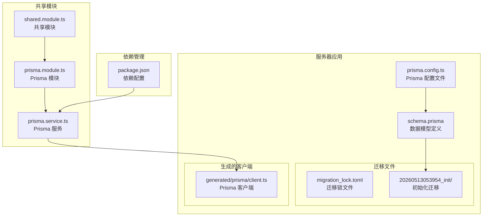
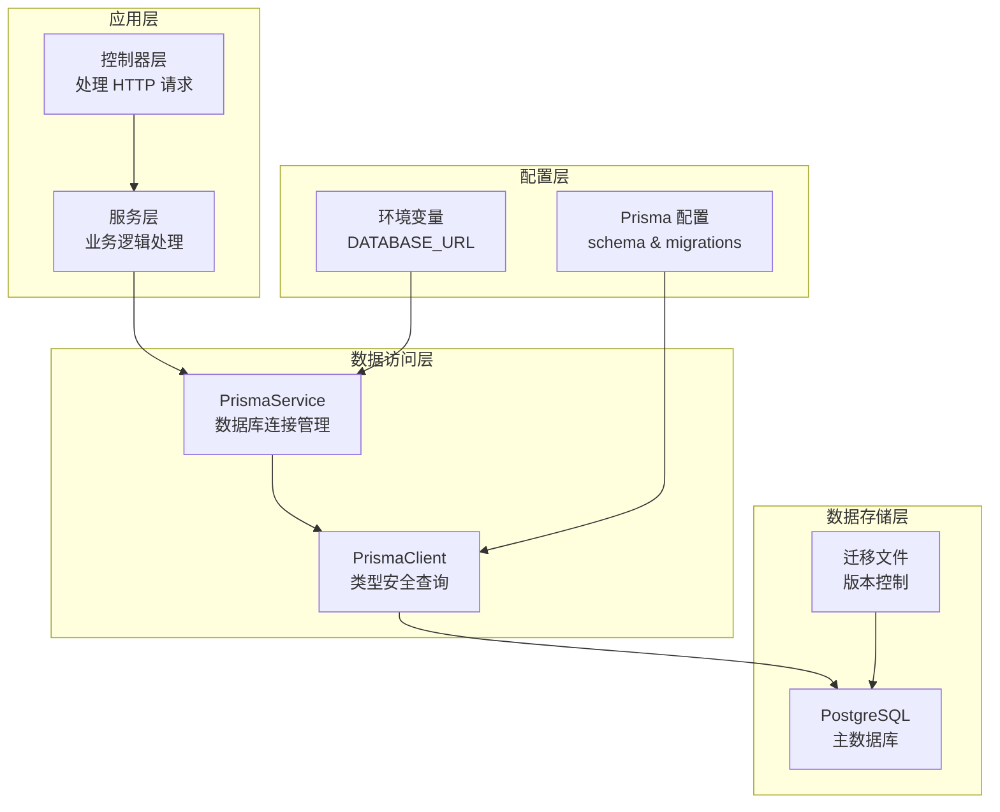
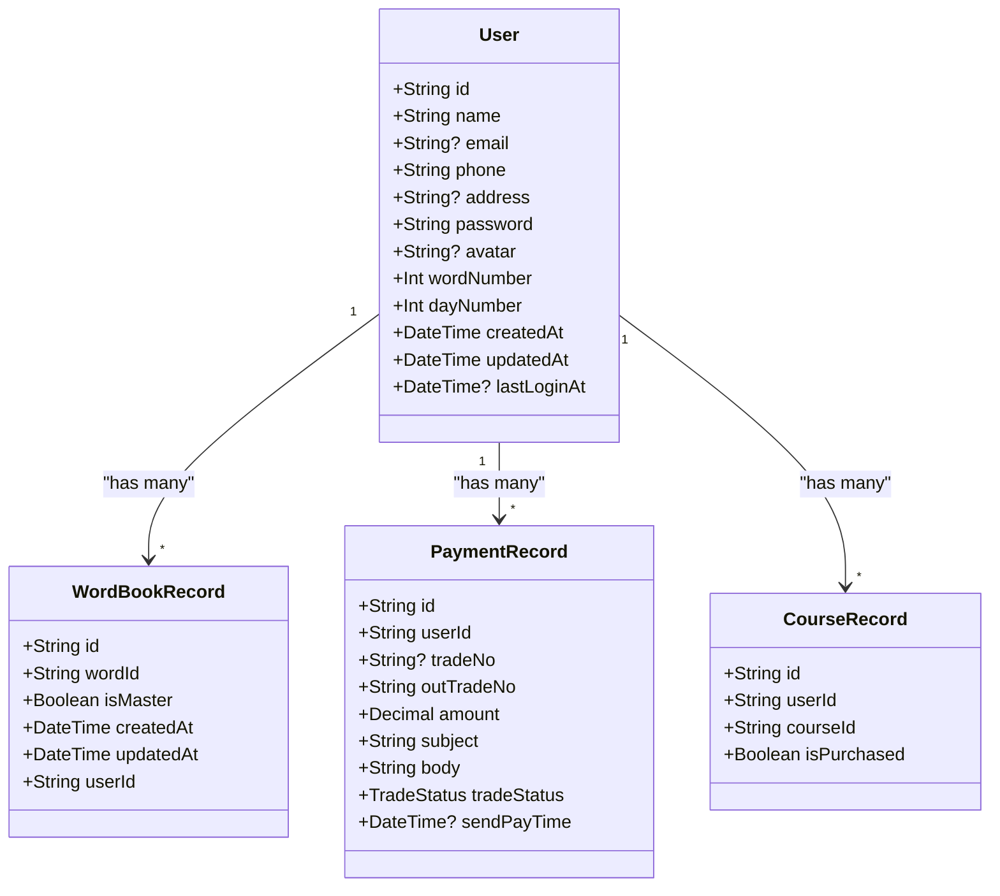
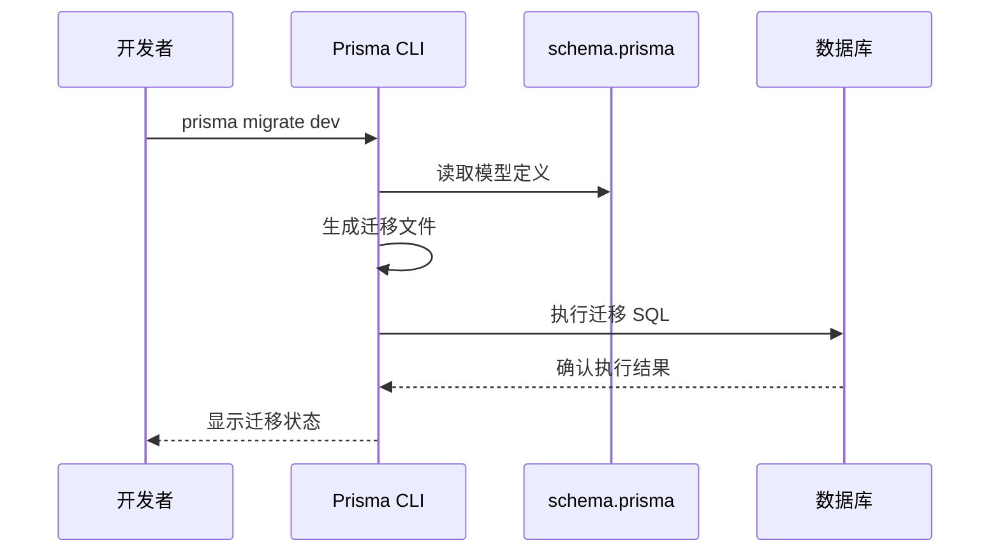
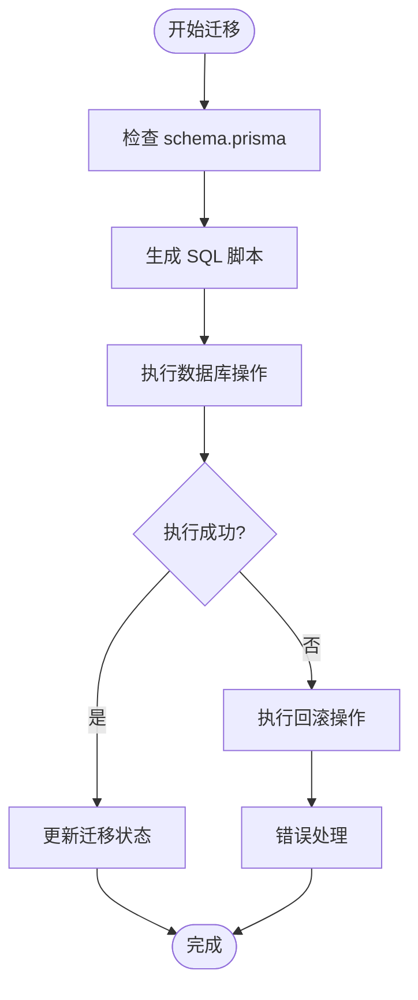
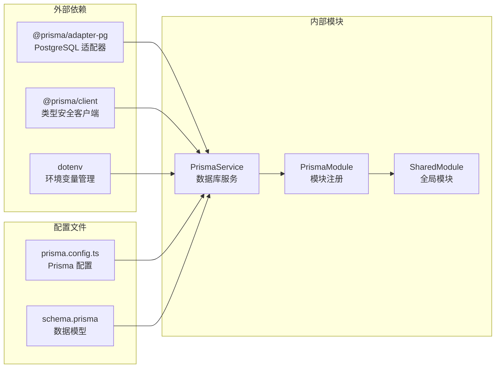
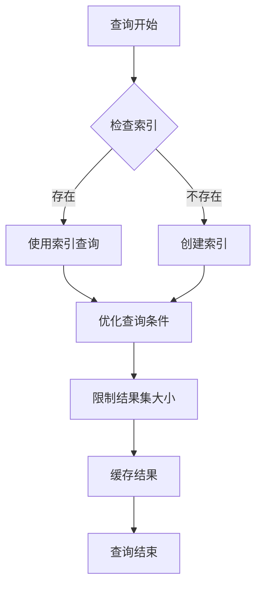

# 数据库配置

<cite>
**本文档引用的文件**
- [schema.prisma](file://server/prisma/schema.prisma)
- [prisma.service.ts](file://server/libs/shared/src/prisma/prisma.service.ts)
- [prisma.module.ts](file://server/libs/shared/src/prisma/prisma.module.ts)
- [prisma.config.ts](file://server/prisma.config.ts)
- [migration.sql](file://server/prisma/migrations/20260513053954_init/migration.sql)
- [package.json](file://server/package.json)
- [shared.module.ts](file://server/libs/shared/src/shared.module.ts)
- [client.ts](file://server/libs/shared/src/generated/prisma/client.ts)
- [class.ts](file://server/libs/shared/src/generated/prisma/internal/class.ts)
</cite>

## 目录
1. [简介](#简介)
2. [项目结构](#项目结构)
3. [核心组件](#核心组件)
4. [架构概览](#架构概览)
5. [详细组件分析](#详细组件分析)
6. [依赖关系分析](#依赖关系分析)
7. [性能考虑](#性能考虑)
8. [故障排除指南](#故障排除指南)
9. [结论](#结论)

## 简介

本文件详细说明了基于 Prisma ORM 的数据库配置方案，涵盖了数据库连接字符串、模型定义、迁移配置等关键方面。该系统采用 NestJS 框架与 PostgreSQL 数据库结合，通过 Prisma 提供类型安全的数据访问层。文档重点解释了 schema.prisma 文件的结构、数据模型定义方法（包括实体关系、字段类型和约束规则），并提供了数据库迁移的管理策略（迁移文件生成、执行和回滚操作）。同时，文档还涵盖了开发、测试和生产环境的数据库配置差异、连接池和性能优化设置，以及新增数据模型的步骤和数据库配置的安全注意事项。

## 项目结构

该项目采用 Monorepo 结构，数据库配置主要集中在 server 目录中，具体组织如下：



**图表来源**
- [prisma.config.ts:1-15](file://server/prisma.config.ts#L1-L15)
- [schema.prisma:1-133](file://server/prisma/schema.prisma#L1-L133)
- [prisma.service.ts:1-18](file://server/libs/shared/src/prisma/prisma.service.ts#L1-L18)
- [prisma.module.ts:1-9](file://server/libs/shared/src/prisma/prisma.module.ts#L1-L9)

**章节来源**
- [prisma.config.ts:1-15](file://server/prisma.config.ts#L1-L15)
- [schema.prisma:1-133](file://server/prisma/schema.prisma#L1-L133)
- [package.json:1-52](file://server/package.json#L1-L52)

## 核心组件

### Prisma 配置文件

Prisma 配置文件位于 `prisma.config.ts`，定义了整个数据库操作的核心配置：

- **模式文件路径**: 指向 `prisma/schema.prisma`
- **迁移目录**: 设置为 `prisma/migrations`
- **数据源配置**: 从环境变量 `DATABASE_URL` 读取连接字符串

### Prisma 服务层

Prisma 服务通过 `PrismaService` 类实现，继承自 `PrismaClient`，使用 `@prisma/adapter-pg` 连接 PostgreSQL 数据库。该服务在构造函数中：
- 从环境变量加载数据库连接字符串
- 使用适配器模式创建连接
- 继承 PrismaClient 的所有功能

### 生成的客户端

Prisma 自动生成的客户端位于 `generated/prisma/client.ts`，提供了类型安全的数据库操作接口。客户端包含：
- 数据模型的类型定义
- 查询构建器
- 关系查询支持
- 事务处理能力

**章节来源**
- [prisma.config.ts:6-14](file://server/prisma.config.ts#L6-L14)
- [prisma.service.ts:7-16](file://server/libs/shared/src/prisma/prisma.service.ts#L7-L16)
- [client.ts:29-29](file://server/libs/shared/src/generated/prisma/client.ts#L29-L29)

## 架构概览

系统采用分层架构设计，确保数据库访问的清晰分离和类型安全：



**图表来源**
- [prisma.service.ts:1-18](file://server/libs/shared/src/prisma/prisma.service.ts#L1-L18)
- [prisma.config.ts:1-15](file://server/prisma.config.ts#L1-L15)
- [shared.module.ts:1-13](file://server/libs/shared/src/shared.module.ts#L1-L13)

## 详细组件分析

### 数据模型定义

schema.prisma 文件定义了完整的数据模型体系，包含以下核心实体：

#### 用户模型 (User)

用户模型是系统的核心实体，包含完整的用户信息管理：



**图表来源**
- [schema.prisma:25-41](file://server/prisma/schema.prisma#L25-L41)
- [schema.prisma:44-55](file://server/prisma/schema.prisma#L44-L55)
- [schema.prisma:89-104](file://server/prisma/schema.prisma#L89-L104)
- [schema.prisma:106-119](file://server/prisma/schema.prisma#L106-L119)

#### 实体关系图

系统中的实体关系通过外键约束实现强一致性：

```mermaid
erDiagram
USER {
String id PK
String name
String email UK
String phone UK
String password
String avatar
Int wordNumber
Int dayNumber
DateTime createdAt
DateTime updatedAt
DateTime lastLoginAt
}
WORD_BOOK_RECORD {
String id PK
String wordId FK
String userId FK
Boolean isMaster
DateTime createdAt
DateTime updatedAt
}
WORD_BOOK {
String id PK
String word
String phonetic
String definition
String translation
String pos
String tag
Boolean gk
Boolean zk
Boolean ky
Boolean cet4
Boolean cet6
Boolean gre
Boolean toefl
Boolean ielts
DateTime createdAt
DateTime updatedAt
}
PAYMENT_RECORD {
String id PK
String userId FK
String? tradeNo
String outTradeNo UK
Decimal amount
String subject
String body
TradeStatus tradeStatus
DateTime? sendPayTime
DateTime createdAt
DateTime updatedAt
}
COURSE_RECORD {
String id PK
String userId FK
String courseId FK
String? paymentRecordId FK
Boolean isPurchased
DateTime createdAt
DateTime updatedAt
}
COURSE {
String id PK
String name
String value
String description
String teacher
String url
Decimal price
DateTime createdAt
DateTime updatedAt
}
USER ||--o{ WORD_BOOK_RECORD : "owns"
WORD_BOOK ||--o{ WORD_BOOK_RECORD : "contains"
USER ||--o{ PAYMENT_RECORD : "makes"
PAYMENT_RECORD ||--o{ COURSE_RECORD : "affects"
USER ||--o{ COURSE_RECORD : "enrolls"
COURSE ||--o{ COURSE_RECORD : "offers"
```

**图表来源**
- [schema.prisma:25-132](file://server/prisma/schema.prisma#L25-L132)

#### 字段类型和约束规则

系统使用了丰富的字段类型和约束规则：

**基础字段类型**:
- `String`: 文本字段，支持可选值
- `Int`: 整数字段，支持默认值
- `Decimal`: 精确数值，用于货币计算
- `Boolean`: 布尔值
- `DateTime`: 时间戳

**约束规则**:
- `@id`: 主键标识
- `@unique`: 唯一约束
- `@default(value)`: 默认值设置
- `@updatedAt`: 自动更新时间戳
- `@relation`: 关系定义

**章节来源**
- [schema.prisma:17-23](file://server/prisma/schema.prisma#L17-L23)
- [schema.prisma:25-41](file://server/prisma/schema.prisma#L25-L41)
- [schema.prisma:44-86](file://server/prisma/schema.prisma#L44-L86)
- [schema.prisma:89-132](file://server/prisma/schema.prisma#L89-L132)

### 迁移管理策略

系统采用 Prisma 的迁移机制来管理数据库结构变更：

#### 迁移文件结构

迁移文件位于 `prisma/migrations/` 目录下，每个迁移包含：
- `migration.sql`: SQL 执行脚本
- `migration_lock.toml`: 迁移锁定文件，防止并发冲突

#### 迁移执行流程



**图表来源**
- [prisma.config.ts:8-10](file://server/prisma.config.ts#L8-L10)
- [migration.sql:1-151](file://server/prisma/migrations/20260513053954_init/migration.sql#L1-L151)

#### 迁移回滚机制

Prisma 支持安全的迁移回滚操作，通过 `prisma migrate resolve` 命令实现：



**图表来源**
- [migration.sql:107-151](file://server/prisma/migrations/20260513053954_init/migration.sql#L107-L151)

**章节来源**
- [prisma.config.ts:8-14](file://server/prisma.config.ts#L8-L14)
- [migration.sql:1-151](file://server/prisma/migrations/20260513053954_init/migration.sql#L1-L151)

### 环境配置差异

系统支持多环境配置，通过不同的环境变量实现：

#### 开发环境配置

开发环境使用本地数据库连接，便于快速迭代和调试。

#### 测试环境配置

测试环境使用独立的数据库实例，确保测试隔离性和可重复性。

#### 生产环境配置

生产环境使用高可用数据库集群，包含连接池优化和监控配置。

**章节来源**
- [prisma.service.ts:9-11](file://server/libs/shared/src/prisma/prisma.service.ts#L9-L11)
- [prisma.config.ts:11-13](file://server/prisma.config.ts#L11-L13)

## 依赖关系分析

系统的依赖关系清晰明确，遵循单一职责原则：



**图表来源**
- [package.json:29-32](file://server/package.json#L29-L32)
- [prisma.service.ts:1-18](file://server/libs/shared/src/prisma/prisma.service.ts#L1-L18)
- [prisma.module.ts:1-9](file://server/libs/shared/src/prisma/prisma.module.ts#L1-L9)

**章节来源**
- [package.json:22-35](file://server/package.json#L22-L35)
- [prisma.service.ts:1-18](file://server/libs/shared/src/prisma/prisma.service.ts#L1-L18)

## 性能考虑

### 连接池优化

系统通过 Prisma 的连接池机制实现高性能数据库访问：

- **连接复用**: 重用数据库连接减少建立连接的开销
- **并发控制**: 限制最大连接数防止数据库过载
- **自动回收**: 定期清理空闲连接释放资源

### 查询优化



### 索引策略

系统为高频查询字段建立了专门的索引：
- 用户邮箱和手机号唯一索引
- 单词表的单词和标签索引
- 支付记录的订单号索引

**章节来源**
- [migration.sql:107-132](file://server/prisma/migrations/20260513053954_init/migration.sql#L107-L132)

## 故障排除指南

### 常见问题及解决方案

#### 数据库连接失败

**症状**: 应用启动时报数据库连接错误
**原因**: DATABASE_URL 环境变量配置错误
**解决**: 检查环境变量格式和数据库可达性

#### 迁移执行失败

**症状**: 迁移命令执行中断或报错
**原因**: schema.prisma 与数据库状态不一致
**解决**: 使用 `prisma migrate resolve` 解决状态问题

#### 查询性能问题

**症状**: 数据库查询响应缓慢
**原因**: 缺少必要的索引或查询条件不当
**解决**: 分析查询计划并添加适当索引

### 调试工具

系统提供了多种调试和监控工具：
- Prisma Studio: 图形化数据库管理界面
- 日志记录: 详细的数据库操作日志
- 性能监控: 查询执行时间和慢查询检测

**章节来源**
- [prisma.service.ts:1-18](file://server/libs/shared/src/prisma/prisma.service.ts#L1-L18)
- [prisma.config.ts:1-15](file://server/prisma.config.ts#L1-L15)

## 结论

本数据库配置方案提供了完整、类型安全且易于维护的数据访问层。通过 Prisma ORM 的强类型特性、完善的迁移管理和灵活的配置选项，系统能够适应不同环境的需求。建议在实际部署时重点关注以下方面：

1. **安全性**: 确保 DATABASE_URL 环境变量的安全存储和传输
2. **性能**: 根据实际负载调整连接池参数和索引策略
3. **监控**: 建立完善的数据库监控和告警机制
4. **备份**: 制定定期备份策略确保数据安全

该配置方案为后续的功能扩展和维护奠定了坚实的基础，支持系统的长期发展需求。