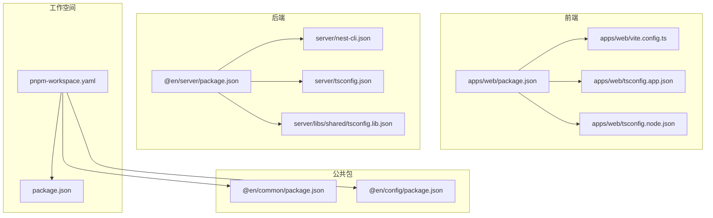
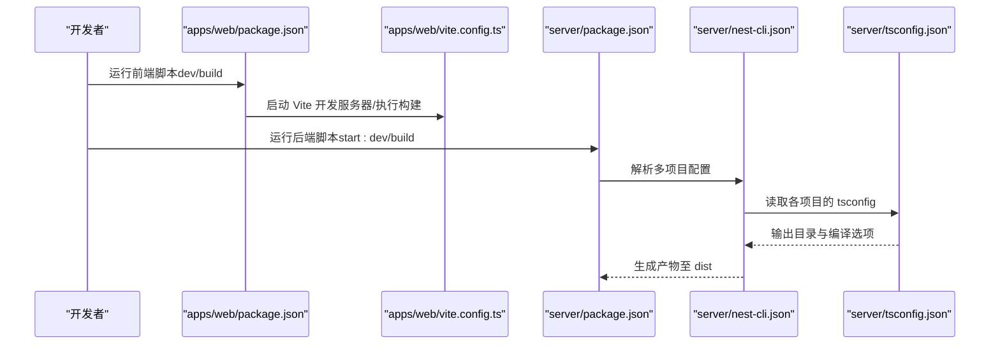
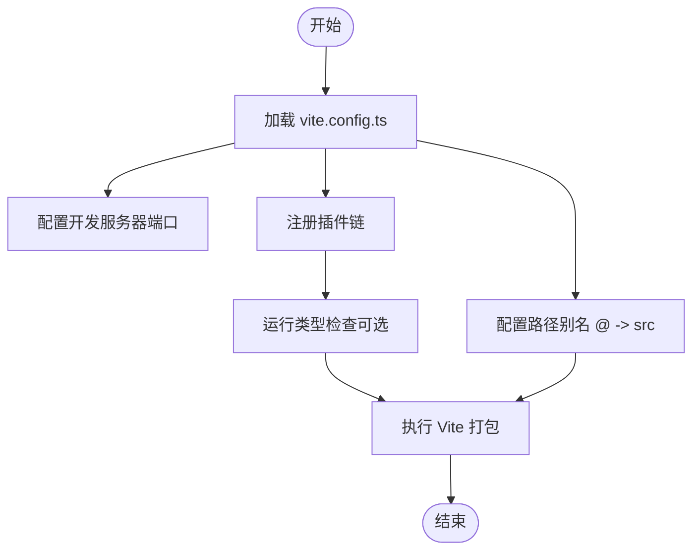
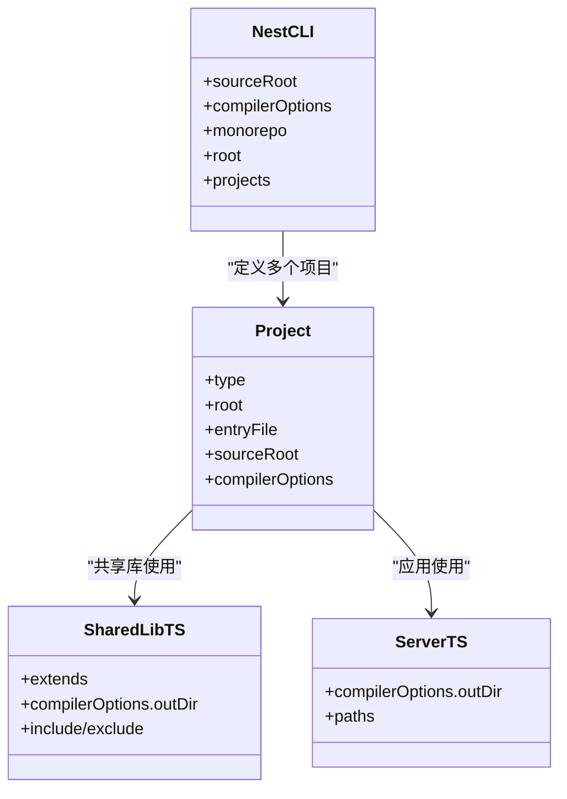
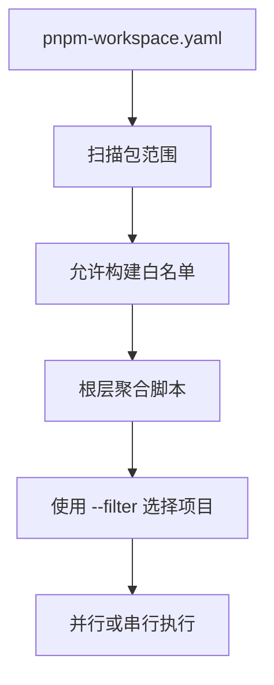
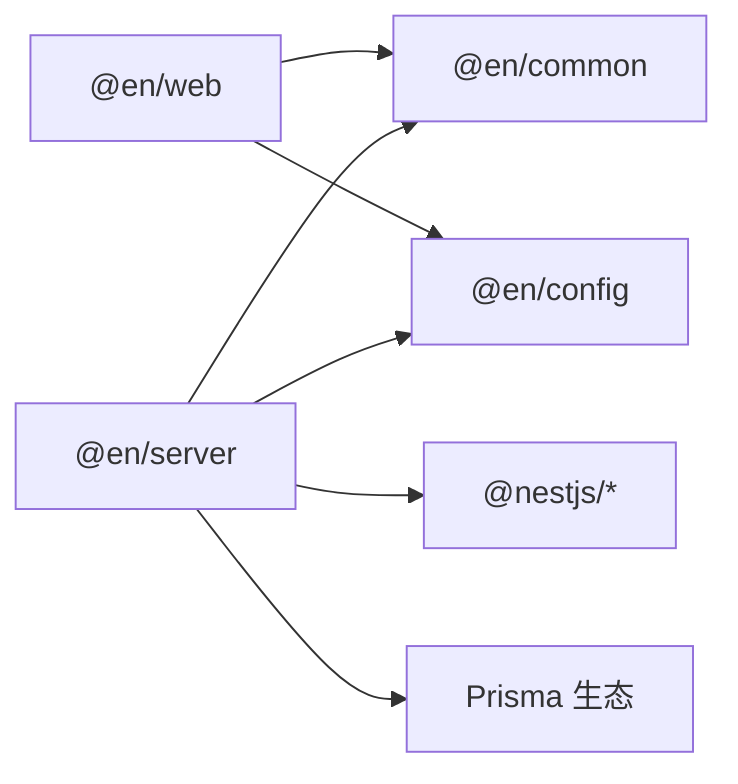

# 构建配置

<cite>
**本文引用的文件**
- [apps/web/vite.config.ts](file://apps/web/vite.config.ts)
- [apps/web/package.json](file://apps/web/package.json)
- [apps/web/tsconfig.json](file://apps/web/tsconfig.json)
- [apps/web/tsconfig.app.json](file://apps/web/tsconfig.app.json)
- [apps/web/tsconfig.node.json](file://apps/web/tsconfig.node.json)
- [server/nest-cli.json](file://server/nest-cli.json)
- [server/package.json](file://server/package.json)
- [server/tsconfig.json](file://server/tsconfig.json)
- [server/tsconfig.build.json](file://server/tsconfig.build.json)
- [server/libs/shared/tsconfig.lib.json](file://server/libs/shared/tsconfig.lib.json)
- [pnpm-workspace.yaml](file://pnpm-workspace.yaml)
- [package.json](file://package.json)
- [packages/common/package.json](file://packages/common/package.json)
- [packages/config/package.json](file://packages/config/package.json)
</cite>

## 目录
1. [简介](#简介)
2. [项目结构](#项目结构)
3. [核心组件](#核心组件)
4. [架构总览](#架构总览)
5. [详细组件分析](#详细组件分析)
6. [依赖分析](#依赖分析)
7. [性能考虑](#性能考虑)
8. [故障排查指南](#故障排查指南)
9. [结论](#结论)
10. [附录](#附录)

## 简介
本文件系统性梳理该仓库的构建配置与流程，覆盖以下方面：
- Vite 前端构建：开发服务器、插件、别名解析与构建脚本
- NestJS CLI 构建：编译选项、输出路径、多项目（monorepo）配置
- pnpm 工作空间：包发现、允许构建白名单与跨包依赖
- 性能优化：类型检查并行、增量构建、输出目录管理
- 自定义扩展：如何新增 Vite 插件、调整 NestJS 编译参数
- 故障排查：常见错误定位与修复建议

## 项目结构
该仓库采用 monorepo 结构，包含前端应用、后端 NestJS 应用、共享库与公共包：
- apps/web：基于 Vue 的前端应用，使用 Vite 开发与构建
- server：NestJS 多项目（ai、server、shared library）monorepo 根
- packages：公共包（common、config）
- pnpm 工作空间：统一管理包与构建顺序

**图表来源**
- [apps/web/vite.config.ts:1-25](file://apps/web/vite.config.ts#L1-L25)
- [apps/web/package.json:1-45](file://apps/web/package.json#L1-L45)
- [apps/web/tsconfig.app.json:1-15](file://apps/web/tsconfig.app.json#L1-L15)
- [apps/web/tsconfig.node.json:1-28](file://apps/web/tsconfig.node.json#L1-L28)
- [server/nest-cli.json:1-43](file://server/nest-cli.json#L1-L43)
- [server/package.json:1-52](file://server/package.json#L1-L52)
- [server/tsconfig.json:1-35](file://server/tsconfig.json#L1-L35)
- [server/libs/shared/tsconfig.lib.json:1-10](file://server/libs/shared/tsconfig.lib.json#L1-L10)
- [pnpm-workspace.yaml:1-10](file://pnpm-workspace.yaml#L1-L10)
- [package.json:1-15](file://package.json#L1-L15)
- [packages/common/package.json:1-21](file://packages/common/package.json#L1-L21)
- [packages/config/package.json:1-24](file://packages/config/package.json#L1-L24)

**章节来源**
- [apps/web/package.json:1-45](file://apps/web/package.json#L1-L45)
- [server/package.json:1-52](file://server/package.json#L1-L52)
- [pnpm-workspace.yaml:1-10](file://pnpm-workspace.yaml#L1-L10)

## 核心组件
- Vite 配置与脚本
  - 开发服务器端口由共享配置模块注入
  - 插件链：Vue、Vue DevTools、TailwindCSS
  - 路径别名指向 src 目录
  - 构建脚本组合类型检查与打包
- NestJS CLI 与 TypeScript
  - monorepo 多项目配置（ai、server、shared）
  - 指定 tsconfig 路径与输出目录
  - 共享库独立 tsconfig 控制声明输出位置
- pnpm 工作空间
  - 包扫描范围与允许构建白名单
  - 根层聚合脚本统一启动前后端

**章节来源**
- [apps/web/vite.config.ts:1-25](file://apps/web/vite.config.ts#L1-L25)
- [apps/web/package.json:6-12](file://apps/web/package.json#L6-L12)
- [server/nest-cli.json:1-43](file://server/nest-cli.json#L1-L43)
- [server/tsconfig.json:1-35](file://server/tsconfig.json#L1-L35)
- [server/libs/shared/tsconfig.lib.json:1-10](file://server/libs/shared/tsconfig.lib.json#L1-L10)
- [pnpm-workspace.yaml:1-10](file://pnpm-workspace.yaml#L1-L10)
- [package.json:2-7](file://package.json#L2-L7)

## 架构总览
下图展示从开发到构建的关键流程与配置交互：

**图表来源**
- [apps/web/package.json:6-12](file://apps/web/package.json#L6-L12)
- [apps/web/vite.config.ts:10-24](file://apps/web/vite.config.ts#L10-L24)
- [server/package.json:8-21](file://server/package.json#L8-L21)
- [server/nest-cli.json:5-32](file://server/nest-cli.json#L5-L32)
- [server/tsconfig.json:15-16](file://server/tsconfig.json#L15-L16)

## 详细组件分析

### Vite 构建配置
- 开发服务器
  - 端口通过共享配置模块注入，便于统一管理
- 插件生态
  - Vue、Vue DevTools、TailwindCSS 插件按顺序加载
- 路径别名
  - 将 @ 映射到 src，提升导入可读性
- 类型检查与构建
  - 构建脚本组合类型检查与打包，确保类型安全后再产出

**图表来源**
- [apps/web/vite.config.ts:10-24](file://apps/web/vite.config.ts#L10-L24)
- [apps/web/package.json:6-12](file://apps/web/package.json#L6-L12)

**章节来源**
- [apps/web/vite.config.ts:1-25](file://apps/web/vite.config.ts#L1-L25)
- [apps/web/package.json:6-12](file://apps/web/package.json#L6-L12)

### NestJS CLI 构建配置
- monorepo 项目布局
  - 定义 ai、server、shared 三个项目，分别指定根目录、入口与 tsconfig
- 编译选项
  - 删除输出目录、指定 tsconfig 路径
- TypeScript 编译器选项
  - 输出目录、声明文件、增量编译、严格模式等
- 共享库
  - 独立 tsconfig 控制声明输出目录，避免污染根 dist

**图表来源**
- [server/nest-cli.json:14-42](file://server/nest-cli.json#L14-L42)
- [server/libs/shared/tsconfig.lib.json:1-10](file://server/libs/shared/tsconfig.lib.json#L1-L10)
- [server/tsconfig.json:15-32](file://server/tsconfig.json#L15-L32)

**章节来源**
- [server/nest-cli.json:1-43](file://server/nest-cli.json#L1-L43)
- [server/tsconfig.json:1-35](file://server/tsconfig.json#L1-L35)
- [server/libs/shared/tsconfig.lib.json:1-10](file://server/libs/shared/tsconfig.lib.json#L1-L10)

### pnpm 工作空间与构建顺序
- 包扫描范围
  - apps/*、packages/*、server
- 允许构建白名单
  - 控制特定包是否允许被构建（如 Prisma、某些引擎）
- 根层脚本
  - 通过过滤器统一启动前端与后端服务

**图表来源**
- [pnpm-workspace.yaml:1-10](file://pnpm-workspace.yaml#L1-L10)
- [package.json:2-7](file://package.json#L2-L7)

**章节来源**
- [pnpm-workspace.yaml:1-10](file://pnpm-workspace.yaml#L1-L10)
- [package.json:2-7](file://package.json#L2-L7)

### TypeScript 配置要点
- 前端
  - tsconfig.json 引用 node 与 app 两个子配置
  - app 配置启用 composite/noEmit，配合 vue-tsc 并行类型检查
  - node 配置用于 Vite/Vitest 等工具的类型支持
- 后端
  - 统一 compilerOptions，输出目录为 dist
  - 共享库独立 tsconfig，声明输出到 server/dist/libs/shared

**章节来源**
- [apps/web/tsconfig.json:1-12](file://apps/web/tsconfig.json#L1-L12)
- [apps/web/tsconfig.app.json:1-15](file://apps/web/tsconfig.app.json#L1-L15)
- [apps/web/tsconfig.node.json:1-28](file://apps/web/tsconfig.node.json#L1-L28)
- [server/tsconfig.json:1-35](file://server/tsconfig.json#L1-L35)
- [server/libs/shared/tsconfig.lib.json:1-10](file://server/libs/shared/tsconfig.lib.json#L1-L10)

## 依赖分析
- 包依赖关系
  - @en/server 依赖 @en/common、@en/config、NestJS 生态与 Prisma
  - @en/web 依赖 Vue、Element Plus、TailwindCSS、@en/common、@en/config
- 工作空间版本约束
  - common、config 使用 workspace:* 与 pnpm 工作空间保持一致
- 脚本耦合
  - 根层脚本通过 pnpm filter 选择 @en/web 与 @en/server，实现一键启动

**图表来源**
- [apps/web/package.json:13-29](file://apps/web/package.json#L13-L29)
- [server/package.json:22-35](file://server/package.json#L22-L35)
- [pnpm-workspace.yaml:1-4](file://pnpm-workspace.yaml#L1-L4)

**章节来源**
- [apps/web/package.json:13-29](file://apps/web/package.json#L13-L29)
- [server/package.json:22-35](file://server/package.json#L22-L35)
- [pnpm-workspace.yaml:1-4](file://pnpm-workspace.yaml#L1-L4)

## 性能考虑
- 类型检查并行化
  - 前端构建脚本组合类型检查与打包，可在本地快速发现类型问题
- 增量构建
  - 后端 tsconfig 启用增量编译，缩短二次构建时间
- 输出目录分离
  - 共享库声明输出独立目录，避免重复编译与缓存污染
- 开发体验
  - Vite DevTools 插件提升调试效率；TailwindCSS 插件按需样式处理

**章节来源**
- [apps/web/package.json:6-12](file://apps/web/package.json#L6-L12)
- [server/tsconfig.json:16-16](file://server/tsconfig.json#L16-L16)
- [server/libs/shared/tsconfig.lib.json:4-5](file://server/libs/shared/tsconfig.lib.json#L4-L5)

## 故障排查指南
- Vite 开发服务器端口冲突
  - 检查共享配置模块提供的端口值，并在 vite.config.ts 中确认注入生效
- 插件加载失败
  - 确认插件安装与版本兼容；按顺序加载 Vue、DevTools、TailwindCSS
- 类型检查阻塞构建
  - 在 apps/web 中先执行类型检查再进入打包阶段
- NestJS 构建产物缺失
  - 检查 nest-cli.json 的 tsConfigPath 与 projects 配置是否正确
  - 确认 server/tsconfig.json 的 outDir 设置
- 共享库未生成声明
  - 检查 shared 库的 tsconfig.lib.json 是否包含 src/**/* 且排除测试文件
- pnpm 工作空间构建异常
  - 查看 pnpm-workspace.yaml 的 allowBuilds 白名单与包扫描范围
  - 使用根层脚本时确认 --filter 选择的项目名称与实际一致

**章节来源**
- [apps/web/vite.config.ts:10-24](file://apps/web/vite.config.ts#L10-L24)
- [apps/web/package.json:6-12](file://apps/web/package.json#L6-L12)
- [server/nest-cli.json:14-42](file://server/nest-cli.json#L14-L42)
- [server/tsconfig.json:15-16](file://server/tsconfig.json#L15-L16)
- [server/libs/shared/tsconfig.lib.json:7-8](file://server/libs/shared/tsconfig.lib.json#L7-L8)
- [pnpm-workspace.yaml:5-10](file://pnpm-workspace.yaml#L5-L10)

## 结论
本仓库通过清晰的 monorepo 分层与标准化的构建配置，实现了前端与后端的高效协同开发。Vite 提供了快速的开发体验，NestJS CLI 支持多项目管理，pnpm 工作空间保障了包依赖与构建顺序的可控性。遵循本文的配置与最佳实践，可进一步提升构建性能与稳定性。

## 附录
- 自定义构建配置建议
  - Vite：新增插件时注意加载顺序与环境变量注入；必要时拆分开发与生产配置
  - NestJS：新增项目时同步更新 nest-cli.json 与对应 tsconfig；共享库保持独立输出目录
  - pnpm：根据需要调整 allowBuilds 白名单，避免不必要的构建开销
- 常用命令参考
  - 前端：dev、build、preview
  - 后端：build、start:dev、start:prod
  - 根层：web、server、ai、all（并行）