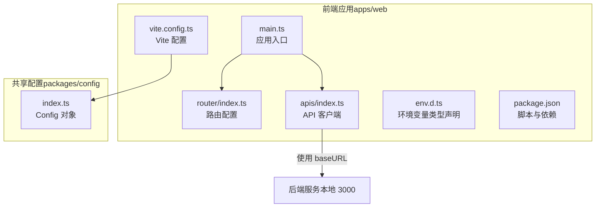
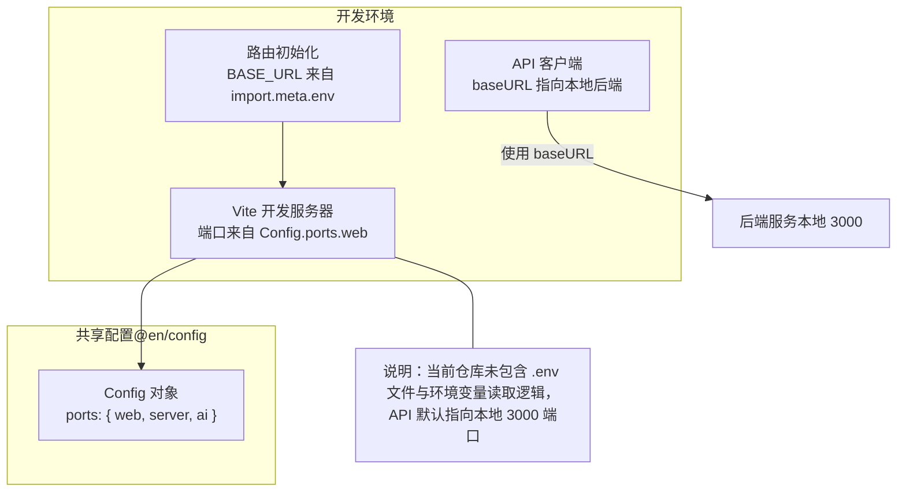
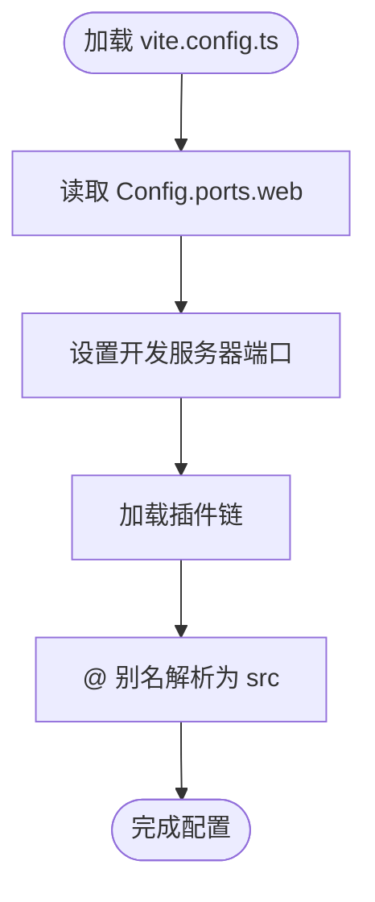
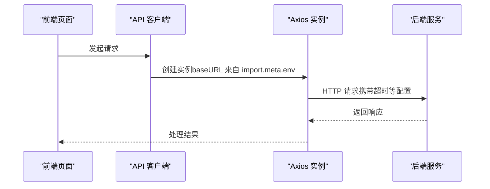
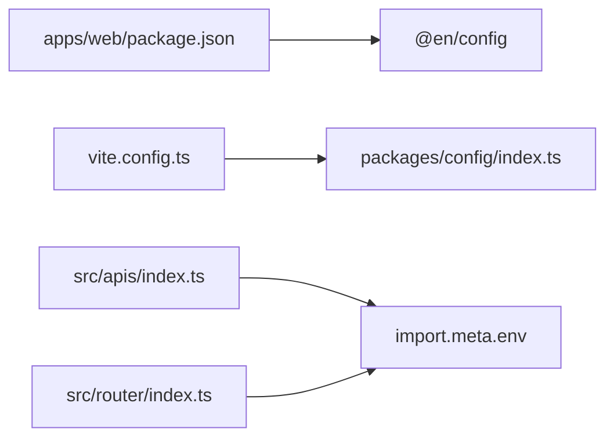

# 环境配置

<cite>
**本文引用的文件**
- [apps/web/vite.config.ts](file://apps/web/vite.config.ts)
- [apps/web/env.d.ts](file://apps/web/env.d.ts)
- [apps/web/package.json](file://apps/web/package.json)
- [packages/config/index.ts](file://packages/config/index.ts)
- [apps/web/src/apis/index.ts](file://apps/web/src/apis/index.ts)
- [apps/web/src/router/index.ts](file://apps/web/src/router/index.ts)
- [apps/web/src/main.ts](file://apps/web/src/main.ts)
- [apps/web/src/App.vue](file://apps/web/src/App.vue)
- [apps/web/src/stores/counter.ts](file://apps/web/src/stores/counter.ts)
- [apps/web/src/router/home/index.ts](file://apps/web/src/router/home/index.ts)
- [apps/web/src/router/word-book/index.ts](file://apps/web/src/router/word-book/index.ts)
- [apps/web/src/views/Home/index.vue](file://apps/web/src/views/Home/index.vue)
- [apps/web/src/views/WordBook/index.vue](file://apps/web/src/views/WordBook/index.vue)
- [package.json（根）](file://package.json)
</cite>

## 目录
1. [简介](#简介)
2. [项目结构](#项目结构)
3. [核心组件](#核心组件)
4. [架构总览](#架构总览)
5. [详细组件分析](#详细组件分析)
6. [依赖分析](#依赖分析)
7. [性能考虑](#性能考虑)
8. [故障排查指南](#故障排查指南)
9. [结论](#结论)
10. [附录](#附录)

## 简介
本文件系统性梳理前端应用的环境配置与运行时行为，重点覆盖以下方面：
- 开发、测试、生产三类环境的配置差异与落地方式
- .env 文件的使用规范与命名约定
- 环境变量在代码中的读取与使用路径
- API 端点、调试开关与第三方服务密钥的管理建议
- 最佳实践、安全注意事项与配置验证方法
- 新增环境变量的步骤与版本控制策略

当前仓库中，前端应用通过 Vite 配置与共享配置包进行端口等参数的统一管理；API 请求默认指向本地后端服务。后续章节将结合现有实现与通用实践，给出可操作的配置方案。

## 项目结构
前端应用位于 apps/web，采用 Vite + Vue 3 技术栈，并通过工作区依赖引入共享配置包 @en/config。关键文件与职责如下：
- 应用入口与路由：main.ts、router/index.ts
- API 客户端：src/apis/index.ts
- 构建与开发服务器：vite.config.ts
- 类型声明：env.d.ts
- 包管理与脚本：apps/web/package.json
- 共享配置：packages/config/index.ts
- 根级脚本：package.json（根）

图表来源
- [apps/web/vite.config.ts:1-25](file://apps/web/vite.config.ts#L1-L25)
- [packages/config/index.ts:1-8](file://packages/config/index.ts#L1-L8)
- [apps/web/src/apis/index.ts:1-6](file://apps/web/src/apis/index.ts#L1-L6)
- [apps/web/src/router/index.ts:1-13](file://apps/web/src/router/index.ts#L1-L13)
- [apps/web/src/main.ts:1-21](file://apps/web/src/main.ts#L1-L21)
- [apps/web/env.d.ts:1-2](file://apps/web/env.d.ts#L1-L2)
- [apps/web/package.json:1-45](file://apps/web/package.json#L1-L45)

章节来源
- [apps/web/vite.config.ts:1-25](file://apps/web/vite.config.ts#L1-L25)
- [packages/config/index.ts:1-8](file://packages/config/index.ts#L1-L8)
- [apps/web/package.json:1-45](file://apps/web/package.json#L1-L45)
- [apps/web/env.d.ts:1-2](file://apps/web/env.d.ts#L1-L2)

## 核心组件
- Vite 配置与开发服务器
  - 通过 @en/config 的 Config.ports.web 设置前端开发端口
  - 使用插件链：Vue、Vue DevTools、TailwindCSS
- API 客户端
  - 默认 baseURL 指向本地后端服务端口
  - 超时时间固定配置
- 路由与基础 URL
  - 基于 import.meta.env.BASE_URL 初始化 History 路由
- 环境变量类型声明
  - 通过 env.d.ts 引入 Vite 环境变量类型，便于 IDE 提示与编译期校验

章节来源
- [apps/web/vite.config.ts:1-25](file://apps/web/vite.config.ts#L1-L25)
- [apps/web/src/apis/index.ts:1-6](file://apps/web/src/apis/index.ts#L1-L6)
- [apps/web/src/router/index.ts:1-13](file://apps/web/src/router/index.ts#L1-L13)
- [apps/web/env.d.ts:1-2](file://apps/web/env.d.ts#L1-L2)

## 架构总览
下图展示前端在不同环境下的配置与调用关系，以及与共享配置包的交互：

图表来源
- [apps/web/vite.config.ts:10-13](file://apps/web/vite.config.ts#L10-L13)
- [packages/config/index.ts:1-8](file://packages/config/index.ts#L1-L8)
- [apps/web/src/router/index.ts:4-6](file://apps/web/src/router/index.ts#L4-L6)
- [apps/web/src/apis/index.ts:3-5](file://apps/web/src/apis/index.ts#L3-L5)

## 详细组件分析

### Vite 配置与开发服务器
- 端口来源：从 @en/config 的 Config.ports.web 读取，避免硬编码
- 插件链：Vue、Vue DevTools、TailwindCSS
- 别名：@ 指向 src 目录，提升导入便捷性

图表来源
- [apps/web/vite.config.ts:10-24](file://apps/web/vite.config.ts#L10-L24)
- [packages/config/index.ts:1-8](file://packages/config/index.ts#L1-L8)

章节来源
- [apps/web/vite.config.ts:1-25](file://apps/web/vite.config.ts#L1-L25)
- [packages/config/index.ts:1-8](file://packages/config/index.ts#L1-L8)

### API 客户端与后端通信
- 当前实现：baseURL 固定为本地后端端口
- 建议：将 baseURL 改为基于 import.meta.env 的环境变量，以支持多环境切换

图表来源
- [apps/web/src/apis/index.ts:1-6](file://apps/web/src/apis/index.ts#L1-L6)

章节来源
- [apps/web/src/apis/index.ts:1-6](file://apps/web/src/apis/index.ts#L1-L6)

### 路由与基础 URL
- History 路由初始化使用 import.meta.env.BASE_URL
- 建议：在不同部署环境下正确设置 BASE_URL，以确保相对路径资源与导航正常

章节来源
- [apps/web/src/router/index.ts:1-13](file://apps/web/src/router/index.ts#L1-L13)

### 环境变量类型声明与使用
- env.d.ts 引入 Vite 环境变量类型，便于在 TS 中获得类型提示
- import.meta.env 用于读取以 VITE_ 前缀的环境变量（如 VITE_API_BASE_URL）

章节来源
- [apps/web/env.d.ts:1-2](file://apps/web/env.d.ts#L1-L2)

### 应用入口与全局状态
- main.ts 初始化 Vue 应用、路由、状态管理与 UI 组件库
- 与环境配置无直接耦合，但可作为后续接入环境变量的入口点

章节来源
- [apps/web/src/main.ts:1-21](file://apps/web/src/main.ts#L1-L21)

### 示例视图与路由模块
- 各页面组件与路由模块按功能拆分，便于扩展与维护
- 与环境配置无直接耦合，但可作为业务层读取环境变量的使用场景

章节来源
- [apps/web/src/views/Home/index.vue:1-7](file://apps/web/src/views/Home/index.vue#L1-L7)
- [apps/web/src/views/WordBook/index.vue:1-7](file://apps/web/src/views/WordBook/index.vue#L1-L7)
- [apps/web/src/router/home/index.ts:1-12](file://apps/web/src/router/home/index.ts#L1-L12)
- [apps/web/src/router/word-book/index.ts:1-11](file://apps/web/src/router/word-book/index.ts#L1-L11)

## 依赖分析
- 前端应用依赖 @en/config 提供统一的端口配置
- Vite 配置通过该包注入开发服务器端口
- API 客户端与路由分别在不同层面体现环境变量需求

图表来源
- [apps/web/package.json:16-16](file://apps/web/package.json#L16-L16)
- [apps/web/vite.config.ts:6-6](file://apps/web/vite.config.ts#L6-L6)
- [packages/config/index.ts:1-8](file://packages/config/index.ts#L1-L8)
- [apps/web/src/apis/index.ts:1-6](file://apps/web/src/apis/index.ts#L1-L6)
- [apps/web/src/router/index.ts:4-6](file://apps/web/src/router/index.ts#L4-L6)

章节来源
- [apps/web/package.json:1-45](file://apps/web/package.json#L1-L45)
- [apps/web/vite.config.ts:1-25](file://apps/web/vite.config.ts#L1-L25)
- [packages/config/index.ts:1-8](file://packages/config/index.ts#L1-L8)
- [apps/web/src/apis/index.ts:1-6](file://apps/web/src/apis/index.ts#L1-L6)
- [apps/web/src/router/index.ts:1-13](file://apps/web/src/router/index.ts#L1-L13)

## 性能考虑
- 将 API baseURL 设为环境变量可减少构建时的硬编码，便于在不同环境复用同一产物
- 在开发环境中启用热更新与源码映射，生产环境开启压缩与 Tree-shaking
- 仅在必要时动态加载大体积资源，避免阻塞首屏渲染

## 故障排查指南
- 端口冲突
  - 确认 Config.ports.web 与实际占用端口不冲突
  - 若冲突，修改 @en/config 或通过 Vite 配置覆盖
- 路由跳转异常
  - 检查 import.meta.env.BASE_URL 是否与部署路径一致
- API 请求失败
  - 确认后端服务已启动且端口正确
  - 如需跨域，请在开发服务器中配置代理或后端 CORS
- 类型提示缺失
  - 确保 env.d.ts 正确引入 Vite 环境变量类型

章节来源
- [apps/web/vite.config.ts:10-13](file://apps/web/vite.config.ts#L10-L13)
- [packages/config/index.ts:1-8](file://packages/config/index.ts#L1-L8)
- [apps/web/src/router/index.ts:4-6](file://apps/web/src/router/index.ts#L4-L6)
- [apps/web/env.d.ts:1-2](file://apps/web/env.d.ts#L1-L2)

## 结论
当前前端应用通过共享配置包集中管理端口，API 客户端与路由分别在不同层面体现了对环境变量的需求。建议尽快引入 .env 文件与 import.meta.env 的使用，将 API 基础地址、调试开关与第三方密钥等敏感信息纳入环境变量管理，以实现多环境一致性与安全性。

## 附录

### 开发/测试/生产环境配置差异
- 开发环境
  - 端口：Config.ports.web
  - API 基础地址：http://localhost:3000
  - 调试：启用 Vue DevTools、Source Map
- 测试环境
  - 端口：独立端口或容器暴露端口
  - API 基础地址：测试后端域名或 IP
  - 调试：按需开启
- 生产环境
  - 端口：由部署平台分配
  - API 基础地址：线上域名
  - 调试：关闭，启用压缩与缓存

### .env 文件使用规范与命名约定
- 文件位置：apps/web/.env（开发）、apps/web/.env.production（生产）、apps/web/.env.development（开发）
- 命名约定：以 VITE_ 前缀声明公开变量，如 VITE_API_BASE_URL
- 值类型：布尔、数字、字符串均以字符串形式存储，运行时按需转换
- 安全性：私有密钥不应提交到仓库，使用 CI/CD 的机密变量注入

### 在代码中的使用示例（路径指引）
- API 客户端
  - 将 baseURL 替换为 import.meta.env.VITE_API_BASE_URL
  - 参考路径：[apps/web/src/apis/index.ts:3-5](file://apps/web/src/apis/index.ts#L3-L5)
- 路由基础 URL
  - 使用 import.meta.env.BASE_URL 初始化 History 路由
  - 参考路径：[apps/web/src/router/index.ts:4-6](file://apps/web/src/router/index.ts#L4-L6)
- 调试开关
  - 通过 import.meta.env.VITE_DEBUG 控制日志输出或调试工具启用
  - 参考路径：[apps/web/env.d.ts:1-2](file://apps/web/env.d.ts#L1-L2)

### 新增环境变量的步骤
- 在 apps/web/.env* 中添加键值对（如 VITE_MY_VAR=...）
- 在 env.d.ts 中补充类型声明，确保 TS 提示
- 在代码中通过 import.meta.env.VITE_MY_VAR 读取
- 在 CI/CD 中为各环境配置对应机密变量
- 更新 apps/web/package.json 的构建脚本，确保新变量参与构建

### 配置验证方法
- 编译期校验：确保 env.d.ts 中声明了所有使用的 VITE_* 变量
- 运行期校验：在应用启动时打印关键配置摘要，或在控制台输出关键变量
- 端到端验证：在不同环境执行一次完整的页面加载与 API 请求流程

### 版本控制策略
- .env 文件不提交到仓库，使用 .gitignore 屏蔽
- 提交 .env.example 或 .env.template 作为模板，随代码库保留
- 在团队内约定变更流程：新增变量需同步更新模板与 CI/CD 机密配置