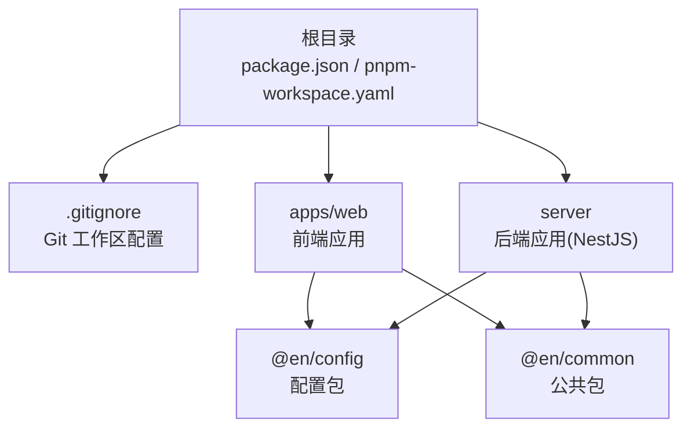
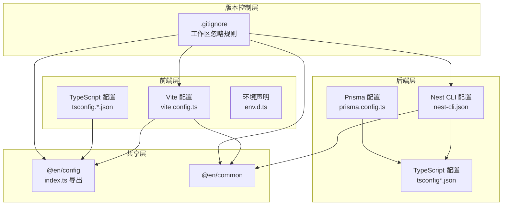
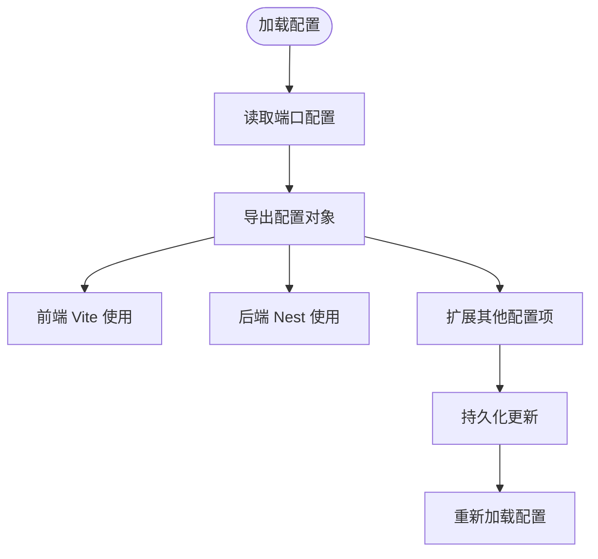
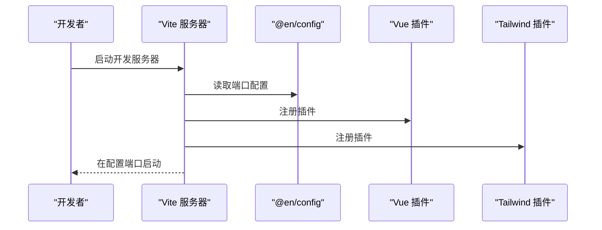
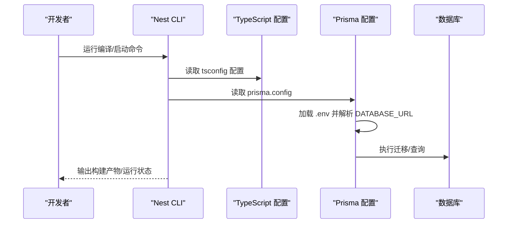
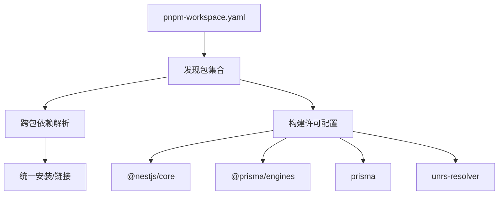
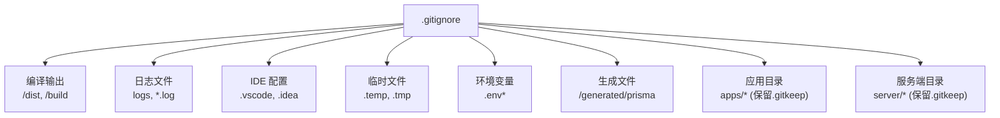
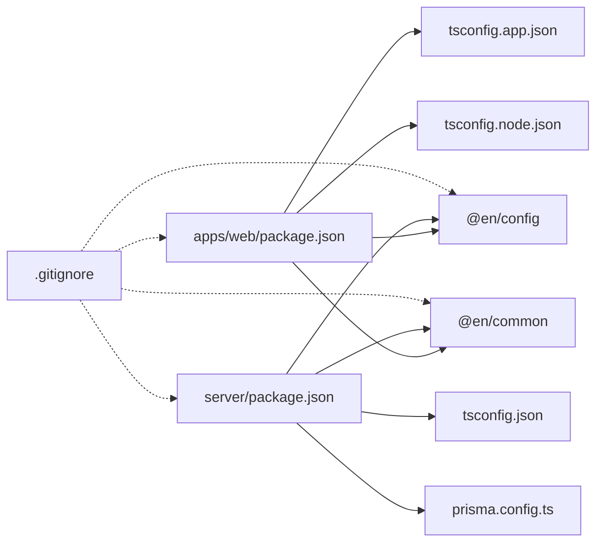

# 配置管理

<cite>
**本文引用的文件**
- [根 package.json](file://package.json)
- [pnpm 工作空间配置](file://pnpm-workspace.yaml)
- [Git 工作区忽略配置](file://.gitignore)
- [Web 应用 package.json](file://apps/web/package.json)
- [服务端应用 package.json](file://server/package.json)
- [配置包 package.json](file://packages/config/package.json)
- [公共包 package.json](file://packages/common/package.json)
- [Vite 配置](file://apps/web/vite.config.ts)
- [Web 应用 TypeScript 根配置](file://apps/web/tsconfig.json)
- [Web 应用 TypeScript 应用配置](file://apps/web/tsconfig.app.json)
- [Web 应用 TypeScript 节点配置](file://apps/web/tsconfig.node.json)
- [服务端 TypeScript 根配置](file://server/tsconfig.json)
- [Nest CLI 配置](file://server/nest-cli.json)
- [Prisma 配置](file://server/prisma.config.ts)
- [配置包导出](file://packages/config/index.ts)
- [Web 环境声明](file://apps/web/env.d.ts)
</cite>

## 更新摘要
**所做更改**
- 新增 Git 工作区配置管理章节，详细说明 .gitignore 的配置策略
- 更新 pnpm workspace 工作空间配置，明确包发现规则与构建许可
- 添加包管理配置的最佳实践与版本控制策略
- 完善多环境配置差异与切换方法
- 增强配置验证与故障排查指南

## 目录
1. [简介](#简介)
2. [项目结构](#项目结构)
3. [核心组件](#核心组件)
4. [架构总览](#架构总览)
5. [详细组件分析](#详细组件分析)
6. [依赖关系分析](#依赖关系分析)
7. [性能考量](#性能考量)
8. [故障排查指南](#故障排查指南)
9. [结论](#结论)
10. [附录](#附录)

## 简介
本文件系统性梳理英语学习平台的配置管理体系，覆盖以下方面：
- 环境变量与运行时配置：如何通过配置包集中管理端口与外部服务地址，以及如何在 Prisma 中读取数据库连接字符串。
- TypeScript 配置：前端与后端的多配置文件组织方式、路径映射与编译选项。
- 构建与开发配置：Vite 开发服务器、Nest CLI 项目结构与编译配置。
- pnpm workspace 工作空间：包发现规则、构建许可与跨包依赖解析。
- Git 工作区配置管理：.gitignore 规则与版本控制策略。
- 多环境配置差异与切换：开发、测试、生产阶段的脚本与配置差异。
- 最佳实践与安全注意事项：敏感信息处理、配置验证与更新流程。

## 项目结构
项目采用 monorepo 结构，使用 pnpm workspace 管理多个包与应用：
- 根目录提供统一脚本入口与工作空间配置。
- apps/web 为前端应用，基于 Vite + Vue 3。
- server 为后端应用，基于 NestJS，包含多个子项目（如 ai、server、shared）。
- packages/config 与 packages/common 提供共享配置与通用工具。

**图表来源**
- [根 package.json:1-15](file://package.json#L1-L15)
- [pnpm 工作空间配置:1-10](file://pnpm-workspace.yaml#L1-L10)
- [Git 工作区忽略配置:1-63](file://.gitignore#L1-L63)
- [Web 应用 package.json:1-45](file://apps/web/package.json#L1-L45)
- [服务端应用 package.json:1-52](file://server/package.json#L1-L52)
- [配置包 package.json:1-24](file://packages/config/package.json#L1-L24)
- [公共包 package.json:1-21](file://packages/common/package.json#L1-L21)

**章节来源**
- [根 package.json:1-15](file://package.json#L1-L15)
- [pnpm 工作空间配置:1-10](file://pnpm-workspace.yaml#L1-L10)
- [Git 工作区忽略配置:1-63](file://.gitignore#L1-L63)

## 核心组件
- 配置包（@en/config）：集中导出运行时配置对象，当前包含各服务端口。
- 公共包（@en/common）：作为跨应用共享模块，参与工作空间依赖解析。
- 前端配置（apps/web）：Vite 开发服务器、TypeScript 多配置文件、路径别名。
- 后端配置（server）：Nest CLI 项目结构、TypeScript 编译配置、Prisma 数据源配置。
- Git 工作区配置：.gitignore 文件管理，确保敏感信息与临时文件不被版本控制。

**章节来源**
- [配置包导出:1-8](file://packages/config/index.ts#L1-L8)
- [Vite 配置:1-25](file://apps/web/vite.config.ts#L1-L25)
- [Git 工作区忽略配置:1-63](file://.gitignore#L1-L63)

## 架构总览
下图展示配置在各层的使用关系与数据流向：

**图表来源**
- [Vite 配置:1-25](file://apps/web/vite.config.ts#L1-L25)
- [Web 应用 TypeScript 根配置:1-12](file://apps/web/tsconfig.json#L1-L12)
- [Web 应用 TypeScript 应用配置:1-15](file://apps/web/tsconfig.app.json#L1-L15)
- [Web 应用 TypeScript 节点配置:1-28](file://apps/web/tsconfig.node.json#L1-L28)
- [Nest CLI 配置:1-43](file://server/nest-cli.json#L1-L43)
- [服务端 TypeScript 根配置:1-35](file://server/tsconfig.json#L1-L35)
- [Prisma 配置:1-15](file://server/prisma.config.ts#L1-L15)
- [配置包导出:1-8](file://packages/config/index.ts#L1-L8)
- [Git 工作区忽略配置:1-63](file://.gitignore#L1-L63)

## 详细组件分析

### 配置包（@en/config）
- 作用：集中导出运行时配置对象，当前包含前端、服务端、AI 服务的端口。
- 使用方式：前端 Vite 配置直接从该包导入配置对象以设置开发服务器端口；后端可复用相同配置对象或扩展。
- 版本与类型：包内声明了类型导出与开发引擎要求，便于统一工具链版本。

**图表来源**
- [配置包导出:1-8](file://packages/config/index.ts#L1-L8)
- [Vite 配置:10-18](file://apps/web/vite.config.ts#L10-L18)

**章节来源**
- [配置包导出:1-8](file://packages/config/index.ts#L1-L8)
- [配置包 package.json:1-24](file://packages/config/package.json#L1-L24)

### 前端配置（apps/web）
- Vite 配置：通过导入配置包设置开发服务器端口，启用 Vue 插件与 TailwindCSS 插件，并配置路径别名。
- TypeScript 配置：采用多配置文件模式，根配置引用应用与节点配置；应用配置包含路径映射与类型声明；节点配置用于工具链与类型检查。
- 环境声明：提供 Vite 环境类型声明，确保开发体验一致。

**图表来源**
- [Vite 配置:10-18](file://apps/web/vite.config.ts#L10-L18)
- [Web 应用 TypeScript 根配置:1-12](file://apps/web/tsconfig.json#L1-L12)
- [Web 应用 TypeScript 应用配置:1-15](file://apps/web/tsconfig.app.json#L1-L15)
- [Web 应用 TypeScript 节点配置:1-28](file://apps/web/tsconfig.node.json#L1-L28)

**章节来源**
- [Vite 配置:1-25](file://apps/web/vite.config.ts#L1-L25)
- [Web 应用 TypeScript 根配置:1-12](file://apps/web/tsconfig.json#L1-L12)
- [Web 应用 TypeScript 应用配置:1-15](file://apps/web/tsconfig.app.json#L1-L15)
- [Web 应用 TypeScript 节点配置:1-28](file://apps/web/tsconfig.node.json#L1-L28)
- [Web 环境声明:1-2](file://apps/web/env.d.ts#L1-L2)

### 后端配置（server）
- Nest CLI 配置：定义多项目结构（ai、server、shared），指定源码根目录与 TypeScript 配置路径，支持 monorepo 模式。
- TypeScript 配置：采用 NodeNext 模块解析与严格编译选项，包含路径映射与类型声明，便于共享库与应用间引用。
- Prisma 配置：通过 dotenv 加载环境变量，读取数据库连接字符串，指定 schema 与迁移目录。

**图表来源**
- [Nest CLI 配置:1-43](file://server/nest-cli.json#L1-L43)
- [服务端 TypeScript 根配置:1-35](file://server/tsconfig.json#L1-L35)
- [Prisma 配置:1-15](file://server/prisma.config.ts#L1-L15)

**章节来源**
- [Nest CLI 配置:1-43](file://server/nest-cli.json#L1-L43)
- [服务端 TypeScript 根配置:1-35](file://server/tsconfig.json#L1-L35)
- [Prisma 配置:1-15](file://server/prisma.config.ts#L1-L15)

### pnpm workspace 工作空间配置
- 包发现：apps/*、packages/*、server 均被纳入工作空间，实现跨包依赖解析与统一安装。
- 构建许可：对特定包（如 @nestjs/core、@prisma/engines、prisma、unrs-resolver）设置允许构建行为，避免误报或不兼容问题。
- 引擎约束：配置包与公共包声明了开发引擎要求，确保团队使用一致的包管理器与 Node 版本。

**图表来源**
- [pnpm 工作空间配置:1-10](file://pnpm-workspace.yaml#L1-L10)
- [配置包 package.json:16-22](file://packages/config/package.json#L16-L22)
- [公共包 package.json:12-18](file://packages/common/package.json#L12-L18)

**章节来源**
- [pnpm 工作空间配置:1-10](file://pnpm-workspace.yaml#L1-L10)
- [配置包 package.json:1-24](file://packages/config/package.json#L1-L24)
- [公共包 package.json:1-21](file://packages/common/package.json#L1-L21)

### Git 工作区配置管理
- 忽略规则：.gitignore 定义了编译输出、日志、IDE 配置、临时文件等的忽略规则。
- 目录结构：针对 apps/* 和 server/* 目录设置通配符忽略，但保留 .gitkeep 文件以便 Git 跟踪空目录。
- 环境变量：.env 相关文件按环境区分，确保敏感信息不被提交到版本控制。
- 生成文件：Prisma 生成文件位于 /generated/prisma 目录，避免被版本控制。

**图表来源**
- [Git 工作区忽略配置:1-63](file://.gitignore#L1-L63)

**章节来源**
- [Git 工作区忽略配置:1-63](file://.gitignore#L1-L63)

### 多环境配置差异与切换
- 根脚本：通过根 package.json 的 scripts 统一入口，分别启动前端、服务端与 AI 子服务，或同时启动全部。
- 开发/生产：前端使用 Vite 开发服务器；后端使用 Nest CLI 的开发与生产启动脚本；Prisma 通过环境变量控制数据源。
- 切换建议：通过环境变量区分开发/测试/生产数据库与第三方服务地址；在 CI 中注入对应变量。

**章节来源**
- [根 package.json:2-6](file://package.json#L2-L6)
- [Web 应用 package.json:6-12](file://apps/web/package.json#L6-L12)
- [服务端应用 package.json:8-21](file://server/package.json#L8-L21)
- [Prisma 配置:12-12](file://server/prisma.config.ts#L12-L12)

## 依赖关系分析
- 前端依赖 @en/config 与 @en/common，通过 workspace:* 解析到本地包。
- 后端同样依赖 @en/config 与 @en/common，并引入 Prisma、NestJS 生态。
- TypeScript 配置在前后端分别通过多配置文件协同，确保类型检查与编译行为一致。

**图表来源**
- [Web 应用 package.json:13-29](file://apps/web/package.json#L13-L29)
- [服务端应用 package.json:22-35](file://server/package.json#L22-L35)
- [Web 应用 TypeScript 应用配置:1-15](file://apps/web/tsconfig.app.json#L1-L15)
- [Web 应用 TypeScript 节点配置:1-28](file://apps/web/tsconfig.node.json#L1-L28)
- [服务端 TypeScript 根配置:1-35](file://server/tsconfig.json#L1-L35)
- [Prisma 配置:1-15](file://server/prisma.config.ts#L1-L15)
- [Git 工作区忽略配置:1-63](file://.gitignore#L1-L63)

**章节来源**
- [Web 应用 package.json:1-45](file://apps/web/package.json#L1-L45)
- [服务端应用 package.json:1-52](file://server/package.json#L1-L52)

## 性能考量
- 类型检查与增量编译：前端使用 vue-tsc 与 tsconfig 的 composite/incremental 设置；后端启用增量编译与严格选项，减少重复编译时间。
- 构建与打包：前端使用 Vite 快速冷启动与热更新；后端使用 Nest CLI 构建输出，配合生产启动脚本。
- 依赖解析：pnpm workspace 减少重复安装与符号链接，提升安装与启动速度。
- 版本控制：.gitignore 规则避免不必要的文件进入版本控制，减少仓库大小与克隆时间。

## 故障排查指南
- 端口冲突：若开发服务器无法启动，检查配置包中的端口是否被占用，或在 Vite 配置中调整端口。
- 环境变量未生效：确认 Prisma 配置已加载 dotenv，并检查 DATABASE_URL 是否正确设置。
- TypeScript 报错：核对 tsconfig 的 include/exclude 与路径映射，确保类型声明与路径别名一致。
- 工作空间依赖异常：检查 pnpm-workspace.yaml 的包发现规则与构建许可配置，必要时清理锁文件并重装依赖。
- Git 忽略规则失效：检查 .gitignore 中的规则是否正确匹配目标文件，注意通配符与目录分隔符的使用。
- 包管理器版本不兼容：根据 devEngines 配置确保使用正确的 pnpm 版本。

**章节来源**
- [配置包导出:1-8](file://packages/config/index.ts#L1-L8)
- [Vite 配置:10-18](file://apps/web/vite.config.ts#L10-L18)
- [Prisma 配置:3-14](file://server/prisma.config.ts#L3-L14)
- [Web 应用 TypeScript 根配置:1-12](file://apps/web/tsconfig.json#L1-L12)
- [服务端 TypeScript 根配置:1-35](file://server/tsconfig.json#L1-L35)
- [pnpm 工作空间配置:1-10](file://pnpm-workspace.yaml#L1-L10)
- [Git 工作区忽略配置:1-63](file://.gitignore#L1-L63)

## 结论
本项目通过配置包集中管理运行时参数，结合 pnpm workspace 实现跨包依赖与统一安装；前端与后端分别采用多配置文件策略保证类型检查与编译效率。Git 工作区配置管理确保敏感信息与临时文件不被版本控制。建议在新增配置项时遵循"集中导出、按需扩展"的原则，并通过环境变量与 CI 管道实现多环境隔离与自动化校验。

## 附录
- 自定义配置项添加与修改指南
  - 在配置包中新增字段并导出，前端通过导入使用，后端可复用或扩展。
  - 修改后执行类型检查与端到端验证，确保变更不影响现有功能。
  - 更新 .gitignore 规则以排除新生成的临时文件或日志文件。
- 安全注意事项
  - 不在代码仓库中提交敏感信息，使用环境变量并通过 dotenv 加载。
  - 对数据库连接字符串与第三方服务密钥进行最小权限配置与轮换。
  - 定期审查 .gitignore 规则，确保不会意外提交敏感文件。
- 配置验证方法
  - 前端：运行类型检查与开发服务器启动验证。
  - 后端：执行构建与单元/集成测试，确保 Prisma 迁移与数据库连通性。
  - 工作空间：使用 pnpm 命令验证包依赖解析与构建许可配置。
- 版本控制最佳实践
  - 使用 .gitignore 统一管理忽略规则，避免个人 IDE 配置污染仓库。
  - 为不同环境创建独立的 .env 文件，使用 .env.local 机制处理本地覆盖。
  - 定期清理生成的临时文件，保持仓库整洁。