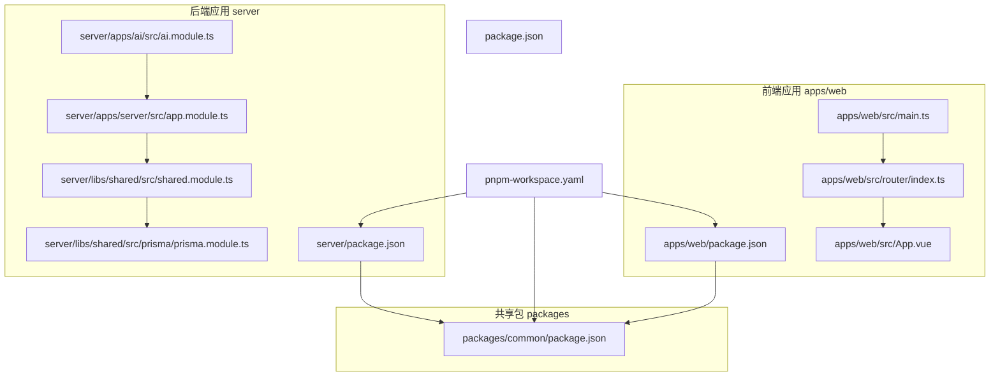
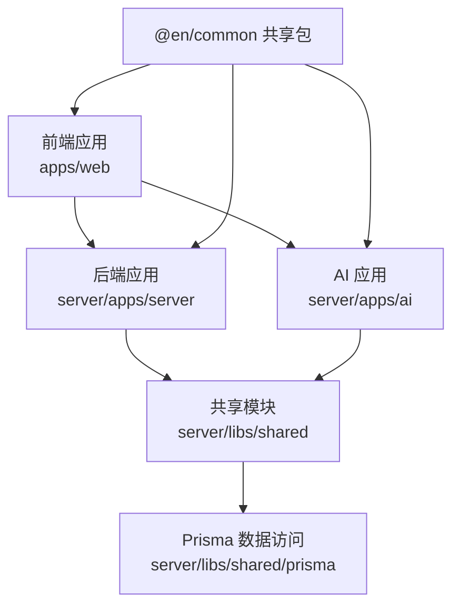
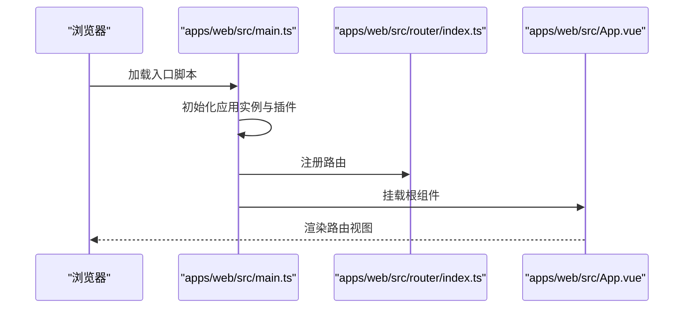
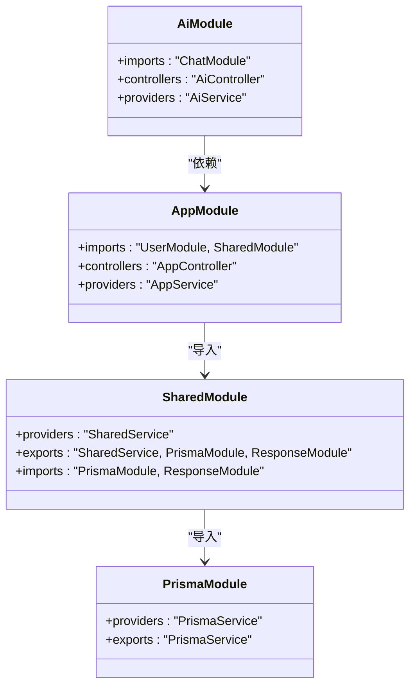
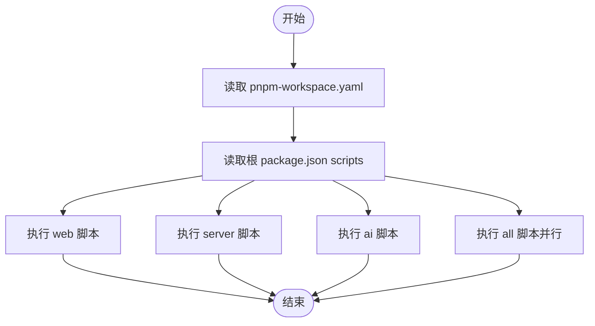
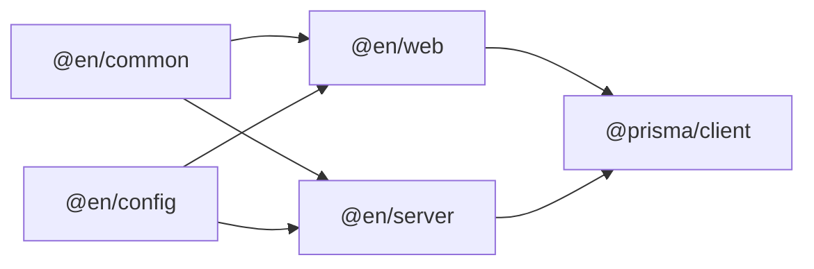

# 项目概述

<cite>
**本文档引用的文件**
- [README.md](file://README.md)
- [package.json](file://package.json)
- [pnpm-workspace.yaml](file://pnpm-workspace.yaml)
- [apps/web/package.json](file://apps/web/package.json)
- [apps/web/src/App.vue](file://apps/web/src/App.vue)
- [apps/web/src/main.ts](file://apps/web/src/main.ts)
- [apps/web/src/router/index.ts](file://apps/web/src/router/index.ts)
- [apps/web/src/stores/counter.ts](file://apps/web/src/stores/counter.ts)
- [server/package.json](file://server/package.json)
- [server/apps/server/src/app.module.ts](file://server/apps/server/src/app.module.ts)
- [server/apps/ai/src/ai.module.ts](file://server/apps/ai/src/ai.module.ts)
- [server/libs/shared/src/shared.module.ts](file://server/libs/shared/src/shared.module.ts)
- [server/libs/shared/src/prisma/prisma.module.ts](file://server/libs/shared/src/prisma/prisma.module.ts)
- [packages/common/package.json](file://packages/common/package.json)
</cite>

## 目录
1. [引言](#引言)
2. [项目结构](#项目结构)
3. [核心组件](#核心组件)
4. [架构总览](#架构总览)
5. [详细组件分析](#详细组件分析)
6. [依赖关系分析](#依赖关系分析)
7. [性能考虑](#性能考虑)
8. [故障排除指南](#故障排除指南)
9. [结论](#结论)
10. [附录](#附录)

## 引言
本项目是一个基于 Monorepo 架构的全栈英语学习平台，旨在通过系统化的单词练习与智能问答能力，帮助用户高效巩固词汇与语言运用能力。项目采用现代化技术栈：前端使用 Vue 3 + Vite + Pinia + Element Plus，后端采用 NestJS 微服务化架构，数据库访问通过 Prisma 实现，AI 智能问答作为独立子应用集成在后端中。项目通过 pnpm workspace 管理多包依赖，支持并行开发与统一构建。

项目的核心价值主张包括：
- 单词记忆与复习体系：围绕“每日一练”的核心场景，提供结构化的单词学习路径。
- 智能问答增强：内置 AI 模块，为用户提供即时的语言学习辅助与答疑。
- 开发体验与可扩展性：Monorepo 统一管理前后端与共享包，便于团队协作与长期演进。

与其他英语学习平台相比，本项目更强调“结构化练习 + 智能问答”的结合，以及工程化与可维护性的优先级，适合希望在真实业务场景中实践现代全栈技术栈的学习者与团队。

## 项目结构
项目采用 pnpm workspace 的 Monorepo 结构，主要目录与职责如下：
- apps/web：前端 Vue 应用，负责用户界面、路由、状态管理与交互。
- server：后端 NestJS 应用，包含两个子应用：
  - apps/server：通用服务模块（如用户管理、基础接口等）。
  - apps/ai：AI 智能问答模块，提供对话与问答能力。
- libs/shared：共享基础设施模块，封装 Prisma 数据访问与统一响应处理。
- packages/common：跨应用的通用工具与类型定义。
- 根目录脚本与工作区配置：统一管理开发与运行命令，协调各包依赖。

**图表来源**
- [pnpm-workspace.yaml:1-10](file://pnpm-workspace.yaml#L1-L10)
- [apps/web/package.json:1-45](file://apps/web/package.json#L1-L45)
- [server/package.json:1-52](file://server/package.json#L1-L52)
- [server/apps/server/src/app.module.ts:1-13](file://server/apps/server/src/app.module.ts#L1-L13)
- [server/apps/ai/src/ai.module.ts:1-12](file://server/apps/ai/src/ai.module.ts#L1-L12)
- [server/libs/shared/src/shared.module.ts:1-13](file://server/libs/shared/src/shared.module.ts#L1-L13)
- [server/libs/shared/src/prisma/prisma.module.ts:1-9](file://server/libs/shared/src/prisma/prisma.module.ts#L1-L9)
- [apps/web/src/main.ts:1-21](file://apps/web/src/main.ts#L1-L21)
- [apps/web/src/router/index.ts:1-13](file://apps/web/src/router/index.ts#L1-L13)
- [apps/web/src/App.vue:1-11](file://apps/web/src/App.vue#L1-L11)

**章节来源**
- [pnpm-workspace.yaml:1-10](file://pnpm-workspace.yaml#L1-L10)
- [package.json:1-15](file://package.json#L1-L15)

## 核心组件
- 前端应用（apps/web）
  - 技术栈：Vue 3 + Vite + TypeScript + Pinia + Element Plus + Vue Router。
  - 路由与视图：通过路由模块组织首页与词库页面，实现页面级导航。
  - 状态管理：使用 Pinia 进行本地状态管理，并启用持久化插件以提升用户体验。
  - 启动流程：在入口文件中初始化应用、挂载路由与状态管理，并引入 UI 组件库。
- 后端应用（server）
  - 通用服务（apps/server）：以模块化方式组织控制器与服务，导入共享模块以复用基础设施。
  - AI 智能问答（apps/ai）：作为独立模块提供问答能力，依赖聊天相关实体与服务。
  - 共享模块（libs/shared）：集中提供 Prisma 数据访问层与统一响应处理模块，供其他模块导出使用。
- 共享包（packages/common）
  - 提供跨应用的通用工具与类型定义，减少重复代码，提升一致性。
- 工作区与脚本
  - pnpm workspace 配置统一管理包集合与允许构建项。
  - 根目录脚本提供一键启动前端、后端与 AI 子服务的能力，支持并行开发。

**章节来源**
- [apps/web/package.json:1-45](file://apps/web/package.json#L1-L45)
- [apps/web/src/main.ts:1-21](file://apps/web/src/main.ts#L1-L21)
- [apps/web/src/router/index.ts:1-13](file://apps/web/src/router/index.ts#L1-L13)
- [apps/web/src/App.vue:1-11](file://apps/web/src/App.vue#L1-L11)
- [apps/web/src/stores/counter.ts:1-13](file://apps/web/src/stores/counter.ts#L1-L13)
- [server/package.json:1-52](file://server/package.json#L1-L52)
- [server/apps/server/src/app.module.ts:1-13](file://server/apps/server/src/app.module.ts#L1-L13)
- [server/apps/ai/src/ai.module.ts:1-12](file://server/apps/ai/src/ai.module.ts#L1-L12)
- [server/libs/shared/src/shared.module.ts:1-13](file://server/libs/shared/src/shared.module.ts#L1-L13)
- [server/libs/shared/src/prisma/prisma.module.ts:1-9](file://server/libs/shared/src/prisma/prisma.module.ts#L1-L9)
- [packages/common/package.json:1-21](file://packages/common/package.json#L1-L21)
- [pnpm-workspace.yaml:1-10](file://pnpm-workspace.yaml#L1-L10)
- [package.json:1-15](file://package.json#L1-L15)

## 架构总览
整体架构采用 Monorepo 分层设计：
- 前端层：负责用户交互与视图渲染，通过路由与状态管理组织功能模块。
- 后端层：以 NestJS 模块化组织业务逻辑，共享模块提供数据访问与统一响应能力。
- AI 层：作为后端中的独立子应用，提供智能问答能力并与主服务解耦。
- 共享层：封装数据库访问与响应处理，降低模块间耦合度，提升可测试性与可维护性。

**图表来源**
- [apps/web/package.json:1-45](file://apps/web/package.json#L1-L45)
- [server/apps/server/src/app.module.ts:1-13](file://server/apps/server/src/app.module.ts#L1-L13)
- [server/apps/ai/src/ai.module.ts:1-12](file://server/apps/ai/src/ai.module.ts#L1-L12)
- [server/libs/shared/src/shared.module.ts:1-13](file://server/libs/shared/src/shared.module.ts#L1-L13)
- [server/libs/shared/src/prisma/prisma.module.ts:1-9](file://server/libs/shared/src/prisma/prisma.module.ts#L1-L9)
- [packages/common/package.json:1-21](file://packages/common/package.json#L1-L21)

## 详细组件分析

### 前端应用（apps/web）
- 启动流程与依赖注入
  - 在入口文件中创建应用实例，注册状态管理、UI 组件库与路由，随后挂载到 DOM。
  - 使用 Pinia 并启用持久化插件，确保刷新后状态不丢失。
- 路由与视图
  - 路由模块聚合首页与词库页面，通过 History 模式实现 SPA 导航。
  - 视图组件通过路由懒加载与组件化组织，便于维护与扩展。
- 状态管理示例
  - 使用 Pinia 定义简单计数 Store，演示响应式状态与派生计算的使用方式。

**图表来源**
- [apps/web/src/main.ts:1-21](file://apps/web/src/main.ts#L1-L21)
- [apps/web/src/router/index.ts:1-13](file://apps/web/src/router/index.ts#L1-L13)
- [apps/web/src/App.vue:1-11](file://apps/web/src/App.vue#L1-L11)

**章节来源**
- [apps/web/src/main.ts:1-21](file://apps/web/src/main.ts#L1-L21)
- [apps/web/src/router/index.ts:1-13](file://apps/web/src/router/index.ts#L1-L13)
- [apps/web/src/App.vue:1-11](file://apps/web/src/App.vue#L1-L11)
- [apps/web/src/stores/counter.ts:1-13](file://apps/web/src/stores/counter.ts#L1-L13)

### 后端应用（server）与共享模块
- 模块化组织
  - 通用服务模块通过导入共享模块，复用 Prisma 与统一响应处理能力。
  - AI 模块依赖聊天相关模块，形成清晰的边界划分。
- 共享模块职责
  - 将 Prisma 服务与响应处理模块以全局模块形式导出，供其他模块按需使用。
  - 通过模块化拆分，降低耦合度，提升可测试性与可维护性。

**图表来源**
- [server/apps/server/src/app.module.ts:1-13](file://server/apps/server/src/app.module.ts#L1-L13)
- [server/apps/ai/src/ai.module.ts:1-12](file://server/apps/ai/src/ai.module.ts#L1-L12)
- [server/libs/shared/src/shared.module.ts:1-13](file://server/libs/shared/src/shared.module.ts#L1-L13)
- [server/libs/shared/src/prisma/prisma.module.ts:1-9](file://server/libs/shared/src/prisma/prisma.module.ts#L1-L9)

**章节来源**
- [server/apps/server/src/app.module.ts:1-13](file://server/apps/server/src/app.module.ts#L1-L13)
- [server/apps/ai/src/ai.module.ts:1-12](file://server/apps/ai/src/ai.module.ts#L1-L12)
- [server/libs/shared/src/shared.module.ts:1-13](file://server/libs/shared/src/shared.module.ts#L1-L13)
- [server/libs/shared/src/prisma/prisma.module.ts:1-9](file://server/libs/shared/src/prisma/prisma.module.ts#L1-L9)

### 开发与运行脚本
- 根目录脚本
  - 提供启动前端、后端、AI 子服务与并行启动的命令，便于本地联调。
- 工作区配置
  - pnpm workspace 明确声明包集合与允许构建项，确保 monorepo 正常运作。

**图表来源**
- [pnpm-workspace.yaml:1-10](file://pnpm-workspace.yaml#L1-L10)
- [package.json:1-15](file://package.json#L1-L15)

**章节来源**
- [package.json:1-15](file://package.json#L1-L15)
- [pnpm-workspace.yaml:1-10](file://pnpm-workspace.yaml#L1-L10)

## 依赖关系分析
- 包依赖关系
  - apps/web 依赖 @en/common 与 @en/config，体现共享包在前端的应用。
  - server 依赖 @en/common 与 @en/config，同时引入 NestJS 与 Prisma 生态。
  - packages/common 作为共享包被前后端共同引用。
- Monorepo 耦合度
  - 通过 workspace:* 引用共享包，避免重复安装与版本漂移。
  - 共享模块在后端内部进一步解耦 Prisma 访问与响应处理，降低模块间耦合。

**图表来源**
- [apps/web/package.json:13-28](file://apps/web/package.json#L13-L28)
- [server/package.json:22-34](file://server/package.json#L22-L34)
- [packages/common/package.json:1-21](file://packages/common/package.json#L1-L21)

**章节来源**
- [apps/web/package.json:1-45](file://apps/web/package.json#L1-L45)
- [server/package.json:1-52](file://server/package.json#L1-L52)
- [packages/common/package.json:1-21](file://packages/common/package.json#L1-L21)

## 性能考虑
- 前端性能
  - 使用 Vite 构建与开发服务器，提供快速热更新与按需编译能力。
  - Pinia 持久化状态减少不必要的网络请求与重复计算。
- 后端性能
  - NestJS 模块化与依赖注入降低运行时开销，Prisma 提供高效的 ORM 能力。
  - 通过共享模块集中处理响应与数据访问，减少重复逻辑与潜在错误。
- 开发效率
  - pnpm workspace 与并行脚本显著缩短启动时间，提升迭代速度。

## 故障排除指南
- 启动失败排查
  - 确认 pnpm workspace 配置正确，包集合与允许构建项设置无误。
  - 检查根脚本是否正确指向各子应用的启动命令。
- 前端问题
  - 若路由或组件未生效，检查路由注册顺序与组件导出是否正确。
  - 确保状态管理插件已正确安装与启用。
- 后端问题
  - 若模块无法导入，检查共享模块导出与导入是否一致。
  - 确认 Prisma 模块已正确注册并提供服务实例。

**章节来源**
- [pnpm-workspace.yaml:1-10](file://pnpm-workspace.yaml#L1-L10)
- [package.json:1-15](file://package.json#L1-L15)
- [apps/web/src/main.ts:1-21](file://apps/web/src/main.ts#L1-L21)
- [apps/web/src/router/index.ts:1-13](file://apps/web/src/router/index.ts#L1-L13)
- [server/libs/shared/src/shared.module.ts:1-13](file://server/libs/shared/src/shared.module.ts#L1-L13)

## 结论
本项目以 Monorepo 为核心，结合 Vue 3 前端与 NestJS 后端，构建了一个结构清晰、易于扩展的英语学习平台。通过模块化与共享模块的设计，实现了前后端的高内聚低耦合；通过 AI 子应用与 Prisma 的集成，提供了智能化与数据驱动的能力。对于初学者而言，项目提供了从入口到模块的完整参考；对于有经验的开发者，项目展示了现代全栈工程的最佳实践与可扩展性设计。

## 附录
- 项目名称与定位
  - 项目名称：每日一练重新记忆英语单词。
  - 定位：面向英语学习者的结构化单词练习与智能问答平台。
- 目标用户
  - 英语学习者、需要系统复习单词的用户、希望获得智能问答辅助的学习者。
- 主要使用场景
  - 日常单词练习、词库浏览与复习、智能问答互动等。

**章节来源**
- [README.md:1-1](file://README.md#L1-L1)